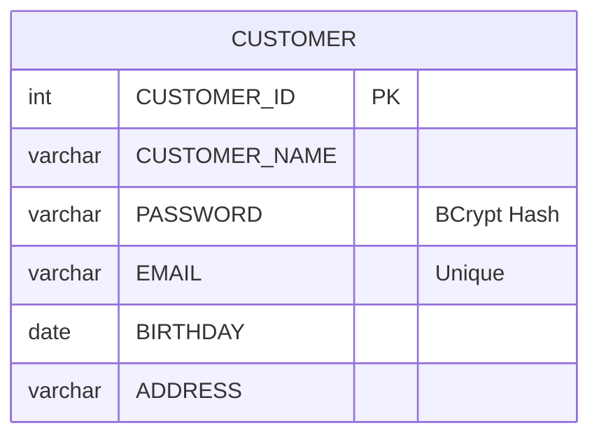

# berry-books-api-sdd - データモデル仕様書

**プロジェクトID:** berry-books-api-sdd  
**バージョン:** 3.0.0  
**最終更新日:** 2026-01-10  
**ステータス:** サービス分離アーキテクチャ対応完了

**変更履歴**:
- v3.0.0 (2026-01-10): サービス分離アーキテクチャ対応
  - サービス間の外部キー制約の削除（CUSTOMER_ID、BOOK_ID）
  - スナップショットパターンの導入（BOOK_NAME、PUBLISHER_NAME）
  - データ整合性をアプリケーションレイヤーで保証
- v2.0.0 (2025-12-27): BFFパターン導入
- v1.0.0: 初版

---

## 1. 概要

本文書は、berry-books-api REST API（BFF）とバックエンドサービスのデータベーススキーマとエンティティ設計を記述する。データモデルはHSQLDB 2.7.xを使用し、Jakarta Persistence (JPA) 3.1でO/Rマッピングを実装する。

**データベース**: HSQLDB  
**データベース名**: testdb  
**接続URL**: jdbc:hsqldb:hsql://localhost:9001/testdb  
**JNDI名**: jdbc/HsqldbDS

### 1.1 BFFパターンにおけるデータ管理の責務分担

| サービス | 管理するテーブル | 実装方式 |
|--------------|--------------|---------|
| **berry-books-api<br/>(BFF)** | ORDER_TRAN<br/>ORDER_DETAIL | JPAエンティティ + DAO |
| **back-office-api** | BOOK<br/>STOCK<br/>CATEGORY<br/>PUBLISHER | JPAエンティティ + DAO<br/>（berry-books-apiからはREST API経由） |
| **customer-hub-api** | CUSTOMER | JPAエンティティ + DAO<br/>（berry-books-apiからはREST API経由） |

**重要**: berry-books-apiは注文データ（ORDER_TRAN、ORDER_DETAIL）のみを直接管理します。書籍・在庫・カテゴリ・顧客データは外部APIを通じてアクセスします。

---

## 2. ER図

### 2.1 全体ER図

```mermaid
erDiagram
    %% サービス間のリレーションシップは論理的参照のみ（外部キー制約なし）
    ORDER_TRAN ||--o{ ORDER_DETAIL : contains
    
    ORDER_TRAN {
        int ORDER_TRAN_ID PK
        date ORDER_DATE
        int CUSTOMER_ID "論理参照のみ（customer-hub-api）"
        int TOTAL_PRICE
        int DELIVERY_PRICE
        varchar DELIVERY_ADDRESS
        int SETTLEMENT_TYPE "1=Bank, 2=Credit, 3=COD"
    }
    
    ORDER_DETAIL {
        int ORDER_TRAN_ID PK_FK
        int ORDER_DETAIL_ID PK
        int BOOK_ID "論理参照のみ（back-office-api）"
        varchar(100) BOOK_NAME "スナップショット"
        varchar(50) PUBLISHER_NAME "スナップショット"
        int PRICE "スナップショット"
        int COUNT
    }
```

**注意**: 上記のER図はberry-books-api-sddが管理するテーブルのみを示しています。書籍・在庫・カテゴリ・出版社データはback-office-api-sdd、顧客データはcustomer-hub-apiが管理します。

### 2.2 他のサービスのテーブル構造（参考）

以下は参考情報です。これらのテーブルはberry-books-api-sddでは管理されません。

**back-office-api-sdd管理テーブル**:
```mermaid
erDiagram
    PUBLISHER ||--o{ BOOK : publishes
    CATEGORY ||--o{ BOOK : categorizes
    BOOK ||--|| STOCK : has
    
    PUBLISHER {
        int PUBLISHER_ID PK
        varchar PUBLISHER_NAME
    }
    
    CATEGORY {
        int CATEGORY_ID PK
        varchar CATEGORY_NAME
    }
    
    BOOK {
        int BOOK_ID PK
        varchar BOOK_NAME
        varchar AUTHOR
        int CATEGORY_ID FK
        int PUBLISHER_ID FK
        int PRICE
    }
    
    STOCK {
        int BOOK_ID PK_FK
        int QUANTITY
        bigint VERSION "Optimistic Lock"
    }
```

**customer-hub-api管理テーブル**:


---

## 3. テーブル定義

### 3.1 PUBLISHER（出版社）

#### 3.1.1 テーブル概要

出版社マスタテーブル。書籍の出版社情報を管理する。

#### 3.1.2 テーブル構造

| カラム名 | データ型 | PK | FK | NN | UQ | デフォルト | 説明 |
|---------|---------|----|----|----|----|----------|------|
| PUBLISHER_ID | INTEGER | ✓ | | ✓ | | IDENTITY | 出版社ID（自動採番） |
| PUBLISHER_NAME | VARCHAR(30) | | | ✓ | | | 出版社名 |

#### 3.1.3 制約

* 主キー: PUBLISHER_ID
* 自動採番: IDENTITY（INSERT時に自動生成）

#### 3.1.5 サンプルデータ

| PUBLISHER_ID | PUBLISHER_NAME |
|-------------|---------------|
| 1 | デジタルフロンティア出版 |
| 2 | コードブレイクプレス |
| 3 | ネットワークノード出版 |
| 4 | クラウドキャスティング社 |
| 5 | データドリフト社 |

---

### 3.2 CATEGORY（カテゴリ）

#### 3.2.1 テーブル概要

カテゴリマスタテーブル。書籍のカテゴリ情報を管理する。

#### 3.2.2 テーブル構造

| カラム名 | データ型 | PK | FK | NN | UQ | デフォルト | 説明 |
|---------|---------|----|----|----|----|----------|------|
| CATEGORY_ID | INTEGER | ✓ | | ✓ | | IDENTITY | カテゴリID（自動採番） |
| CATEGORY_NAME | VARCHAR(20) | | | ✓ | | | カテゴリ名 |

#### 3.2.3 制約

* 主キー: CATEGORY_ID
* 自動採番: IDENTITY（INSERT時に自動生成）

#### 3.2.5 サンプルデータ

| CATEGORY_ID | CATEGORY_NAME |
|------------|--------------|
| 1 | Java |
| 2 | SpringBoot |
| 3 | SQL |
| 4 | HTML/CSS |
| 5 | JavaScript |
| 6 | Python |
| 7 | 生成AI |
| 8 | クラウド |
| 9 | AWS |

---

### 3.3 BOOK（書籍）

#### 3.3.1 テーブル概要

書籍マスタテーブル。書籍の基本情報を管理する。

#### 3.3.2 テーブル構造

| カラム名 | データ型 | PK | FK | NN | UQ | デフォルト | 説明 |
|---------|---------|----|----|----|----|----------|------|
| BOOK_ID | INTEGER | ✓ | | ✓ | | IDENTITY | 書籍ID（自動採番） |
| BOOK_NAME | VARCHAR(80) | | | ✓ | | | 書籍名 |
| AUTHOR | VARCHAR(40) | | | ✓ | | | 著者 |
| CATEGORY_ID | INT | | ✓ | ✓ | | | カテゴリID |
| PUBLISHER_ID | INT | | ✓ | ✓ | | | 出版社ID |
| PRICE | INT | | | ✓ | | | 価格（円） |

#### 3.3.3 制約

* 主キー: BOOK_ID
* 外部キー:
  - CATEGORY_ID → CATEGORY.CATEGORY_ID
  - PUBLISHER_ID → PUBLISHER.PUBLISHER_ID
* 自動採番: IDENTITY（INSERT時に自動生成）

#### 3.3.5 インデックス

* PK_BOOK: BOOK_ID（主キーインデックス）
* IDX_CATEGORY_ID: CATEGORY_ID（外部キーインデックス、検索最適化）

#### 3.3.6 サンプルデータ

| BOOK_ID | BOOK_NAME | AUTHOR | CATEGORY_ID | PUBLISHER_ID | PRICE |
|---------|----------|--------|------------|-------------|-------|
| 1 | Java SEディープダイブ | Michael Johnson | 1 | 3 | 3400 |
| 2 | JVMとバイトコードの探求 | James Lopez | 1 | 1 | 4200 |
| 3 | SpringBoot in Cloud | Paul Martin | 2 | 3 | 3000 |

---

### 3.4 STOCK（在庫）

#### 3.4.1 テーブル概要

在庫マスタテーブル。書籍の在庫数を管理する。楽観的ロック制御用のVERSIONカラムを持つ。

#### 3.4.2 テーブル構造

| カラム名 | データ型 | PK | FK | NN | UQ | デフォルト | 説明 |
|---------|---------|----|----|----|----|----------|------|
| BOOK_ID | INT | ✓ | ✓ | ✓ | | | 書籍ID |
| QUANTITY | INT | | | ✓ | | | 在庫数 |
| VERSION | BIGINT | | | ✓ | | | バージョン番号（楽観的ロック用） |

#### 3.4.3 制約

* 主キー: BOOK_ID
* 外部キー: BOOK_ID → BOOK.BOOK_ID（1:1関係）

#### 3.4.5 楽観的ロック制御

* VERSION: 在庫更新時に自動インクリメント
* 更新処理の論理構造:
  - 対象テーブル: STOCK
  - SET句:
    - QUANTITY = QUANTITY - (減算数量)
    - VERSION = VERSION + 1
  - WHERE句:
    - BOOK_ID = (対象書籍ID)
    - VERSION = (現在のバージョン番号)
* VERSION不一致時: UPDATE結果が0件 → OptimisticLockException

#### 3.4.6 サンプルデータ

| BOOK_ID | QUANTITY | VERSION |
|---------|----------|---------|
| 1 | 10 | 1 |
| 2 | 5 | 1 |
| 3 | 20 | 1 |

---

### 3.5 CUSTOMER（顧客）

#### 3.5.1 テーブル概要

顧客マスタテーブル。顧客情報を管理する。パスワードはBCryptハッシュで保存する。

**注意**: このテーブルは外部API（berry-books-rest）経由でアクセスされる。

#### 3.5.2 テーブル構造

| カラム名 | データ型 | PK | FK | NN | UQ | デフォルト | 説明 |
|---------|---------|----|----|----|----|----------|------|
| CUSTOMER_ID | INT | ✓ | | ✓ | | IDENTITY | 顧客ID（自動採番） |
| CUSTOMER_NAME | VARCHAR(30) | | | ✓ | | | 顧客名 |
| PASSWORD | VARCHAR(60) | | | ✓ | | | パスワード（BCryptハッシュ） |
| EMAIL | VARCHAR(30) | | | ✓ | ✓ | | メールアドレス（一意制約） |
| BIRTHDAY | DATE | | | | | | 生年月日 |
| ADDRESS | VARCHAR(120) | | | | | | 住所（UTF-8で40文字） |

#### 3.5.3 制約

* 主キー: CUSTOMER_ID
* 一意制約: EMAIL（同一メールアドレスでの重複登録不可）
* 自動採番: IDENTITY（INSERT時に自動生成）

#### 3.5.5 パスワードハッシュ

* ハッシュアルゴリズム: BCrypt（cost=10）
* ハッシュ長: 60文字（例: `$2a$10$...`）
* 平文パスワード: 開発環境のみサポート（本番環境では不可）

#### 3.5.6 サンプルデータ

| CUSTOMER_ID | CUSTOMER_NAME | PASSWORD | EMAIL | BIRTHDAY | ADDRESS |
|------------|--------------|---------|-------|----------|---------|
| 1 | Alice | password | alice@gmail.com | 1990-01-01 | 東京都渋谷区1-2-3 |
| 2 | Bob | password | bob@gmail.com | 1985-05-15 | 大阪府大阪市北区1-1-1 |

---

### 3.6 ORDER_TRAN（注文トランザクション）

#### 3.6.1 テーブル概要

注文トランザクションテーブル。顧客の注文情報（注文日、合計金額、配送先など）を管理する。

#### 3.6.2 テーブル構造

| カラム名 | データ型 | PK | FK | NN | UQ | デフォルト | 説明 |
|---------|---------|----|----|----|----|----------|------|
| ORDER_TRAN_ID | INTEGER | ✓ | | ✓ | | IDENTITY | 注文トランザクションID（自動採番） |
| ORDER_DATE | DATE | | | ✓ | | | 注文日 |
| CUSTOMER_ID | INT | | | ✓ | | | 顧客ID（論理参照のみ、外部キー制約なし） |
| TOTAL_PRICE | INT | | | ✓ | | | 注文金額合計（配送料を含む） |
| DELIVERY_PRICE | INT | | | ✓ | | | 配送料金 |
| DELIVERY_ADDRESS | VARCHAR(30) | | | ✓ | | | 配送先住所 |
| SETTLEMENT_TYPE | INT | | | ✓ | | | 決済方法（1:銀行振込, 2:クレジットカード, 3:着払い） |

#### 3.6.3 制約

* 主キー: ORDER_TRAN_ID
* 外部キー: **なし**（CUSTOMER_IDは論理参照のみ。顧客データはcustomer-hub-apiが管理）
* 自動採番: IDENTITY（INSERT時に自動生成）

**サービス分離アーキテクチャ設計方針**:
- `CUSTOMER_ID`は顧客IDを保持しますが、データベースレベルの外部キー制約は設定しません
- 理由: 顧客データは別のサービス（customer-hub-api）が管理するため
- データ整合性: アプリケーションレイヤーで検証（外部API呼び出しによる顧客存在確認）

#### 3.6.5 決済方法（SETTLEMENT_TYPE）

| 値 | 説明 |
|---|------|
| 1 | 銀行振込 |
| 2 | クレジットカード |
| 3 | 着払い |

#### 3.6.6 サンプルデータ

| ORDER_TRAN_ID | ORDER_DATE | CUSTOMER_ID | TOTAL_PRICE | DELIVERY_PRICE | DELIVERY_ADDRESS | SETTLEMENT_TYPE |
|--------------|-----------|------------|------------|---------------|----------------|----------------|
| 1 | 2025-12-27 | 1 | 6800 | 800 | 東京都渋谷区1-2-3 | 1 |
| 2 | 2025-12-26 | 2 | 10500 | 0 | 大阪府大阪市北区1-1-1 | 2 |

---

### 3.7 ORDER_DETAIL（注文明細）

#### 3.7.1 テーブル概要

注文明細テーブル。各注文の書籍情報（書籍ID、価格、数量）を管理する。複合主キー（ORDER_TRAN_ID, ORDER_DETAIL_ID）を使用する。

#### 3.7.2 テーブル構造

| カラム名 | データ型 | PK | FK | NN | UQ | デフォルト | 説明 |
|---------|---------|----|----|----|----|----------|------|
| ORDER_TRAN_ID | INT | ✓ | ✓ | ✓ | | | 注文トランザクションID |
| ORDER_DETAIL_ID | INT | ✓ | | ✓ | | | 注文明細ID（注文内で一意） |
| BOOK_ID | INT | | | ✓ | | | 書籍ID（論理参照のみ、外部キー制約なし） |
| BOOK_NAME | VARCHAR(100) | | | ✓ | | | 書籍名（スナップショット：注文時点の名称） |
| PUBLISHER_NAME | VARCHAR(50) | | | ✓ | | | 出版社名（スナップショット：注文時点の名称） |
| PRICE | INT | | | ✓ | | | 価格（スナップショット：注文時点の価格） |
| COUNT | INT | | | ✓ | | | 注文数 |

#### 3.7.3 制約

* 主キー: (ORDER_TRAN_ID, ORDER_DETAIL_ID)（複合主キー）
* 外部キー:
  - ORDER_TRAN_ID → ORDER_TRAN.ORDER_TRAN_ID（サービス内の制約）
  - BOOK_ID: **外部キー制約なし**（書籍データはback-office-api-sddが管理）

**サービス分離アーキテクチャ設計方針**:
- `BOOK_ID`は書籍IDを保持しますが、データベースレベルの外部キー制約は設定しません
- 理由: 書籍データは別のサービス（back-office-api-sdd）が管理するため
- **スナップショットパターン**: 注文時点の書籍名、出版社名、価格を非正規化して保持
  - メリット1: 書籍マスタが変更されても、過去の注文履歴は影響を受けない
  - メリット2: 書籍が削除されても、注文履歴を正常に表示できる
  - メリット3: 注文履歴表示時に外部API呼び出しが不要（パフォーマンス向上）
- データ整合性: 注文登録時にアプリケーションレイヤーで検証（外部API呼び出しによる書籍存在確認）

#### 3.7.5 複合主キーの設計

**複合主キー**: (ORDER_TRAN_ID, ORDER_DETAIL_ID)

* ORDER_TRAN_ID: 注文トランザクションID（親テーブルへの外部キー）
* ORDER_DETAIL_ID: 注文明細ID（注文内で連番: 1, 2, 3, ...）

JPA実装:

* OrderDetailPK: 複合主キークラス（@Embeddable）
* OrderDetail: エンティティクラス（@IdClass(OrderDetailPK.class)）
* @MapsId: ORDER_TRAN_IDを複合主キーと外部キーで共有

#### 3.7.6 サンプルデータ

| ORDER_TRAN_ID | ORDER_DETAIL_ID | BOOK_ID | BOOK_NAME | PUBLISHER_NAME | PRICE | COUNT |
|--------------|----------------|---------|-----------|----------------|-------|-------|
| 1 | 1 | 1 | Java入門 | 翔泳社 | 3400 | 2 |
| 1 | 2 | 3 | Python基礎 | オライリー | 3000 | 1 |
| 2 | 1 | 2 | Spring実践 | 技術評論社 | 4200 | 2 |

**注**: BOOK_NAME、PUBLISHER_NAMEは注文時点のスナップショットデータです。

---

## 4. JPAエンティティマッピング

### 4.1 エンティティ一覧（BFFパターン）

#### 4.1.1 berry-books-api (BFF)で実装されるエンティティ

| エンティティクラス | テーブル | 主キー | バージョン管理 | 実装状況 |
|---------------|---------|--------|--------------|---------|
| OrderTran | ORDER_TRAN | orderTranId | - | ✓ 実装済み |
| OrderDetail | ORDER_DETAIL | (orderTranId, orderDetailId) | - | ✓ 実装済み |
| OrderDetailPK | - | 複合主キークラス | - | ✓ 実装済み |

#### 4.1.2 外部APIで管理されるエンティティ（BFFでは未実装）

| エンティティクラス | テーブル | 管理API | アクセス方式 |
|---------------|---------|---------|------------|
| Book | BOOK | back-office-api | REST API (BookTO) |
| Stock | STOCK | back-office-api | REST API (StockTO) |
| Category | CATEGORY | back-office-api | REST API |
| Publisher | PUBLISHER | back-office-api | REST API |
| Customer | CUSTOMER | customer-hub-api | REST API (CustomerTO) |

**注意**: berry-books-apiには上記のエンティティクラスは実装されていません。代わりに、外部API用のDTO（BookTO、StockTO、CustomerTO）を使用します。

### 4.2 リレーションシップ

**注意**: 以下のリレーションシップ仕様は、全体のデータモデルを示しています。berry-books-api (BFF)では、注文関連のリレーションシップ（4.2.4、4.2.5、4.2.6）のみが実装されています。

#### 4.2.1 Book ⇔ Publisher（多対一） - **back-office-apiで実装**

リレーションシップ仕様:
* エンティティ: Book
* リレーション種別: 多対一（ManyToOne）
* 参照先エンティティ: Publisher
* 結合カラム: PUBLISHER_ID（Bookテーブル内）
* カーディナリティ: 多数のBookが1つのPublisherに関連

#### 4.2.2 Book ⇔ Category（多対一） - **back-office-apiで実装**

リレーションシップ仕様:
* エンティティ: Book
* リレーション種別: 多対一（ManyToOne）
* 参照先エンティティ: Category
* 結合カラム: CATEGORY_ID（Bookテーブル内）
* カーディナリティ: 多数のBookが1つのCategoryに関連

#### 4.2.3 Book ⇔ Stock（一対一） - **back-office-apiで実装**

Bookエンティティ側の仕様:
* リレーション種別: 一対一（OneToOne）
* 参照先エンティティ: Stock
* マッピング方式: 逆参照（mappedBy = "book"）
* フェッチ戦略: LAZY（遅延ロード）

Stockエンティティ側の仕様:
* 主キー: BOOK_ID
* リレーション種別: 一対一（OneToOne）
* 結合カラム: BOOK_ID
* マッピング方式: 主キー共有（MapsId）
* バージョン管理: VERSIONカラムで楽観的ロック

循環参照対策:

Book → Stock → Book という双方向の関係により、JSONシリアル化時に無限ループが発生する可能性があるため、Stock側のbookフィールドはJSONシリアル化から除外する必要があります（JsonbTransient相当の処理）。

#### 4.2.4 OrderTran ⇔ Customer（論理参照のみ） - **berry-books-apiで論理参照のみ**

**注意**: OrderTranエンティティはberry-books-apiに実装されていますが、Customerエンティティは外部API（customer-hub-api）で管理されています。

**サービス分離アーキテクチャ設計方針**:
* エンティティ: OrderTran
* リレーション種別: **JPAリレーションシップなし**（論理参照のみ）
* 参照先エンティティ: Customer（customer-hub-apiで管理）
* 結合カラム: CUSTOMER_ID（OrderTranテーブル内、通常のINTカラム）
* **データベース制約**: 外部キー制約なし
* **データ整合性**: アプリケーションレイヤーで検証
  - 注文登録時に外部APIクライアント経由で顧客存在確認
  - 顧客情報取得時に外部APIクライアント経由でREST API呼び出し

#### 4.2.5 OrderTran ⇔ OrderDetail（一対多） - **berry-books-apiで実装**

OrderTranエンティティ側の仕様:
* リレーション種別: 一対多（OneToMany）
* 参照先エンティティ: OrderDetail（リスト）
* マッピング方式: 逆参照（mappedBy = "orderTran"）
* カスケード設定: ALL（親の操作が子に伝播）

OrderDetailエンティティ側の仕様:
* 複合主キークラス: OrderDetailPK
* 主キーフィールド:
  - ORDER_TRAN_ID
  - ORDER_DETAIL_ID
* リレーション種別: 多対一（ManyToOne）
* 結合カラム: ORDER_TRAN_ID
* 更新制限: insertable=false, updatable=false（複合主キーの一部のため）

#### 4.2.6 OrderDetail ⇔ Book（論理参照＋スナップショット） - **berry-books-apiで論理参照＋スナップショット実装**

**注意**: OrderDetailエンティティはberry-books-apiに実装されていますが、Bookエンティティは外部API（back-office-api-sdd）で管理されています。

**サービス分離アーキテクチャ設計方針**:
* エンティティ: OrderDetail
* リレーション種別: **JPAリレーションシップなし**（論理参照＋スナップショット）
* 参照先エンティティ: Book（back-office-api-sddで管理）
* 結合カラム: BOOK_ID（OrderDetailテーブル内、通常のINTカラム）
* **データベース制約**: 外部キー制約なし
* **スナップショットカラム**:
  - BOOK_NAME（VARCHAR(100)）: 注文時点の書籍名
  - PUBLISHER_NAME（VARCHAR(50)）: 注文時点の出版社名
  - PRICE（INT）: 注文時点の価格
* **設計意図**: 
  - 注文履歴は過去の取引記録であり、書籍マスタの変更や削除の影響を受けるべきではない
  - 注文履歴表示時に外部API呼び出しが不要（パフォーマンス向上）
* **データ整合性**: 
  - 注文登録時に外部APIクライアント経由で書籍情報を取得し、スナップショットとして保存
  - 在庫確認も外部APIクライアント経由で実施

### 4.3 楽観的ロック（バージョン管理） - **back-office-apiで実装**

**適用テーブル**: STOCK

**注意**: 楽観的ロックはback-office-apiのStockエンティティで実装されています。berry-books-apiはバージョン番号を外部APIに転送するのみです。

楽観的ロック仕様（back-office-api側）:
* エンティティ: Stock
* 主キー: BOOK_ID（INTEGER型）
* バージョン管理: 
    @Column(name = "QUANTITY")
    private Integer quantity;
    
    @Version
    @Column(name = "VERSION")
    private Long version;
}
```

動作:
* UPDATE時に VERSION カラムを自動インクリメント
* WHERE句に VERSION 条件を追加
* VERSION不一致時に OptimisticLockException

---

## 5. データアクセスパターン

### 5.1 書籍検索（N+1問題回避）

**問題**: 書籍一覧取得時に、カテゴリ、出版社、在庫を個別にSELECT（N+1問題）

**解決策**: JOIN FETCHを使用して一括取得

クエリ仕様:
* 対象エンティティ: Book
* JOIN FETCH対象:
  - category（内部結合）
  - publisher（内部結合）
  - stock（外部結合、LEFT JOIN）
* WHERE条件: category.categoryId = パラメータ値
* 戻り値: Bookエンティティのリスト
* 効果: 関連エンティティを1回のSQLで取得、N+1問題を回避

### 5.2 注文履歴取得（非正規化DTO）

**問題**: 注文履歴を注文単位で取得すると、明細を個別にSELECT（N+1問題）

**解決策**: 注文明細ごとに1レコードで返す非正規化DTO（OrderHistoryTO）

クエリ仕様:
* SELECT句: 新しいDTOオブジェクトを構築（OrderHistoryTO）
  - 選択フィールド: orderDate, orderTranId, orderDetailId, bookName, publisherName, price, count
* FROM句: OrderTran エンティティ（別名: ot）
* JOIN句:
  - ot.orderDetails → od（注文明細）
  - od.book → b（書籍）
  - b.publisher → p（出版社）
* WHERE条件: customer.customerId = パラメータ値
* ORDER BY句: orderDate の降順
* 戻り値: OrderHistoryTOのリスト
* 効果: 1回のSQLで全データを取得、N+1問題を回避

---

## 6. インデックス設計

### 6.1 インデックス一覧

| テーブル | インデックス名 | カラム | タイプ | 目的 |
|---------|--------------|--------|--------|------|
| PUBLISHER | PK_PUBLISHER | PUBLISHER_ID | PRIMARY KEY | 主キー |
| CATEGORY | PK_CATEGORY | CATEGORY_ID | PRIMARY KEY | 主キー |
| BOOK | PK_BOOK | BOOK_ID | PRIMARY KEY | 主キー |
| BOOK | IDX_CATEGORY_ID | CATEGORY_ID | INDEX | カテゴリ検索最適化 |
| BOOK | IDX_PUBLISHER_ID | PUBLISHER_ID | INDEX | 外部キー |
| STOCK | PK_STOCK | BOOK_ID | PRIMARY KEY | 主キー |
| CUSTOMER | PK_CUSTOMER | CUSTOMER_ID | PRIMARY KEY | 主キー |
| CUSTOMER | UQ_EMAIL | EMAIL | UNIQUE | メールアドレス一意制約 |
| ORDER_TRAN | PK_ORDER_TRAN | ORDER_TRAN_ID | PRIMARY KEY | 主キー |
| ORDER_TRAN | IDX_CUSTOMER_ID | CUSTOMER_ID | INDEX | 顧客別注文履歴検索最適化 |
| ORDER_DETAIL | PK_ORDER_DETAIL | (ORDER_TRAN_ID, ORDER_DETAIL_ID) | PRIMARY KEY | 複合主キー |
| ORDER_DETAIL | IDX_BOOK_ID | BOOK_ID | INDEX | 外部キー |

### 6.2 検索最適化

#### 6.2.1 書籍検索

**クエリ論理構造**: カテゴリIDで検索
* SELECT句: 全カラム
* FROM句: BOOK テーブル
* WHERE句: CATEGORY_ID = パラメータ値

**最適化**: IDX_CATEGORY_ID インデックスを使用

#### 6.2.2 注文履歴検索

**クエリ論理構造**: 顧客IDで注文履歴検索
* SELECT句: 全カラム
* FROM句: ORDER_TRAN テーブル
* WHERE句: CUSTOMER_ID = パラメータ値
* ORDER BY句: ORDER_DATE の降順

**最適化**: IDX_CUSTOMER_ID インデックスを使用

---

## 7. データ整合性ルール

### 7.1 外部キー制約

#### 7.1.1 berry-books-api-sdd管理テーブル（本サービス）

| 子テーブル | 親テーブル | 外部キー | 動作 |
|----------|----------|---------|------|
| ORDER_DETAIL | ORDER_TRAN | ORDER_TRAN_ID | CASCADE（注文削除時に明細も削除） |

**サービス分離アーキテクチャ設計方針**:
- **ORDER_TRAN.CUSTOMER_ID**: 外部キー制約なし（customer-hub-apiが管理）
- **ORDER_DETAIL.BOOK_ID**: 外部キー制約なし（back-office-api-sddが管理）
- データ整合性はアプリケーションレイヤーで保証（外部API呼び出しによる検証）

#### 7.1.2 他のサービス管理テーブル（参考）

**back-office-api-sdd**:
| 子テーブル | 親テーブル | 外部キー | 動作 |
|----------|----------|---------|------|
| BOOK | CATEGORY | CATEGORY_ID | CASCADE |
| BOOK | PUBLISHER | PUBLISHER_ID | CASCADE |
| STOCK | BOOK | BOOK_ID | CASCADE |

**customer-hub-api**:
| 子テーブル | 親テーブル | 外部キー | 動作 |
|----------|----------|---------|------|
| （単一テーブル） | - | - | - |

### 7.2 トランザクション分離レベル

**分離レベル**: READ_COMMITTED（デフォルト）

* ダーティリードを防ぐ
* 非反復可能読み取り（Non-Repeatable Read）は許容
* ファントムリード（Phantom Read）は許容

### 7.3 楽観的ロック制御

**対象テーブル**: STOCK

* VERSION: 在庫更新時に自動インクリメント
* 競合検出: UPDATE結果が0件の場合、OptimisticLockException
* リトライ: アプリケーション側で再試行（UI側でユーザーに通知）

---

## 8. データライフサイクル

### 8.1 初期データ投入

**データ投入スクリプト**: `sql/hsqldb/3_BOOKSTORE_DML.sql`

* PUBLISHER: 5件
* CATEGORY: 9件
* BOOK: 50件
* STOCK: 50件（各書籍に対応）
* CUSTOMER: 2件（開発用）

### 8.2 データ削除順序

#### 8.2.1 berry-books-api-sdd管理テーブル

外部キー制約により、以下の順序で削除する必要がある：

1. ORDER_DETAIL
2. ORDER_TRAN

#### 8.2.2 他のサービス管理テーブル（参考）

**back-office-api-sdd**:
1. STOCK
2. BOOK
3. CATEGORY
4. PUBLISHER

**customer-hub-api**:
1. CUSTOMER

**注意**: サービス間に外部キー制約は存在しないため、各サービスは独立してデータを削除できます。ただし、データ整合性を保つために、論理的な削除順序を考慮する必要があります（例: 注文データを削除する前に、該当する顧客や書籍が存在することを確認）。

### 8.3 データバックアップ

**バックアップ方法**: HSQLDBのSHUTDOWN SCRIPT

データベースをシャットダウンしてスクリプト形式でデータを保存するコマンドを実行します。

**バックアップファイル**: `hsqldb/data/testdb.script`

---

## 9. データベース設計原則

### 9.1 命名規則

* テーブル名: 英語大文字、単数形（BOOK, ORDER_TRAN）
* カラム名: 英語大文字、スネークケース（BOOK_NAME, ORDER_DATE）
* 主キー: テーブル名 + _ID（BOOK_ID, CUSTOMER_ID）
* 外部キー制約: FK_カラム名（FK_CATEGORY_ID）

### 9.2 正規化

* 第1正規形: 原子性を満たす（繰り返しフィールドなし）
* 第2正規形: 部分関数従属性なし
* 第3正規形: 推移的関数従属性なし

**例外: スナップショットパターン（意図的な非正規化）**

ORDER_DETAILテーブルでは、以下のカラムで非正規化を許容しています：

* `BOOK_NAME` (VARCHAR(100)): 書籍名（back-office-api-sddのBOOKテーブルから複製）
* `PUBLISHER_NAME` (VARCHAR(50)): 出版社名（back-office-api-sddのPUBLISHERテーブルから複製）
* `PRICE` (INT): 価格（back-office-api-sddのBOOKテーブルから複製）

**非正規化の理由**:
1. **サービス分離アーキテクチャ**: 書籍データは別のサービス（back-office-api-sdd）が管理しており、外部キー制約を設定できない
2. **履歴データの保護**: 注文履歴は過去の取引記録であり、書籍マスタの変更や削除の影響を受けるべきではない
3. **パフォーマンス**: 注文履歴表示時に外部API呼び出しが不要
4. **可用性**: back-office-api-sddが停止していても、注文履歴を表示できる

**デメリットとトレードオフ**:
- ストレージ容量の増加（許容範囲内）
- データ更新時の整合性管理（注文データは履歴のため更新不要）

---

## 10. 参考資料

本データモデル仕様書に関連する詳細ドキュメント：

* [requirements.md](requirements.md) - 要件定義書
* [functional_design.md](functional_design.md) - 機能設計書（API仕様）
* [architecture_design.md](architecture_design.md) - アーキテクチャ設計書
* [behaviors.md](behaviors.md) - 振る舞い仕様書（受入基準）
* [external_interface.md](external_interface.md) - 外部インターフェース仕様書
* [README.md](../../README.md) - プロジェクトREADME
