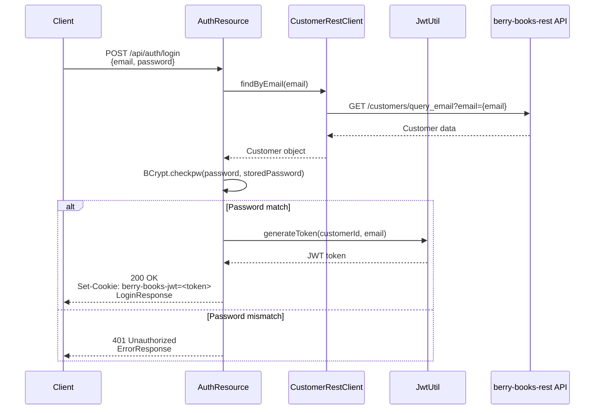
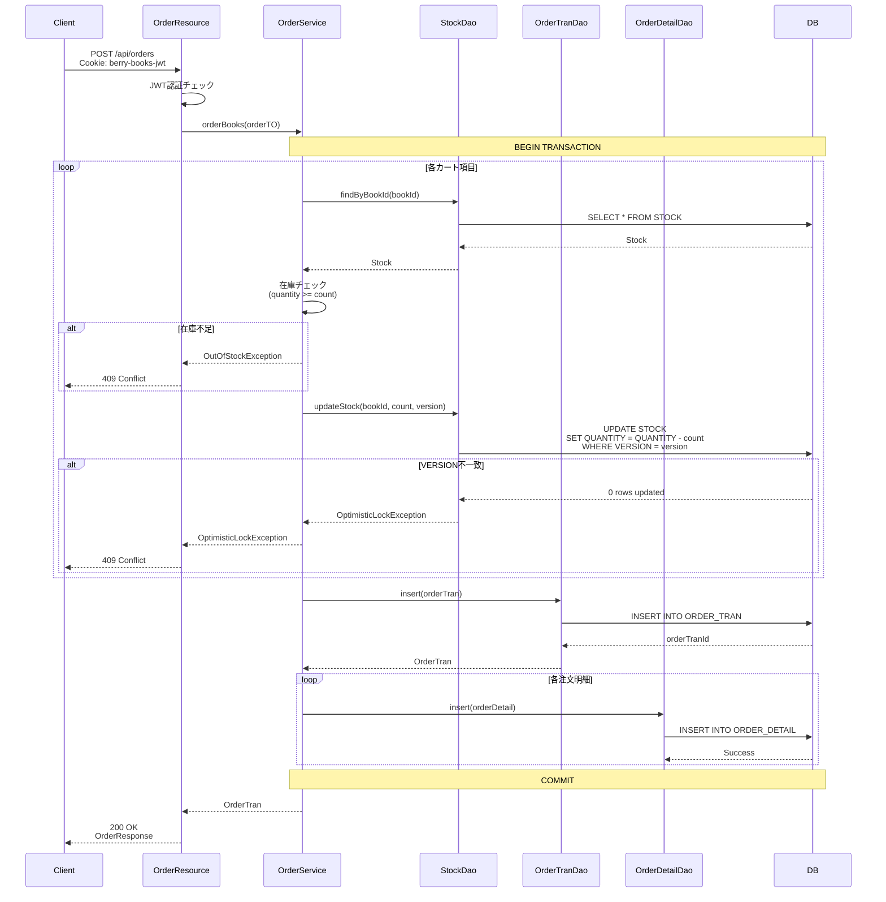

# berry-books-api - 機能設計書（API仕様）

**プロジェクトID:** berry-books-api  
**バージョン:** 2.0.0  
**最終更新日:** 2025-12-27  
**ステータス:** REST API仕様確定

---

## 1. 概要

本文書は、berry-books-api REST APIの各エンドポイントの詳細仕様を記述する。各APIについて、リクエスト/レスポンス形式、ビジネスルール、エラーハンドリングを定義する。

**ベースURL**: `http://localhost:8080/berry-books-api/api`

**認証方式**: JWT（HttpOnly Cookie）

### 1.1 API別詳細仕様

API単位の詳細仕様は、以下のドキュメントを参照してください：

- **[API_001_auth](../api/API_001_auth/functional_design.md)** - 認証API（ログイン、ログアウト、新規登録、ユーザー情報取得）
- **[API_002_books](../api/API_002_books/functional_design.md)** - 書籍API（書籍一覧、詳細、検索、カテゴリ一覧）
- **[API_003_orders](../api/API_003_orders/functional_design.md)** - 注文API（注文作成、注文履歴、注文詳細）
- **[API_004_images](../api/API_004_images/functional_design.md)** - 画像API（書籍表紙画像取得）

---

## 2. 認証API (`/api/auth`)

### 2.1 ログイン

#### 2.1.1 エンドポイント

```
POST /api/auth/login
```

#### 2.1.2 概要

メールアドレスとパスワードで認証し、JWT Cookieを発行する。

#### 2.1.3 リクエスト

**Content-Type**: `application/json`

**リクエストボディ**:

```json
{
  "email": "alice@gmail.com",
  "password": "password"
}
```

| フィールド | 型 | 必須 | 検証ルール |
|----------|---|------|----------|
| email | string | ✓ | メールアドレス形式、最大30文字 |
| password | string | ✓ | 最小1文字、最大60文字 |

#### 2.1.4 レスポンス

**成功時 (200 OK)**:

**Set-Cookie**: `berry-books-jwt=<JWT Token>; Path=/; Max-Age=86400; HttpOnly`

```json
{
  "customerId": 1,
  "customerName": "Alice",
  "email": "alice@gmail.com",
  "birthday": "1990-01-01",
  "address": "東京都渋谷区1-2-3"
}
```

**エラー時 (401 Unauthorized)**:

```json
{
  "status": 401,
  "error": "Unauthorized",
  "message": "メールアドレスまたはパスワードが正しくありません",
  "path": "/api/auth/login"
}
```

#### 2.1.5 ビジネスルール

| ルールID | 説明 |
|---------|-------------|
| BR-AUTH-001 | メールアドレスが存在しない場合、401エラー |
| BR-AUTH-002 | パスワードが一致しない場合、401エラー |
| BR-AUTH-003 | パスワードはBCryptハッシュまたは平文（開発環境）で照合 |
| BR-AUTH-004 | JWTの有効期限は24時間（設定可能） |
| BR-AUTH-005 | JWT Cookieは HttpOnly, Path=/, MaxAge=86400 |

#### 2.1.6 シーケンス図



---

### 2.2 ログアウト

#### 2.2.1 エンドポイント

```
POST /api/auth/logout
```

#### 2.2.2 概要

JWT Cookieを削除（MaxAge=0）してログアウトする。

#### 2.2.3 リクエスト

**Content-Type**: `application/json`

**リクエストボディ**: なし

#### 2.2.4 レスポンス

**成功時 (200 OK)**:

**Set-Cookie**: `berry-books-jwt=; Path=/; Max-Age=0; HttpOnly`

```json
{}
```

---

### 2.3 新規登録

#### 2.3.1 エンドポイント

```
POST /api/auth/register
```

#### 2.3.2 概要

新規顧客を登録し、JWT Cookieを発行する。

#### 2.3.3 リクエスト

**Content-Type**: `application/json`

**リクエストボディ**:

```json
{
  "customerName": "山田太郎",
  "password": "password123",
  "email": "yamada@example.com",
  "birthday": "1990-01-01",
  "address": "東京都渋谷区1-2-3"
}
```

| フィールド | 型 | 必須 | 検証ルール |
|----------|---|------|----------|
| customerName | string | ✓ | 最大30文字 |
| password | string | ✓ | 最小1文字、最大60文字 |
| email | string | ✓ | メールアドレス形式、最大30文字、一意制約 |
| birthday | string (date) | - | YYYY-MM-DD形式 |
| address | string | - | 最大120文字、都道府県名から始まること |

#### 2.3.4 レスポンス

**成功時 (200 OK)**:

**Set-Cookie**: `berry-books-jwt=<JWT Token>; Path=/; Max-Age=86400; HttpOnly`

```json
{
  "customerId": 10,
  "customerName": "山田太郎",
  "email": "yamada@example.com",
  "birthday": "1990-01-01",
  "address": "東京都渋谷区1-2-3"
}
```

**エラー時 (409 Conflict)**:

```json
{
  "status": 409,
  "error": "Conflict",
  "message": "指定されたメールアドレスは既に登録されています",
  "path": "/api/auth/register"
}
```

**エラー時 (400 Bad Request)**:

```json
{
  "status": 400,
  "error": "Bad Request",
  "message": "住所は都道府県名から始めてください",
  "path": "/api/auth/register"
}
```

#### 2.3.5 ビジネスルール

| ルールID | 説明 |
|---------|-------------|
| BR-AUTH-010 | メールアドレスが既に存在する場合、409エラー |
| BR-AUTH-011 | パスワードはBCryptでハッシュ化して保存 |
| BR-AUTH-012 | 住所は都道府県名から始まること（AddressUtil.startsWithValidPrefecture()） |
| BR-AUTH-013 | 登録成功時、自動的にJWT Cookieを発行してログイン状態にする |

---

### 2.4 現在のログインユーザー情報取得

#### 2.4.1 エンドポイント

```
GET /api/auth/me
```

#### 2.4.2 概要

JWT Cookieから顧客情報を取得する。認証必須。

#### 2.4.3 リクエスト

**Cookie**: `berry-books-jwt=<JWT Token>`

**リクエストボディ**: なし

#### 2.4.4 レスポンス

**成功時 (200 OK)**:

```json
{
  "customerId": 1,
  "customerName": "Alice",
  "email": "alice@gmail.com",
  "birthday": "1990-01-01",
  "address": "東京都渋谷区1-2-3"
}
```

**エラー時 (401 Unauthorized)**:

```json
{
  "status": 401,
  "error": "Unauthorized",
  "message": "認証が必要です",
  "path": "/api/auth/me"
}
```

---

## 3. 書籍API (`/api/books`)

### 3.1 書籍一覧取得

#### 3.1.1 エンドポイント

```
GET /api/books
```

#### 3.1.2 概要

全書籍を取得する。認証不要。

#### 3.1.3 リクエスト

**リクエストパラメータ**: なし

#### 3.1.4 レスポンス

**成功時 (200 OK)**:

```json
[
  {
    "bookId": 1,
    "bookName": "Java入門",
    "author": "山田太郎",
    "categoryId": 1,
    "publisherId": 1,
    "price": 3000,
    "category": {
      "categoryId": 1,
      "categoryName": "Java"
    },
    "publisher": {
      "publisherId": 1,
      "publisherName": "技術評論社"
    },
    "stock": {
      "bookId": 1,
      "quantity": 10,
      "version": 1
    }
  }
]
```

---

### 3.2 書籍詳細取得

#### 3.2.1 エンドポイント

```
GET /api/books/{id}
```

#### 3.2.2 概要

指定されたIDの書籍を取得する。認証不要。

#### 3.2.3 リクエスト

**パスパラメータ**:

| パラメータ | 型 | 説明 |
|----------|---|------|
| id | integer | 書籍ID |

#### 3.2.4 レスポンス

**成功時 (200 OK)**:

```json
{
  "bookId": 1,
  "bookName": "Java入門",
  "author": "山田太郎",
  "categoryId": 1,
  "publisherId": 1,
  "price": 3000,
  "category": {
    "categoryId": 1,
    "categoryName": "Java"
  },
  "publisher": {
    "publisherId": 1,
    "publisherName": "技術評論社"
  },
  "stock": {
    "bookId": 1,
    "quantity": 10,
    "version": 1
  }
}
```

**エラー時 (404 Not Found)**:

```json
{
  "error": "書籍が見つかりません"
}
```

---

### 3.3 書籍検索

#### 3.3.1 エンドポイント

```
GET /api/books/search?categoryId={id}&keyword={keyword}
```

#### 3.3.2 概要

カテゴリIDとキーワードで書籍を検索する。認証不要。

#### 3.3.3 リクエスト

**クエリパラメータ**:

| パラメータ | 型 | 必須 | 説明 |
|----------|---|------|------|
| categoryId | integer | - | カテゴリID（0または未指定=全カテゴリ） |
| keyword | string | - | キーワード（書籍名、著者名で部分一致検索） |

**検索パターン**:

| categoryId | keyword | 動作 |
|-----------|---------|------|
| 未指定/0 | 未指定 | 全書籍取得 |
| 未指定/0 | 指定 | キーワードで検索 |
| 指定 | 未指定 | カテゴリで検索 |
| 指定 | 指定 | カテゴリ+キーワードで検索 |

#### 3.3.4 レスポンス

**成功時 (200 OK)**:

```json
[
  {
    "bookId": 1,
    "bookName": "Java入門",
    "author": "山田太郎",
    "categoryId": 1,
    "publisherId": 1,
    "price": 3000,
    "category": {
      "categoryId": 1,
      "categoryName": "Java"
    },
    "publisher": {
      "publisherId": 1,
      "publisherName": "技術評論社"
    },
    "stock": {
      "bookId": 1,
      "quantity": 10,
      "version": 1
    }
  }
]
```

#### 3.3.5 ビジネスルール

| ルールID | 説明 |
|---------|-------------|
| BR-BOOK-001 | キーワード検索は書籍名、著者名で部分一致（LIKE '%keyword%'） |
| BR-BOOK-002 | カテゴリIDが0の場合は全カテゴリを対象 |
| BR-BOOK-003 | 検索結果には在庫情報（Stock）を含む |

---

### 3.4 カテゴリ一覧取得

#### 3.4.1 エンドポイント

```
GET /api/books/categories
```

#### 3.4.2 概要

全カテゴリをMapで取得する。認証不要。

#### 3.4.3 レスポンス

**成功時 (200 OK)**:

```json
{
  "Java": 1,
  "JavaScript": 2,
  "Python": 3,
  "データベース": 4,
  "AWS": 5,
  "生成AI": 6
}
```

---

## 4. 注文API (`/api/orders`)

### 4.1 注文作成

#### 4.1.1 エンドポイント

```
POST /api/orders
```

#### 4.1.2 概要

カート内の書籍を注文する。認証必須。在庫引き当て、在庫減算、注文レコード作成を実行する。

#### 4.1.3 リクエスト

**Content-Type**: `application/json`

**Cookie**: `berry-books-jwt=<JWT Token>`

**リクエストボディ**:

```json
{
  "cartItems": [
    {
      "bookId": 1,
      "bookName": "Java入門",
      "publisherName": "技術評論社",
      "price": 3000,
      "count": 2,
      "version": 1
    }
  ],
  "totalPrice": 6000,
  "deliveryPrice": 800,
  "deliveryAddress": "東京都渋谷区1-2-3",
  "settlementType": 1
}
```

| フィールド | 型 | 必須 | 説明 |
|----------|---|------|------|
| cartItems | array | ✓ | カート内の書籍リスト |
| cartItems[].bookId | integer | ✓ | 書籍ID |
| cartItems[].bookName | string | ✓ | 書籍名 |
| cartItems[].publisherName | string | ✓ | 出版社名 |
| cartItems[].price | integer | ✓ | 価格 |
| cartItems[].count | integer | ✓ | 注文数 |
| cartItems[].version | integer | ✓ | 在庫バージョン（楽観的ロック用） |
| totalPrice | integer | ✓ | 商品合計金額 |
| deliveryPrice | integer | ✓ | 配送料金 |
| deliveryAddress | string | ✓ | 配送先住所 |
| settlementType | integer | ✓ | 決済方法（1:銀行振込, 2:クレジットカード, 3:着払い） |

#### 4.1.4 レスポンス

**成功時 (200 OK)**:

```json
{
  "orderTranId": 1,
  "orderDate": "2025-12-27",
  "totalPrice": 6000,
  "deliveryPrice": 800,
  "deliveryAddress": "東京都渋谷区1-2-3",
  "settlementType": 1,
  "orderDetails": [
    {
      "orderDetailId": 1,
      "bookId": 1,
      "bookName": "Java入門",
      "publisherName": "技術評論社",
      "price": 3000,
      "count": 2
    }
  ]
}
```

**エラー時 (409 Conflict - 在庫不足)**:

```json
{
  "status": 409,
  "error": "Conflict",
  "message": "在庫が不足しています: Java入門",
  "path": "/api/orders"
}
```

**エラー時 (409 Conflict - 楽観的ロック競合)**:

```json
{
  "status": 409,
  "error": "Conflict",
  "message": "他のユーザーが購入済みです。最新の在庫情報を確認してください。",
  "path": "/api/orders"
}
```

**エラー時 (401 Unauthorized)**:

```json
{
  "status": 401,
  "error": "Unauthorized",
  "message": "認証が必要です",
  "path": "/api/orders"
}
```

#### 4.1.5 ビジネスルール

| ルールID | 説明 |
|---------|-------------|
| BR-ORDER-001 | 注文作成は認証必須（JWT Cookie） |
| BR-ORDER-002 | 在庫数が注文数より少ない場合、OutOfStockException（409） |
| BR-ORDER-003 | 在庫のVERSIONが一致しない場合、OptimisticLockException（409） |
| BR-ORDER-004 | 注文処理は単一トランザクション（@Transactional） |
| BR-ORDER-005 | 注文作成時に在庫を減算（UPDATE STOCK SET QUANTITY = QUANTITY - count） |
| BR-ORDER-006 | 配送料金は購入金額に応じて計算（DeliveryFeeService） |
| BR-ORDER-007 | 沖縄県の場合、配送料金が異なる |

#### 4.1.6 シーケンス図



---

### 4.2 注文履歴取得

#### 4.2.1 エンドポイント

```
GET /api/orders/history
```

#### 4.2.2 概要

ログイン中の顧客の注文履歴を取得する。認証必須。

#### 4.2.3 リクエスト

**Cookie**: `berry-books-jwt=<JWT Token>`

**リクエストパラメータ**: なし

#### 4.2.4 レスポンス

**成功時 (200 OK)**:

```json
[
  {
    "orderDate": "2025-12-27",
    "orderTranId": 1,
    "orderDetailId": 1,
    "bookName": "Java入門",
    "publisherName": "技術評論社",
    "price": 3000,
    "count": 2
  },
  {
    "orderDate": "2025-12-27",
    "orderTranId": 1,
    "orderDetailId": 2,
    "bookName": "Spring Boot実践",
    "publisherName": "技術評論社",
    "price": 3500,
    "count": 1
  }
]
```

**エラー時 (401 Unauthorized)**:

```json
{
  "status": 401,
  "error": "Unauthorized",
  "message": "認証が必要です",
  "path": "/api/orders/history"
}
```

#### 4.2.5 ビジネスルール

| ルールID | 説明 |
|---------|-------------|
| BR-ORDER-010 | 注文履歴取得は認証必須 |
| BR-ORDER-011 | 顧客IDでフィルタリング（JWT Claimsから取得） |
| BR-ORDER-012 | 注文日降順でソート |
| BR-ORDER-013 | 1注文明細=1レコード（非正規化） |

---

### 4.3 注文詳細取得

#### 4.3.1 エンドポイント

```
GET /api/orders/{tranId}
```

#### 4.3.2 概要

指定された注文IDの注文詳細を取得する。認証不要。

#### 4.3.3 リクエスト

**パスパラメータ**:

| パラメータ | 型 | 説明 |
|----------|---|------|
| tranId | integer | 注文トランザクションID |

#### 4.3.4 レスポンス

**成功時 (200 OK)**:

```json
{
  "orderTranId": 1,
  "orderDate": "2025-12-27",
  "totalPrice": 6500,
  "deliveryPrice": 800,
  "deliveryAddress": "東京都渋谷区1-2-3",
  "settlementType": 1,
  "orderDetails": [
    {
      "orderDetailId": 1,
      "bookId": 1,
      "bookName": "Java入門",
      "publisherName": "技術評論社",
      "price": 3000,
      "count": 2
    },
    {
      "orderDetailId": 2,
      "bookId": 2,
      "bookName": "Spring Boot実践",
      "publisherName": "技術評論社",
      "price": 3500,
      "count": 1
    }
  ]
}
```

**エラー時 (404 Not Found)**:

```json
{
  "status": 404,
  "error": "Not Found",
  "message": "注文が見つかりません",
  "path": "/api/orders/1"
}
```

---

### 4.4 注文明細取得

#### 4.4.1 エンドポイント

```
GET /api/orders/{tranId}/details/{detailId}
```

#### 4.4.2 概要

指定された注文明細を取得する。認証不要。

#### 4.4.3 リクエスト

**パスパラメータ**:

| パラメータ | 型 | 説明 |
|----------|---|------|
| tranId | integer | 注文トランザクションID |
| detailId | integer | 注文明細ID |

#### 4.4.4 レスポンス

**成功時 (200 OK)**:

```json
{
  "orderDetailId": 1,
  "bookId": 1,
  "bookName": "Java入門",
  "publisherName": "技術評論社",
  "price": 3000,
  "count": 2
}
```

**エラー時 (404 Not Found)**:

```json
{
  "status": 404,
  "error": "Not Found",
  "message": "注文明細が見つかりません",
  "path": "/api/orders/1/details/1"
}
```

---

## 5. 画像API (`/api/images`)

### 5.1 書籍表紙画像取得

#### 5.1.1 エンドポイント

```
GET /api/images/covers/{bookId}
```

#### 5.1.2 概要

指定された書籍IDの表紙画像を取得する。認証不要。

#### 5.1.3 リクエスト

**パスパラメータ**:

| パラメータ | 型 | 説明 |
|----------|---|------|
| bookId | integer | 書籍ID |

#### 5.1.4 レスポンス

**成功時 (200 OK)**:

**Content-Type**: `image/jpeg`

**Body**: 画像バイナリデータ

**エラー時 (404 Not Found)**:

フォールバック画像（`no-image.jpg`）を返す

#### 5.1.5 ビジネスルール

| ルールID | 説明 |
|---------|-------------|
| BR-IMAGE-001 | 画像ファイル名は書籍名.jpg |
| BR-IMAGE-002 | 画像が存在しない場合、no-image.jpgを返す |
| BR-IMAGE-003 | 画像は webapp/resources/images/covers/ に配置 |

---

## 6. エラーレスポンス仕様

### 6.1 統一エラーフォーマット

全APIのエラーレスポンスは以下の統一形式を使用する。

```json
{
  "status": 400,
  "error": "Bad Request",
  "message": "詳細なエラーメッセージ",
  "path": "/api/xxx"
}
```

### 6.2 HTTPステータスコード

| ステータスコード | 説明 | 例 |
|---------------|------|-----|
| 200 OK | 成功 | GET, POST成功 |
| 400 Bad Request | バリデーションエラー | 必須項目未入力、形式不正 |
| 401 Unauthorized | 認証エラー | JWT未設定、JWT無効、パスワード不一致 |
| 404 Not Found | リソースが見つからない | 書籍ID、注文IDが存在しない |
| 409 Conflict | ビジネスエラー | 在庫不足、楽観的ロック競合、メールアドレス重複 |
| 500 Internal Server Error | システムエラー | データベース接続エラー、予期しない例外 |

### 6.3 エラーメッセージ一覧

#### 6.3.1 認証エラー

| エラーコード | メッセージ | ステータス |
|------------|----------|----------|
| AUTH-001 | メールアドレスまたはパスワードが正しくありません | 401 |
| AUTH-002 | 認証が必要です | 401 |
| AUTH-003 | 指定されたメールアドレスは既に登録されています | 409 |
| AUTH-004 | 住所は都道府県名から始めてください | 400 |

#### 6.3.2 書籍エラー

| エラーコード | メッセージ | ステータス |
|------------|----------|----------|
| BOOK-001 | 書籍が見つかりません | 404 |

#### 6.3.3 注文エラー

| エラーコード | メッセージ | ステータス |
|------------|----------|----------|
| ORDER-001 | 在庫が不足しています: {bookName} | 409 |
| ORDER-002 | 他のユーザーが購入済みです。最新の在庫情報を確認してください。 | 409 |
| ORDER-003 | 注文が見つかりません | 404 |
| ORDER-004 | 注文明細が見つかりません | 404 |

---

## 7. データフロー

### 7.1 注文処理全体フロー


---

## 8. バッチ処理

### 8.1 バッチ処理一覧

| バッチID | バッチ名 | 実行タイミング | 目的 | 優先度 |
|---------|---------|-------------|------|-------|
| なし | なし | - | - | - |

**注意:** バッチ処理の要件がない場合は、このセクションを「該当なし」として残す。

---

## 9. 参考資料

本機能設計書に関連する詳細ドキュメント：

- [requirements.md](requirements.md) - 要件定義書
- [behaviors.md](behaviors.md) - 振る舞い仕様書（受入基準）
- [architecture_design.md](architecture_design.md) - アーキテクチャ設計書
- [data_model.md](data_model.md) - データモデル仕様書
- [external_interface.md](external_interface.md) - 外部インターフェース仕様書
- [README.md](../../README.md) - プロジェクトREADME
