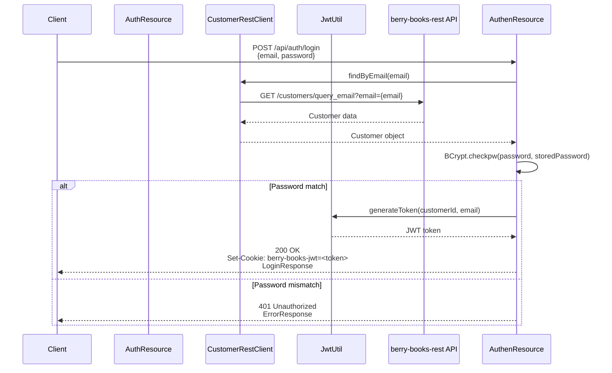
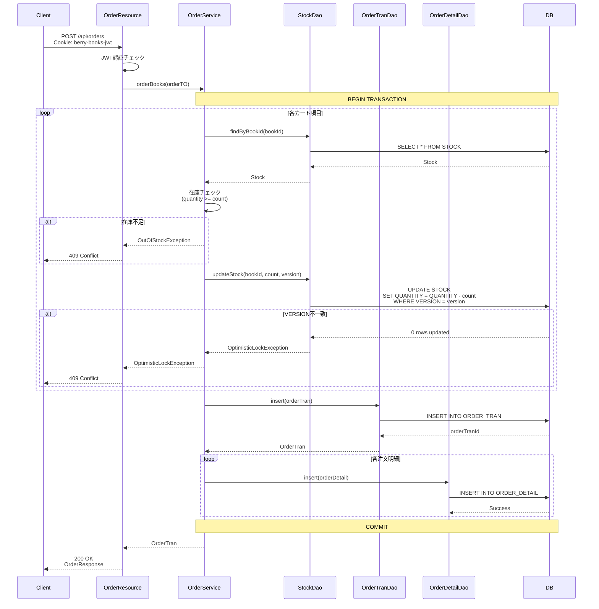
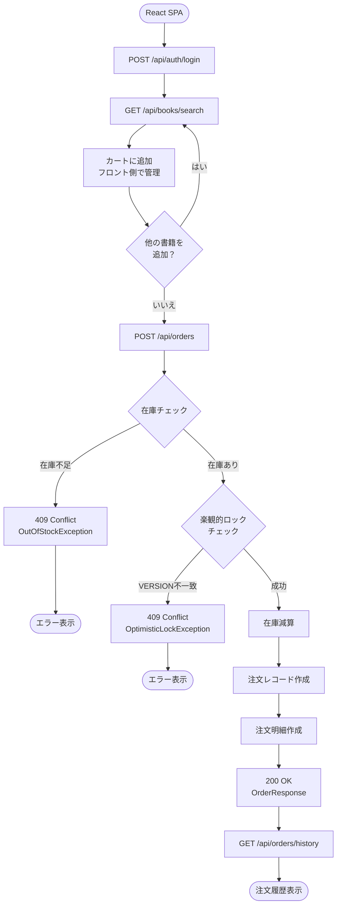

# berry-books-api - 機能設計書（API仕様）

プロジェクトID: berry-books-api  
バージョン: 2.0.0  
最終更新日: 2025-12-27  
ステータス: REST API仕様確定

---

## 1. 概要

本文書は、berry-books-api REST API（BFF）の各エンドポイントの詳細仕様を記述する。各APIについて、リクエスト/レスポンス形式、ビジネスルール、エラーハンドリングを定義する。

* ベースURL: `http://localhost:8080/berry-books-api/api`

* 認証方式: JWT（HttpOnly Cookie）

* アーキテクチャパターン: BFF（Backend for Frontend）

### 1.1 BFFパターンにおけるAPI実装方式

berry-books-apiは、フロントエンド（berry-books-spa）の唯一のエントリーポイントとして、複数のバックエンドマイクロサービスを統合します。

| API | 実装方式 | 説明 |
|-----|---------|------|
| 認証API | 独自実装 + 外部連携 | JWT生成・検証はBFF層、顧客情報はcustomer-hub-api経由 |
| 書籍API | プロキシ | back-office-apiに透過的に転送 |
| カテゴリAPI | プロキシ | back-office-apiに透過的に転送 |
| 注文API | 独自実装 + 外部連携 | 注文処理はBFF層、在庫更新はback-office-api経由 |
| 画像API | 独自実装 | WAR内リソースを直接配信 |

### 1.2 API別詳細仕様

API単位の詳細仕様は、以下のドキュメントを参照してください：

* [API_001_auth](../api/API_001_auth/functional_design.md) - 認証API（ログイン、ログアウト、新規登録、ユーザー情報取得）
* [API_002_books](../api/API_002_books/functional_design.md) - 書籍API（書籍一覧、詳細、検索、カテゴリ一覧）※プロキシ
* [API_003_orders](../api/API_003_orders/functional_design.md) - 注文API（注文作成、注文履歴、注文詳細）
* [API_004_images](../api/API_004_images/functional_design.md) - 画像API（書籍表紙画像取得）

---

## 2. 認証API (`/api/auth`)

### 2.1 ログイン

```
POST /api/auth/login
```

メールアドレスとパスワードで認証し、JWT Cookieを発行する。

* Content-Type: `application/json`
* 認証: 不要
* レスポンス: 200 OK（Set-Cookie: JWT）、401 Unauthorized

詳細仕様: [API_001_auth/openapi.yaml](../api/API_001_auth/openapi.yaml)

#### シーケンス図



---

### 2.2 ログアウト

```
POST /api/auth/logout
```

JWT Cookieを削除（MaxAge=0）してログアウトする。

* Content-Type: `application/json`
* 認証: 不要
* レスポンス: 200 OK（Set-Cookie: 削除）

詳細仕様: [API_001_auth/openapi.yaml](../api/API_001_auth/openapi.yaml)

---

### 2.3 新規登録

```
POST /api/auth/register
```

新規顧客を登録し、JWT Cookieを発行する。

* Content-Type: `application/json`
* 認証: 不要
* レスポンス: 200 OK（Set-Cookie: JWT）、409 Conflict、400 Bad Request

詳細仕様: [API_001_auth/openapi.yaml](../api/API_001_auth/openapi.yaml)

---

### 2.4 現在のログインユーザー情報取得

```
GET /api/auth/me
```

JWT Cookieから顧客情報を取得する。

* 認証: 必須（JWT Cookie）
* レスポンス: 200 OK、401 Unauthorized

詳細仕様: [API_001_auth/openapi.yaml](../api/API_001_auth/openapi.yaml)

---

## 3. 書籍API (`/api/books`)

### 3.1 書籍一覧取得

```
GET /api/books
```

全書籍を取得する。back-office-apiにプロキシ転送。

* 認証: 不要
* レスポンス: 200 OK

詳細仕様: [API_002_books/openapi.yaml](../api/API_002_books/openapi.yaml)

---

### 3.2 書籍詳細取得

```
GET /api/books/{id}
```

指定されたIDの書籍を取得する。back-office-apiにプロキシ転送。

* 認証: 不要
* レスポンス: 200 OK、404 Not Found

詳細仕様: [API_002_books/openapi.yaml](../api/API_002_books/openapi.yaml)

---

### 3.3 書籍検索

```
GET /api/books/search?categoryId={id}&keyword={keyword}
```

カテゴリIDとキーワードで書籍を検索する。back-office-apiにプロキシ転送。

* 認証: 不要
* クエリパラメータ: categoryId（オプション）、keyword（オプション）
* レスポンス: 200 OK

詳細仕様: [API_002_books/openapi.yaml](../api/API_002_books/openapi.yaml)

---

### 3.4 カテゴリ一覧取得

```
GET /api/books/categories
```

全カテゴリをMapで取得する。back-office-apiにプロキシ転送。

* 認証: 不要
* レスポンス: 200 OK

詳細仕様: [API_002_books/openapi.yaml](../api/API_002_books/openapi.yaml)

---

## 4. 注文API (`/api/orders`)

### 4.1 注文作成

```
POST /api/orders
```

カート内の書籍を注文する。在庫引き当て、在庫減算、注文レコード作成を実行する。

* Content-Type: `application/json`
* 認証: 必須（JWT Cookie）
* レスポンス: 200 OK、409 Conflict（在庫不足/楽観的ロック）、401 Unauthorized

詳細仕様: [API_003_orders/openapi.yaml](../api/API_003_orders/openapi.yaml)

#### シーケンス図



---

### 4.2 注文履歴取得

```
GET /api/orders/history
```

ログイン中の顧客の注文履歴を取得する。1注文明細=1レコードの非正規化形式。

* 認証: 必須（JWT Cookie）
* レスポンス: 200 OK、401 Unauthorized

詳細仕様: [API_003_orders/openapi.yaml](../api/API_003_orders/openapi.yaml)

---

### 4.3 注文詳細取得

```
GET /api/orders/{tranId}
```

指定された注文IDの注文詳細を取得する。

* 認証: 不要
* パスパラメータ: tranId（注文トランザクションID）
* レスポンス: 200 OK、404 Not Found

詳細仕様: [API_003_orders/openapi.yaml](../api/API_003_orders/openapi.yaml)

---

### 4.4 注文明細取得

```
GET /api/orders/{tranId}/details/{detailId}
```

指定された注文明細を取得する。

* 認証: 不要
* パスパラメータ: tranId（注文トランザクションID）、detailId（注文明細ID）
* レスポンス: 200 OK、404 Not Found

詳細仕様: [API_003_orders/openapi.yaml](../api/API_003_orders/openapi.yaml)

---

## 5. 画像API (`/api/images`)

### 5.1 書籍表紙画像取得

```
GET /api/images/covers/{bookId}
```

指定された書籍IDの表紙画像を取得する。画像が存在しない場合はフォールバック画像を返す。

* 認証: 不要
* パスパラメータ: bookId（書籍ID）
* レスポンス: 200 OK（Content-Type: image/jpeg）

詳細仕様: [API_004_images/openapi.yaml](../api/API_004_images/openapi.yaml)

---

## 6. エラーレスポンス仕様

### 6.1 HTTPステータスコード

| ステータスコード | 説明 | 例 |
|---------------|------|-----|
| 200 OK | 成功 | GET, POST成功 |
| 400 Bad Request | バリデーションエラー | 必須項目未入力、形式不正 |
| 401 Unauthorized | 認証エラー | JWT未設定、JWT無効、パスワード不一致 |
| 404 Not Found | リソースが見つからない | 書籍ID、注文IDが存在しない |
| 409 Conflict | ビジネスエラー | 在庫不足、楽観的ロック競合、メールアドレス重複 |
| 500 Internal Server Error | システムエラー | データベース接続エラー、予期しない例外 |

---

## 7. データフロー

### 7.1 注文処理全体フロー



---

## 8. バッチ処理

### 8.1 バッチ処理一覧

| バッチID | バッチ名 | 実行タイミング | 目的 | 優先度 |
|---------|---------|-------------|------|-------|
| なし | なし | - | - | - |

注意: バッチ処理の要件がない場合は、このセクションを「該当なし」として残す。

---

## 9. 参考資料

本機能設計書に関連する詳細ドキュメント：

* [requirements.md](requirements.md) - 要件定義書
* [behaviors.md](behaviors.md) - 振る舞い仕様書（受入基準）
* [architecture_design.md](architecture_design.md) - アーキテクチャ設計書
* [data_model.md](data_model.md) - データモデル仕様書
* [external_interface.md](external_interface.md) - 外部インターフェース仕様書
* [README.md](../../README.md) - プロジェクトREADME
