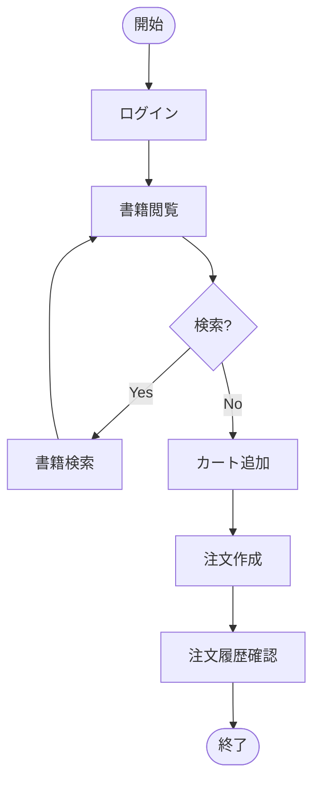
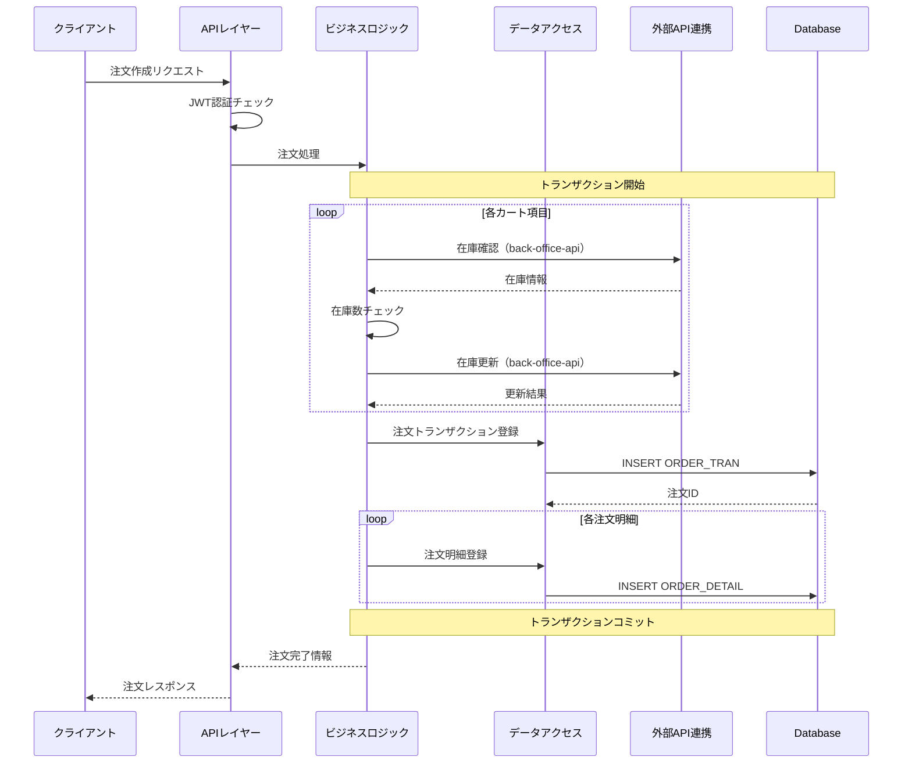

# berry-books-api - システム機能設計書

ファイル名: functional_design.md（system/配下）  
プロジェクトID: berry-books-api  
バージョン: 2.0.0  
最終更新日: 2026-01-17  
ステータス: システム機能設計確定

---

## 1. 概要

本文書は、berry-books-apiシステム全体の機能設計、共通サービス、ドメインモデルの機能設計を記述する。

* API固有の機能設計は、各api/{api_id}/functional_design.mdを参照すること
* 実装クラス設計（JPAエンティティ、Dao、共通Service等）、メソッドシグネチャ、アノテーションは詳細設計（system/detailed_design.md）で記述します

* ベースURL: `http://localhost:8080/berry-books-api/api`

* 認証方式: JWT（HttpOnly Cookie）

* アーキテクチャ: 注文管理を担う独立したバックエンドサービス

---

## 2. システムアーキテクチャ

### 2.1 システム概要

berry-books-apiは、オンライン書店の注文管理を担う独立したバックエンドサービスです。

* プライマリドメイン: 注文管理
* セカンダリドメイン: 顧客管理（外部API経由）、書籍管理（外部API経由）

### 2.2 アーキテクチャパターン

* マイクロサービスアーキテクチャ: 注文管理ドメインに特化
* 外部API統合: 書籍情報、顧客情報は外部サービスから取得
* レイヤードアーキテクチャ: プレゼンテーション層、ビジネスロジック層、データアクセス層

---

## 3. API一覧

### 3.1 API実装方式

| API ID | API名 | ベースパス | 実装方式 | 説明 | 機能設計書 |
|--------|------|----------|---------|------|----------|
| API_001 | 認証API | /api/auth | 独自実装 + 外部連携 | JWT生成・検証は本システム、顧客情報はcustomer-hub-api経由 | [API_001_auth](../api/API_001_auth/functional_design.md) |
| API_002 | 書籍API | /api/books | 外部API呼び出し | back-office-apiから書籍情報を取得 | [API_002_books](../api/API_002_books/functional_design.md) |
| API_003 | 注文API | /api/orders | 独自実装 + 外部連携 | 注文処理は本システム、在庫更新はback-office-api経由 | [API_003_orders](../api/API_003_orders/functional_design.md) |
| API_004 | 画像API | /api/images | 独自実装 | WAR内リソースを直接配信 | [API_004_images](../api/API_004_images/functional_design.md) |

注意: API固有の詳細仕様は、各APIディレクトリ配下のfunctional_design.mdを参照してください。

---

## 4. 共通機能設計

注意: API固有の機能設計は、各api/{api_id}/functional_design.mdを参照してください。

### 4.1 認証・認可

#### 4.1.1 認証方式

* 認証方式: JWT（JSON Web Token）
* トークン管理: HttpOnly Cookie
* トークン有効期限: 24時間
* アルゴリズム: HMAC-SHA256

#### 4.1.2 認証フロー

1. ログイン時にJWT生成
2. HttpOnly CookieでJWTを管理
3. 認証必須APIは、JWTフィルターで検証
4. 認証除外エンドポイント: /api/auth/login, /api/auth/logout, /api/auth/register, /api/books/*, /api/images/*

#### 4.1.3 外部連携による顧客認証

* 顧客情報は、customer-hub-api経由で取得
* パスワード照合は本システムで実施

### 4.2 ログ処理

* ログレベル: ERROR, WARN, INFO, DEBUG
* ログ出力方針: SLF4J + Log4j2
* 重要なイベント: ログイン成功/失敗、注文作成、外部API呼び出し

### 4.3 エラーハンドリング

* エラーレスポンス形式: ErrorResponse（status, error, message, path）
* 例外マッピング: Exception Mapperで統一的なエラーレスポンスを返却

---

## 5. ドメインモデル機能設計

### 5.1 注文ドメイン

#### 5.1.1 ビジネスルール

| ルールID | 説明 |
|---------|------|
| BR-ORDER-001 | 注文作成時、在庫数が注文数以上であること |
| BR-ORDER-002 | 在庫更新は楽観的ロックで並行制御すること |
| BR-ORDER-003 | 注文トランザクションと注文明細は同一トランザクション内で作成すること |
| BR-ORDER-004 | 注文履歴は、1注文明細=1レコードの非正規化形式で返却すること |

#### 5.1.2 状態遷移

* 注文状態: 注文作成（固定、ステータス管理なし）

### 5.2 顧客ドメイン（外部API経由）

* 顧客情報はcustomer-hub-api経由で取得
* 本システムでは顧客情報を永続化しない

### 5.3 書籍ドメイン（外部API経由）

* 書籍情報はback-office-api経由で取得
* 本システムでは書籍情報を永続化しない

---

## 6. システム全体のユーザーフロー

### 6.1 メインユーザーフロー



---

## 7. システム全体のデータフロー

### 7.1 注文作成フロー（論理レベル）

注意: 実装クラス名は使用していません。詳細設計書（detailed_design.md）で実装クラスを定義します。



---

## 8. エラーハンドリング

### 8.1 エラーレスポンス仕様

| ステータスコード | 説明 | 例 |
|---------------|------|-----|
| 200 OK | 成功 | GET, POST成功 |
| 400 Bad Request | バリデーションエラー | 必須項目未入力、形式不正 |
| 401 Unauthorized | 認証エラー | JWT未設定、JWT無効、パスワード不一致 |
| 404 Not Found | リソースが見つからない | 書籍ID、注文IDが存在しない |
| 409 Conflict | ビジネスエラー | 在庫不足、楽観的ロック競合、メールアドレス重複 |
| 500 Internal Server Error | システムエラー | データベース接続エラー、予期しない例外 |

### 8.2 エラーレスポンス形式

```json
{
  "status": 409,
  "error": "Conflict",
  "message": "在庫が不足しています",
  "path": "/api/orders"
}
```

---

## 9. トランザクション管理

### 9.1 トランザクション境界

| レイヤー | トランザクション境界 | 説明 |
|---------|------------------|------|
| プレゼンテーション層 | なし | トランザクションは持たない |
| ビジネスロジック層 | トランザクション境界 | Serviceクラスでトランザクション管理 |
| データアクセス層 | なし | トランザクションは持たない |

### 9.2 重要なトランザクション処理

| 処理名 | トランザクション範囲 | 並行制御 |
|--------|------------------|---------|
| 注文作成 | 在庫更新（外部API） + 注文トランザクション登録 + 注文明細登録 | 楽観的ロック（外部API側） |

---

## 10. 外部連携

### 10.1 外部システム連携一覧

| 外部システム | 連携目的 | API一覧 |
|------------|---------|---------|
| customer-hub-api | 顧客情報取得 | 顧客検索、顧客登録 |
| back-office-api | 書籍情報取得、在庫更新 | 書籍一覧、書籍詳細、書籍検索、カテゴリ一覧、在庫更新 |

詳細: [external_interface.md](external_interface.md)を参照

---

## 11. 参考資料

### 11.1 システムレベルドキュメント

* [requirements.md](requirements.md) - 要件定義書
* [architecture_design.md](architecture_design.md) - アーキテクチャ設計書
* [data_model.md](data_model.md) - データモデル仕様書
* [behaviors.md](behaviors.md) - システム振る舞い仕様書（システム統合受入基準）
* [external_interface.md](external_interface.md) - 外部インターフェース仕様書

### 11.2 API単位ドキュメント

API固有の詳細仕様は、以下のドキュメントを参照してください：

* [../api/API_001_auth/functional_design.md](../api/API_001_auth/functional_design.md) - 認証API機能設計書
* [../api/API_002_books/functional_design.md](../api/API_002_books/functional_design.md) - 書籍API機能設計書
* [../api/API_003_orders/functional_design.md](../api/API_003_orders/functional_design.md) - 注文API機能設計書
* [../api/API_004_images/functional_design.md](../api/API_004_images/functional_design.md) - 画像API機能設計書

### 11.3 プロジェクト情報

* [../../README.md](../../README.md) - プロジェクトREADME
