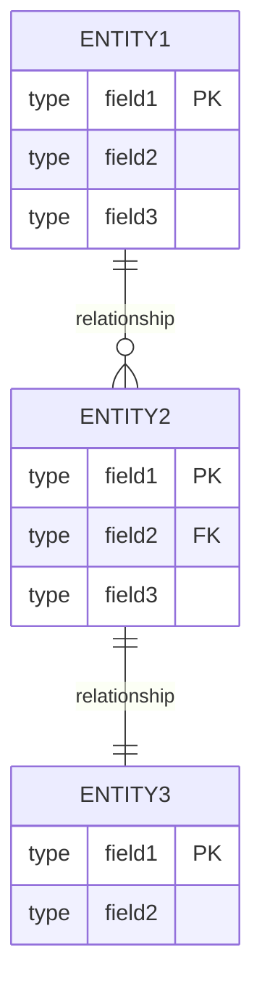
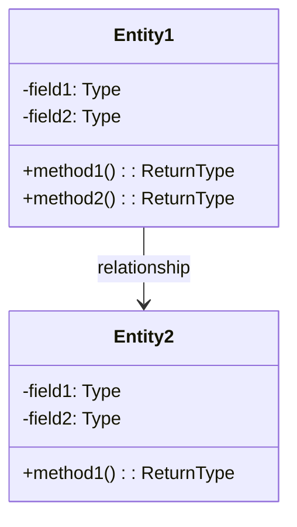

# [PROJECT_NAME] - データモデル仕様書

**プロジェクトID:** [PROJECT_ID]  
**バージョン:** 1.0.0  
**最終更新日:** [DATE]  
**ステータス:** [STATUS]

---

## 1. エンティティ関係図



---

## 2. ドメインモデル



---

## 3. テーブル定義

### 3.1 [TABLE_NAME_1] ([テーブル名])

**目的:** [テーブルの目的と説明]

| カラム | 型 | 制約 | 説明 |
|--------|------|-------------|-------------|
| [COLUMN_NAME_1] | [TYPE] | PRIMARY KEY, IDENTITY | [説明]（自動採番） |
| [COLUMN_NAME_2] | [TYPE] | NOT NULL | [説明] |
| [COLUMN_NAME_3] | [TYPE] | NULL | [説明] |

**外部キー:**
- `[COLUMN_NAME]` → `[REF_TABLE]([REF_COLUMN])`

**ビジネスルール:**
- [ルール1]
- [ルール2]

**サンプルデータ:**
```
[サンプルデータの例]
```

**インデックス:**
- PRIMARY KEY: `[COLUMN_NAME]`
- UNIQUE KEY: `[COLUMN_NAME]`
- INDEX: `[COLUMN_NAME]`

**外部キー制約:**
- `[FK_NAME]`: `[COLUMN]` → `[REF_TABLE]([REF_COLUMN])`

---

### 3.2 [TABLE_NAME_2]

[必要に応じてテーブルを追加]

---

## 4. エンティティクラス仕様

### 4.1 [ENTITY_CLASS_NAME_1]

**パッケージ:** `[package.name]`  
**クラス名:** `[ClassName]`  
**テーブルマッピング:** `[TABLE_NAME]`

**フィールド:**

| フィールド名 | 型 | アノテーション | 説明 |
|------------|-----|-------------|------|
| [fieldName1] | [Type] | @Id, @GeneratedValue | [説明] |
| [fieldName2] | [Type] | @Column(name="...") | [説明] |
| [fieldName3] | [Type] | @ManyToOne | [説明] |

**リレーションシップ:**
- `@ManyToOne`: [RelatedEntity] ([説明])
- `@OneToMany`: [RelatedEntity] ([説明])

**制約:**
- `@NotNull`
- `@Size(min=X, max=Y)`
- `@Email`

---

### 4.2 [ENTITY_CLASS_NAME_2]

[必要に応じてエンティティを追加]

---

## 5. データ整合性ルール

### 5.1 トランザクション整合性

| ルール | 説明 | 実装方法 |
|--------|------|---------|
| [RULE_1] | [DESCRIPTION] | [IMPLEMENTATION] |
| [RULE_2] | [DESCRIPTION] | [IMPLEMENTATION] |

### 5.2 参照整合性

| 関係 | カスケードルール | 説明 |
|------|--------------|------|
| [TABLE1] → [TABLE2] | [CASCADE/RESTRICT/SET NULL] | [説明] |
| [TABLE2] → [TABLE3] | [CASCADE/RESTRICT/SET NULL] | [説明] |

---

## 6. サンプルデータ（最小セット）

### 6.1 マスタデータ ([TABLE_NAME_1])

```sql
INSERT INTO [TABLE_NAME_1] ([COLUMN1], [COLUMN2]) VALUES
([VALUE1], '[VALUE2]'),
([VALUE1], '[VALUE2]'),
([VALUE1], '[VALUE2]');
```

### 6.2 テストデータ (CUSTOMER例)

```sql
INSERT INTO CUSTOMER (CUSTOMER_ID, CUSTOMER_NAME, EMAIL, PASSWORD, BIRTHDAY, ADDRESS) VALUES
(1, 'Alice', 'alice@gmail.com', 'password', '1998-04-10', '東京都中央区1-1-1'),
(2, 'Bob', 'bob@gmail.com', 'password', '1988-05-10', '東京都杉並区2-2-2');
```

### 6.3 テストデータ (BOOK例)

```sql
INSERT INTO BOOK (BOOK_ID, BOOK_NAME, AUTHOR, CATEGORY_ID, PUBLISHER_ID, PRICE) VALUES
(1, 'Java SEディープダイブ', 'Michael Johnson', 1, 3, 3400),
(9, 'SpringBoot in Cloud', 'Paul Martin', 2, 3, 3000);
```

**注記:** 詳細なサンプルデータは実際のDMLスクリプトを参照する。

---

## 7. リレーションシップカーディナリティ

| 親テーブル | 子テーブル | リレーションシップ | カーディナリティ | 外部キー |
|-----------|-----------|------------------|----------------|---------|
| [PARENT_TABLE_1] | [CHILD_TABLE_1] | [RELATIONSHIP] | [CARDINALITY] | [FK_COLUMN] |
| [PARENT_TABLE_2] | [CHILD_TABLE_2] | [RELATIONSHIP] | [CARDINALITY] | [FK_COLUMN] |

**カーディナリティの表記:**
- `1:1` - 1対1
- `1:N` - 1対多
- `N:M` - 多対多

**外部キー制約:**
- `ON DELETE CASCADE` - 親レコード削除時に子レコードも削除
- `ON DELETE SET NULL` - 親レコード削除時に外部キーをNULLに設定
- `ON DELETE RESTRICT` - 子レコードが存在する場合、親レコードの削除を拒否

---

## 8. データ整合性制約

### 8.1 一意性制約

| テーブル | カラム | 制約名 | 説明 |
|---------|--------|--------|------|
| [TABLE_1] | [COLUMN_1] | [CONSTRAINT_NAME] | [DESCRIPTION] |
| [TABLE_2] | [COLUMN_2] | [CONSTRAINT_NAME] | [DESCRIPTION] |

### 8.2 CHECK制約

| テーブル | 制約式 | 説明 |
|---------|--------|------|
| [TABLE_1] | [CHECK_EXPRESSION] | [DESCRIPTION] |
| [TABLE_2] | [CHECK_EXPRESSION] | [DESCRIPTION] |

### 8.3 NOT NULL制約

必須項目はテーブル定義のNULL許可列で「いいえ」と記載する。

### 8.4 参照整合性

全ての外部キーには参照整合性制約を定義する。

---

## 9. データアクセスパターン

### 9.1 頻出クエリパターン

| クエリID | クエリ概要 | 対象テーブル | 頻度 | インデックス |
|---------|-----------|------------|------|------------|
| Q-001 | [QUERY_DESCRIPTION] | [TABLE] | [FREQUENCY] | [INDEX] |
| Q-002 | [QUERY_DESCRIPTION] | [TABLE] | [FREQUENCY] | [INDEX] |

### 9.2 インデックス戦略

| テーブル | インデックス名 | カラム | タイプ | 目的 |
|---------|--------------|--------|--------|------|
| [TABLE_1] | [INDEX_NAME] | [COLUMNS] | [TYPE] | [PURPOSE] |
| [TABLE_2] | [INDEX_NAME] | [COLUMNS] | [TYPE] | [PURPOSE] |

**インデックスタイプ:**
- B-Tree: 範囲検索、等値検索
- Hash: 等値検索のみ
- Full-text: 全文検索

---

## 10. データ量見積もり

| テーブル | 初期データ量 | 年間増加量 | 3年後予測 | 備考 |
|---------|------------|-----------|---------|------|
| [TABLE_1] | [INITIAL] | [ANNUAL_GROWTH] | [3Y_PROJECTION] | [NOTE] |
| [TABLE_2] | [INITIAL] | [ANNUAL_GROWTH] | [3Y_PROJECTION] | [NOTE] |

**ストレージ見積もり:**
- 総データ量: [TOTAL_SIZE]
- インデックスサイズ: [INDEX_SIZE]
- バックアップサイズ: [BACKUP_SIZE]

---

## 11. データベーススキーマ進化

### 11.1 マイグレーション戦略

- **ツール:** [MIGRATION_TOOL] (例: Flyway, Liquibase)
- **バージョニング:** [VERSIONING_STRATEGY]
- **ロールバック:** [ROLLBACK_STRATEGY]

### 11.2 スキーマ変更ポリシー

- **後方互換性:** [BACKWARD_COMPATIBILITY_POLICY]
- **ダウンタイム:** [DOWNTIME_POLICY]
- **変更手順:** [CHANGE_PROCEDURE]

---

## 12. データアーカイブと保持

### 12.1 データ保持ポリシー

| データ種別 | 保持期間 | アーカイブ方法 | 削除ポリシー |
|-----------|---------|--------------|------------|
| [DATA_TYPE_1] | [RETENTION_PERIOD] | [ARCHIVE_METHOD] | [DELETION_POLICY] |
| [DATA_TYPE_2] | [RETENTION_PERIOD] | [ARCHIVE_METHOD] | [DELETION_POLICY] |

### 12.2 アーカイブ戦略

- **アーカイブトリガー:** [TRIGGER]
- **アーカイブ先:** [DESTINATION]
- **復元手順:** [RESTORE_PROCEDURE]

---

## 13. データセキュリティ考慮事項

### 13.1 機密データの保護

| データ種別 | 保護方法 | アクセス制御 |
|-----------|---------|------------|
| [DATA_TYPE_1] | [PROTECTION_METHOD] | [ACCESS_CONTROL] |
| [DATA_TYPE_2] | [PROTECTION_METHOD] | [ACCESS_CONTROL] |

### 13.2 暗号化

- **保存時暗号化:** [ENCRYPTION_AT_REST]
- **転送時暗号化:** [ENCRYPTION_IN_TRANSIT]
- **暗号化アルゴリズム:** [ALGORITHM]

---

## 14. データベースパフォーマンスチューニング

### 14.1 チューニング観点

| 観点 | 対策 | 期待効果 |
|------|------|---------|
| [ASPECT_1] | [COUNTERMEASURE] | [EXPECTED_EFFECT] |
| [ASPECT_2] | [COUNTERMEASURE] | [EXPECTED_EFFECT] |

### 14.2 モニタリング指標

- **レスポンスタイム:** [TARGET]
- **スループット:** [TARGET]
- **接続数:** [TARGET]

---

## 15. テストデータ要件

### 15.1 ユニットテストデータ

- **目的:** [PURPOSE]
- **データ量:** [VOLUME]
- **特徴:** [CHARACTERISTICS]

### 15.2 結合テストデータ

- **目的:** [PURPOSE]
- **データ量:** [VOLUME]
- **特徴:** [CHARACTERISTICS]

### 15.3 パフォーマンステストデータ

- **目的:** [PURPOSE]
- **データ量:** [VOLUME]
- **特徴:** [CHARACTERISTICS]