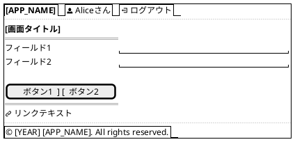
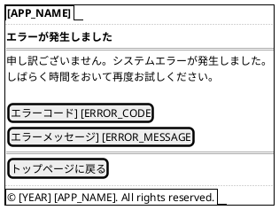

# [PROJECT_NAME] - 画面仕様書

プロジェクトID: [PROJECT_ID]  
バージョン: 1.0.0  
最終更新日: [DATE]  
フォーマット: PlantUML (draw.io インポート可能)

---

## 使用方法

### PlantUMLレンダリング
各ワイヤーフレームは PlantUML の `salt` 記法で記述されています。

* レンダリング方法：:
  1. [PlantUML Online Editor](https://www.plantuml.com/plantuml/uml/)
  2. VS Code PlantUML拡張機能
  3. draw.io（File → Import → PlantUML）

### draw.ioへのインポート
```
1. draw.ioを開く
2. File → Import from → Text
3. 以下のPlantUMLコードをコピー＆ペースト
4. 必要に応じて編集
```

---

## 画面一覧

1. [画面名1 (file1.html)](#1-画面名1)
2. [画面名2 (file2.html)](#2-画面名2)
3. [画面名3 (file3.html)](#3-画面名3)

---

## 1. 画面名1

ファイル名: `[FILENAME]`  
目的: [画面の目的]

### PlantUML



### レイアウト説明

| エリア | コンポーネント | 説明 |
|--------|--------------|------|
| ヘッダー | [COMPONENT] | [DESCRIPTION] |
| メインコンテンツ | [COMPONENT] | [DESCRIPTION] |
| フッター | [COMPONENT] | [DESCRIPTION] |

### バリデーション

* フィールド1：[検証ルール]
* フィールド2：[検証ルール]

### 画面項目定義

| 項目名 | 物理名 | 型 | 桁数 | 必須 | 入力チェック | エラーコード |
|--------|--------|-----|------|------|------------|-------------|
| [項目名1] | [物理名1] | [型] | [桁数] | ○ | [チェック内容] | VAL-001 |
| [項目名2] | [物理名2] | [型] | [桁数] | - | [チェック内容] | - |

### 画面遷移

| アクション | 遷移先 | 条件 |
|----------|--------|------|
| [ACTION] | [TARGET_SCREEN] | [CONDITION] |
| [ACTION] | [TARGET_SCREEN] | [CONDITION] |

---

## 2. 画面名2

[必要に応じて画面を追加]

---

## 3. 共通コンポーネント

### 3.1 ヘッダー

```plantuml
@startsalt
{+
  {/ <b>[APP_NAME]</b> | <&account-login> [USER_NAME] | <&power-standby> ログアウト }
}
@endsalt
```



### 3.2 ナビゲーションメニュー

```plantuml
@startsalt
{
  [メニュー1] | [メニュー2] | [メニュー3]
}
@endsalt
```



### 3.3 フッター

```plantuml
@startsalt
{+
  {/ © [YEAR] [APP_NAME]. All rights reserved. }
}
@endsalt
```



---

## 4. レスポンシブデザイン

### 4.1 デスクトップ (> 1024px)

[デスクトップレイアウトの説明]

### 4.2 タブレット (768px - 1024px)

[タブレットレイアウトの説明]

### 4.3 モバイル (< 768px)

[モバイルレイアウトの説明]

---

## 5. スタイルガイド

### 5.1 カラーパレット

| 用途 | カラーコード | 説明 |
|------|-----------|------|
| プライマリ | #[XXXXXX] | [説明] |
| セカンダリ | #[XXXXXX] | [説明] |
| アクセント | #[XXXXXX] | [説明] |
| エラー | #[XXXXXX] | [説明] |

### 5.2 タイポグラフィ

| 要素 | フォント | サイズ | 太さ |
|------|---------|--------|------|
| 見出し1 | [FONT] | [SIZE] | [WEIGHT] |
| 見出し2 | [FONT] | [SIZE] | [WEIGHT] |
| 本文 | [FONT] | [SIZE] | [WEIGHT] |

---

## 6. エラー画面

ファイル名: `error.xhtml`  
目的: システムエラー発生時の表示

### PlantUML



注記: エラー画面が不要な場合は、このセクションを「該当なし」とする。

---

## 7. レスポンシブブレークポイント

| ブレークポイント | 画面幅 | 対象デバイス | 備考 |
|----------------|--------|-------------|------|
| Desktop | 1024px以上 | PC | [NOTE] |
| Tablet | 768px - 1023px | タブレット | [NOTE] |
| Mobile | 767px以下 | スマートフォン | [NOTE] |

* レスポンシブ対応方針:
  * [RESPONSIVE_POLICY]

注記: レスポンシブ対応が不要な場合は、このセクションを「該当なし」とする。

---

## 8. アクセシビリティ要件

### 8.1 キーボードナビゲーション

* Tab キーでフォーカス移動
* Enter キーでボタン/リンク実行
* Esc キーでモーダル閉じる

### 8.2 スクリーンリーダー対応

* `alt` 属性を全画像に設定
* `aria-label` を適切に使用
* フォームラベルを明示

### 8.3 コントラスト比

* テキストと背景: 4.5:1 以上
* 大きなテキストと背景: 3:1 以上

### 8.4 WCAG準拠レベル

準拠レベル: WCAG 2.1 Level AA

注記: アクセシビリティ要件が不要な場合は、このセクションを「該当なし」とする。
