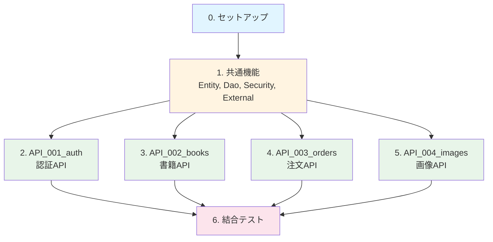

# berry-books-api-sdd - 実装タスクリスト

プロジェクトID: berry-books-api-sdd  
バージョン: 1.0.0  
最終更新日: 2026-01-18  
ステータス: タスク分解完了

---

## 全体構成と担当割り当て

### タスク概要

| タスク | タスクファイル | 担当者 | 並行実行 | 想定工数 |
|---------|--------------|--------|---------|---------|
| 0. セットアップ | setup.md | 全員 | 不可 | 2時間 |
| 1. 共通機能 | common.md | 共通機能チーム（1名） | 一部可能 | 16時間 |
| 2. API_001_auth | API_001_auth.md | 担当者A（1名） | 可能 | 12時間 |
| 3. API_002_books | API_002_books.md | 担当者B（1名） | 可能 | 6時間 |
| 4. API_003_orders | API_003_orders.md | 担当者C（1名） | 可能 | 16時間 |
| 5. API_004_images | API_004_images.md | 担当者D（1名） | 可能 | 4時間 |
| 6. 結合テスト | integration_tasks.md | 全員 | 一部可能 | 8時間 |

* 合計想定工数: 64時間

### 実行順序

1. タスク0: セットアップ（全員で実行、プロジェクト開始時に1回）
2. タスク1: 共通機能（共通機能チームが実装）
   * 注文エンティティ、Dao
   * JWT認証基盤
   * 外部API連携クライアント
   * 共通DTO、ユーティリティ
   * 例外ハンドラ
3. タスク2～5: API別実装（各担当者が並行実行）← ここが並行化のポイント
   * API_001_auth: 認証API（JWT + 外部API連携）
   * API_002_books: 書籍API（外部API呼び出し）
   * API_003_orders: 注文API（独自実装 + 外部API連携）
   * API_004_images: 画像API（静的リソース配信）
4. タスク6: 結合テスト（全員で実施、全API実装後）

### タスクファイル一覧

* [セットアップタスク](setup.md)
* [共通機能タスク](common.md)
* [API_001_auth のタスク](API_001_auth.md)
* [API_002_books のタスク](API_002_books.md)
* [API_003_orders のタスク](API_003_orders.md)
* [API_004_images のタスク](API_004_images.md)
* [結合テストタスク](integration_tasks.md)

---

## 依存関係図

---

## プロジェクト特性

### アーキテクチャパターン

* Backend Service Architecture（BFF - Backend for Frontend）
* フロントエンド（berry-books-spa）の唯一のエントリーポイント
* 複数のバックエンドサービス（back-office-api、customer-hub-api）を統合

### データ管理の分離

本システムで管理するデータ:
* 注文トランザクション（ORDER_TRAN）
* 注文明細（ORDER_DETAIL）

外部APIで管理するデータ（本システムでは管理しない）:
* 書籍・在庫・カテゴリ（back-office-api）
* 顧客情報（customer-hub-api）

### 実装パターン

#### 外部API呼び出し型
* BookResource: 書籍情報をback-office-apiから取得
* CategoryResource: カテゴリ情報をback-office-apiから取得

#### 独自ビジネスロジック実装型
* AuthenResource: JWT認証 + customer-hub-api連携
* OrderResource: 注文処理 + back-office-api在庫管理連携
* ImageResource: WAR内リソース配信

---

## 技術スタック

* Jakarta EE 10
* Payara Server 6
* JAX-RS 3.1（REST API）
* JPA 3.1（O/Rマッピング）
* CDI 4.0（依存性注入）
* Bean Validation 3.0（入力検証）
* JWT（jjwt 0.12.6）
* BCrypt（パスワードハッシュ化）
* HSQLDB 2.7.x

---

## 参考資料

### プロジェクトドキュメント

* [README.md](../README.md) - プロジェクトREADME
* [requirements.md](../specs/baseline/basic_design/requirements.md) - 要件定義書
* [architecture_design.md](../specs/baseline/basic_design/architecture_design.md) - アーキテクチャ設計書
* [functional_design.md](../specs/baseline/basic_design/functional_design.md) - 機能設計書
* [data_model.md](../specs/baseline/basic_design/data_model.md) - データモデル仕様書
* [behaviors.md](../specs/baseline/basic_design/behaviors.md) - 振る舞い仕様書
* [external_interface.md](../specs/baseline/basic_design/external_interface.md) - 外部インターフェース仕様書

### Agent Skills

* [architecture.md](../../../agent_skills/jakarta-ee-api-base/principles/architecture.md) - Jakarta EE APIアーキテクチャ標準
* [security.md](../../../agent_skills/jakarta-ee-api-base/principles/security.md) - セキュリティ標準
* [common_rules.md](../../../agent_skills/jakarta-ee-api-base/principles/common_rules.md) - 共通ルール
