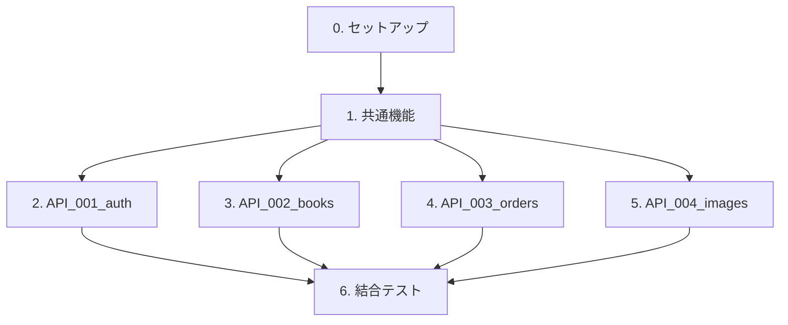

# berry-books-api-sdd - 実装タスクリスト

**プロジェクトID:** berry-books-api-sdd  
**バージョン:** 2.0.0  
**最終更新日:** 2025-01-10  
**アーキテクチャパターン:** BFF (Backend for Frontend)

---

## 全体構成と担当割り当て

### タスク概要

| タスク | タスクファイル | 担当者 | 並行実行 | 想定工数 |
|---------|--------------|--------|---------|---------|
| 0. セットアップ | [setup_tasks.md](setup_tasks.md) | 全員 | 不可 | 2時間 |
| 1. 共通機能 | [common_tasks.md](common_tasks.md) | 共通機能チーム | 一部可能 | 8時間 |
| 2. API_001_auth | [API_001_auth.md](API_001_auth.md) | 担当者A | 可能 | 6時間 |
| 3. API_002_books | [API_002_books.md](API_002_books.md) | 担当者B | 可能 | 3時間 |
| 4. API_003_orders | [API_003_orders.md](API_003_orders.md) | 担当者C | 可能 | 8時間 |
| 5. API_004_images | [API_004_images.md](API_004_images.md) | 担当者D | 可能 | 2時間 |
| 6. 結合テスト | [integration_tasks.md](integration_tasks.md) | 全員 | 一部可能 | 6時間 |

**合計想定工数:** 35時間

---

## 実行順序

1. **タスク0: セットアップ**（全員で実行）
   - プロジェクト初期化
   - データベース設定
   - アプリケーションサーバー設定

2. **タスク1: 共通機能**（共通機能チームが実装）
   - 注文エンティティ（OrderTran, OrderDetail）
   - 注文DAO
   - JWT認証基盤
   - 外部API連携クライアント（BackOfficeRestClient, CustomerHubRestClient）
   - 共通DTO・ユーティリティ
   - フィルター・例外ハンドラ

3. **タスク2～5: API別実装**（各担当者が並行実行） ← **並行化のポイント**
   - API_001_auth: JWT認証 + 顧客管理連携
   - API_002_books: プロキシパターン（back-office-api転送）
   - API_003_orders: 注文処理 + 在庫管理連携
   - API_004_images: WAR内リソース配信

4. **タスク6: 結合テスト**（全員で実施）
   - API間結合テスト
   - E2E APIテスト（REST Assured）
   - 認証・認可テスト
   - 楽観的ロックテスト

---

## タスクファイル一覧

- [setup_tasks.md](setup_tasks.md) - セットアップタスク
- [common_tasks.md](common_tasks.md) - 共通機能タスク
- [API_001_auth.md](API_001_auth.md) - 認証API
- [API_002_books.md](API_002_books.md) - 書籍API（プロキシ）
- [API_003_orders.md](API_003_orders.md) - 注文API
- [API_004_images.md](API_004_images.md) - 画像API
- [integration_tasks.md](integration_tasks.md) - 結合テストタスク

---

## 依存関係図

---

## BFFアーキテクチャ特有の注意事項

### データ管理の分離

**BFFで管理するデータ:**
- 注文トランザクション（ORDER_TRAN）
- 注文明細（ORDER_DETAIL）

**外部APIで管理するデータ（BFFでは管理しない）:**
- 書籍・在庫・カテゴリ・出版社（back-office-api）
- 顧客情報（customer-hub-api）

### 実装パターン

| API Resource | 実装パターン | 説明 |
|-------------|------------|------|
| **AuthenResource** | 独自実装 + 外部連携 | JWT生成、customer-hub-apiで認証情報取得 |
| **BookResource** | プロキシ | back-office-apiにそのまま転送、独自ロジックなし |
| **CategoryResource** | プロキシ | back-office-apiにそのまま転送、独自ロジックなし |
| **OrderResource** | 独自実装 + 外部連携 | 注文処理、back-office-apiで在庫更新 |
| **ImageResource** | 独自実装 | WAR内リソースを直接配信 |

---

## 参考資料

### 仕様書

- [requirements.md](../specs/baseline/system/requirements.md) - 要件定義書
- [architecture_design.md](../specs/baseline/system/architecture_design.md) - アーキテクチャ設計書
- [functional_design.md](../specs/baseline/system/functional_design.md) - 機能設計書
- [data_model.md](../specs/baseline/system/data_model.md) - データモデル仕様書
- [external_interface.md](../specs/baseline/system/external_interface.md) - 外部インターフェース仕様書
- [behaviors.md](../specs/baseline/system/behaviors.md) - 振る舞い仕様書

### API別仕様書

- [API_001_auth](../specs/baseline/api/API_001_auth/) - 認証API仕様
- [API_002_books](../specs/baseline/api/API_002_books/) - 書籍API仕様
- [API_003_orders](../specs/baseline/api/API_003_orders/) - 注文API仕様
- [API_004_images](../specs/baseline/api/API_004_images/) - 画像API仕様

### 開発憲章

- [@agent_skills/jakarta-ee-standard/principles/constitution.md](../../../../agent_skills/jakarta-ee-standard/principles/constitution.md) - Jakarta EE開発憲章

---

## プロジェクト情報

**プロジェクトルート:** `projects/sdd/bookstore/berry-books-api-sdd`

**技術スタック:**
- Jakarta EE 10
- JAX-RS 3.1（REST API）
- JPA 3.1（Hibernate実装）
- CDI 4.0（依存性注入）
- Bean Validation 3.0
- JWT（jjwt 0.12.6）
- BCrypt（パスワードハッシュ化）
- Payara Server 6
- HSQLDB 2.7.x

**ビルドツール:** Gradle 8.x

**テストフレームワーク:** JUnit 5 + Mockito
