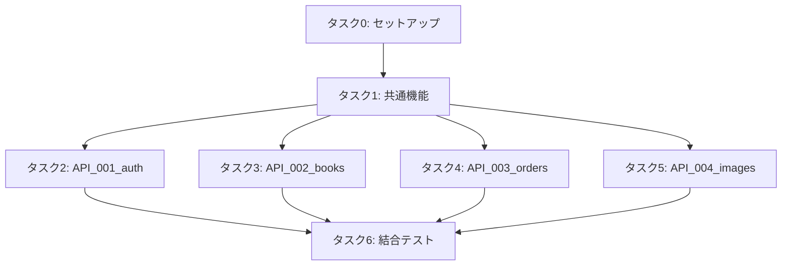

# berry-books-api-sdd - 実装タスクリスト

プロジェクトID: berry-books-api-sdd  
バージョン: 2.0.0  
最終更新日: 2026-01-17  
ステータス: タスク分解完了

---

## 全体構成と担当割り当て

### タスク概要

| タスク | タスクファイル | 担当者 | 並行実行 | 想定工数 |
|---------|--------------|--------|---------|---------|
| 0. セットアップ | [setup_tasks.md](setup_tasks.md) | 全員 | 不可 | 2時間 |
| 1. 共通機能 | [common_tasks.md](common_tasks.md) | 共通機能チーム | 一部可能 | 8時間 |
| 2. API_001_auth | [API_001_auth.md](API_001_auth.md) | 担当者A | 可能 | 6時間 |
| 3. API_002_books | [API_002_books.md](API_002_books.md) | 担当者B | 可能 | 3時間 |
| 4. API_003_orders | [API_003_orders.md](API_003_orders.md) | 担当者C | 可能 | 8時間 |
| 5. API_004_images | [API_004_images.md](API_004_images.md) | 担当者D | 可能 | 2時間 |
| 6. 結合テスト | [integration_tasks.md](integration_tasks.md) | 全員 | 一部可能 | 4時間 |

---

## 実行順序

### フェーズ1: 環境準備

1. **タスク0: セットアップ（全員で実行）**
   * プロジェクト初期化
   * データベーススキーマ作成
   * 設定ファイル作成
   * 静的リソース配置

### フェーズ2: 共通基盤構築

2. **タスク1: 共通機能（共通機能チームが実装）**
   * 注文エンティティ（OrderTran, OrderDetail）
   * 注文DAO（OrderTranDao, OrderDetailDao）
   * JWT認証基盤（JwtUtil, JwtAuthenFilter, AuthenContext）
   * 外部API連携クライアント（BackOfficeRestClient, CustomerHubRestClient）
   * 共通DTO（ErrorResponse, 外部API用DTO）
   * 共通ユーティリティ（AddressUtil, MessageUtil）
   * 例外ハンドラ（ExceptionMapper群）

### フェーズ3: API実装（並行実行可能）

3. **タスク2～5: API別実装（各担当者が並行実行）**
   * API_001_auth: JWT認証 + 外部API連携
   * API_002_books: 外部API呼び出し（パススルー）
   * API_003_orders: 注文処理 + 在庫管理連携
   * API_004_images: WAR内リソース配信

### フェーズ4: 統合テスト

4. **タスク6: 結合テスト（全員で実施）**
   * API間結合テスト
   * E2E APIテスト
   * パフォーマンステスト
   * 最終検証

---

## タスクファイル一覧

* [セットアップタスク](setup_tasks.md)
* [共通機能タスク](common_tasks.md)
* [API_001_auth タスク](API_001_auth.md)
* [API_002_books タスク](API_002_books.md)
* [API_003_orders タスク](API_003_orders.md)
* [API_004_images タスク](API_004_images.md)
* [結合テストタスク](integration_tasks.md)

---

## 依存関係図

---

## プロジェクト特性

### アーキテクチャ

* バックエンドサービスアーキテクチャ
* 注文管理ドメインを持つ独立したバックエンドサービス
* 外部API連携（back-office-api、customer-hub-api）
* JWT認証によるステートレス認証
* フロントエンド（berry-books-spa）の唯一のエントリーポイント

### データ管理の責務分担

| データ | 管理システム | 実装対象 |
|--------|------------|---------|
| 注文データ（ORDER_TRAN, ORDER_DETAIL） | berry-books-api | ✓ 実装する |
| 書籍・在庫・カテゴリ | back-office-api | ✗ 外部API連携 |
| 顧客情報 | customer-hub-api | ✗ 外部API連携 |

### 実装パターン

| API | 実装方式 | 説明 |
|-----|---------|------|
| AuthenResource | 独自実装 + 外部連携 | JWT生成・検証は本システム、顧客情報はcustomer-hub-api経由 |
| BookResource | 外部API呼び出し | back-office-apiから書籍情報を取得（パススルー） |
| CategoryResource | 外部API呼び出し | back-office-apiからカテゴリ情報を取得（パススルー） |
| OrderResource | 独自実装 + 外部連携 | 注文処理は本システム、在庫更新はback-office-api経由 |
| ImageResource | 独自実装 | WAR内リソースを直接配信 |

---

## 技術スタック

* Jakarta EE 10
* Payara Server 6
* JAX-RS (Jakarta RESTful Web Services) 3.1
* Jakarta Persistence (JPA) 3.1 - Hibernate実装
* Jakarta Transactions (JTA)
* Jakarta CDI 4.0
* Jakarta Bean Validation 3.0
* HSQLDB 2.7.x
* JWT (JSON Web Token) - jjwt 0.12.6
* BCrypt - パスワードハッシュ化
* JUnit 5, Mockito - テスト

---

## 開発ガイドライン

### コーディング規約

* Java Records: DTO、レスポンスオブジェクトで使用
* アスタリスク箇条書き: ドキュメントで統一
* ボールド不使用: 見出しレベルで構造化
* パッケージ構造: レイヤードアーキテクチャに従う

### セキュリティ標準

* JWT認証: HttpOnly Cookie
* パスワードハッシュ化: BCrypt
* Bean Validation: サーバーサイド入力検証
* SQLインジェクション対策: JPA/JPQL使用

### 品質基準

* ユニットテスト: サービス層カバレッジ80%以上
* エラーハンドリング: 統一的なErrorResponse形式
* ログ出力: SLF4J + Log4j2

---

## 参考資料

### システム仕様書

* [requirements.md](../specs/baseline/system/requirements.md) - 要件定義書
* [architecture_design.md](../specs/baseline/system/architecture_design.md) - アーキテクチャ設計書
* [functional_design.md](../specs/baseline/system/functional_design.md) - 機能設計書
* [data_model.md](../specs/baseline/system/data_model.md) - データモデル仕様書
* [external_interface.md](../specs/baseline/system/external_interface.md) - 外部インターフェース仕様書
* [behaviors.md](../specs/baseline/system/behaviors.md) - 振る舞い仕様書

### API仕様書

* [API_001_auth](../specs/baseline/api/API_001_auth/functional_design.md) - 認証API
* [API_002_books](../specs/baseline/api/API_002_books/functional_design.md) - 書籍API
* [API_003_orders](../specs/baseline/api/API_003_orders/functional_design.md) - 注文API
* [API_004_images](../specs/baseline/api/API_004_images/functional_design.md) - 画像API

### Agent Skills

* Agent Skillsルール: `agent_skills/jakarta-ee-api-base/principles/`
* 共通ルール: [common_rules.md](../../agent_skills/jakarta-ee-api-base/principles/common_rules.md)
* セキュリティ標準: [security_standard.md](../../agent_skills/jakarta-ee-api-base/principles/security_standard.md)
