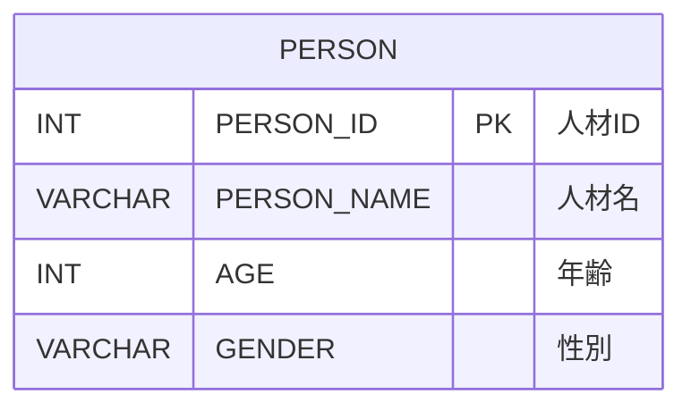

# 人材管理システム - データモデル仕様書

プロジェクトID: jsf-person-sdd  
バージョン: 1.0.0  
最終更新日: 2026-01-17  
ステータス: Struts → JSF移行対応

* 変更履歴:
  * v1.0.0 (2026-01-17): Struts → JSF移行に伴う仕様書化

---

## 1. 概要

本文書は、人材管理システム（JSF Person）のデータベーススキーマ（RDB論理設計）を記述する。

* データベース種別: HSQLDB

注意: 
* JPAエンティティクラスの設計（@Entity、@Column等のアノテーション、Javaクラス構造）は詳細設計フェーズで実施します
* データソース設定（JNDI名、接続URL、接続プール等）はarchitecture_design.mdに記載します

---

## 2. ER図

### 2.1 全体ER図



### 2.2 テーブル説明

* 本システムはPERSONテーブルのみを持つシンプルな構造
* テーブル間のリレーション（FOREIGN KEY）は存在しない
* 将来的に他のテーブル（DEPARTMENT、POSITION等）が追加される可能性がある

---

## 3. テーブル定義

### 3.1 PERSON（人材）

#### 3.1.1 テーブル概要

人材情報を管理するテーブル。

#### 3.1.2 テーブル構造

| カラム名 | データ型 | PK | FK | NN | UQ | デフォルト | 説明 |
|---------|---------|----|----|----|----|----------|------|
| PERSON_ID | INT | ✓ | | ✓ | | IDENTITY | 人材ID（自動採番） |
| PERSON_NAME | VARCHAR(30) | | | ✓ | | | 人材名 |
| AGE | INT | | | ✓ | | | 年齢 |
| GENDER | VARCHAR(10) | | | ✓ | | | 性別（male/female） |

#### 3.1.3 制約

* 主キー: PERSON_ID
* 自動採番: IDENTITY（INSERT時に自動生成）

#### 3.1.4 DDL

```sql
CREATE TABLE PERSON (
    PERSON_ID   INT GENERATED BY DEFAULT AS IDENTITY PRIMARY KEY,
    PERSON_NAME VARCHAR(30) NOT NULL,
    AGE         INT NOT NULL,
    GENDER      VARCHAR(10) NOT NULL
);
```

#### 3.1.5 初期データ

```sql
INSERT INTO PERSON (PERSON_ID, PERSON_NAME, AGE, GENDER) VALUES(1, 'Alice', 35, 'female');
INSERT INTO PERSON (PERSON_ID, PERSON_NAME, AGE, GENDER) VALUES(2, 'Bob', 20, 'male');
INSERT INTO PERSON (PERSON_ID, PERSON_NAME, AGE, GENDER) VALUES(3, 'Carol', 30, 'female');
```

* テスト用の初期データとして3件のPERSONレコードを用意
* PERSON_IDは明示的に指定しているが、新規追加時は自動採番される

---

## 4. インデックス設計

### 4.1 インデックス一覧

| テーブル | インデックス名 | カラム | タイプ | 目的 |
|---------|--------------|--------|--------|------|
| PERSON | PK_PERSON | PERSON_ID | PRIMARY KEY | 主キー |

### 4.2 検索最適化

本システムは単一テーブルで検索パターンも単純なため、主キーインデックスのみで十分。

---

## 5. データ整合性ルール

### 5.1 NOT NULL制約

* すべてのカラムがNOT NULL制約を持つ
* データベースレベルで制約を定義

### 5.2 主キー制約

* PERSON_IDがPRIMARY KEY
* 自動採番（IDENTITY列）により一意性を保証
* 重複する値が挿入されることはない

### 5.3 データ型整合性

* AGEは整数型（INT）
* GENDERは文字列型（VARCHAR）

### 5.4 アプリケーションレベルのバリデーション

* GENDERは "male" または "female" のみを許容（アプリケーションで検証）

注意: 具体的なBean Validation（@NotNull等）やJPAアノテーション（nullable = false等）の実装は詳細設計フェーズで実施します。

---

## 6. データベース設計原則

### 6.1 命名規則

* テーブル名: 英語大文字、単数形（PERSON）
* カラム名: 英語大文字、スネークケース（PERSON_NAME、PERSON_ID）
* 主キー: テーブル名 + _ID（PERSON_ID）

### 6.2 正規化

* 第1正規形: 原子性を満たす（繰り返しフィールドなし）
* 第2正規形: 部分関数従属性なし
* 第3正規形: 推移的関数従属性なし

### 6.3 拡張性

* 現在は単一のPERSONテーブルのみ
* 将来的に追加される可能性のあるテーブル:
  * DEPARTMENT（部署）
  * POSITION（役職）
  * SKILL（スキル）
  * PERSON_SKILL（人物とスキルの関連）

---

## 7. 参考資料

* [システム要件定義](requirements.md) - システム要件
* [アーキテクチャ設計書](architecture_design.md) - システム全体のアーキテクチャ
* [機能設計書](functional_design.md) - 画面遷移とコンポーネント設計
* [振る舞い仕様書](behaviors.md) - システム全体の振る舞い
