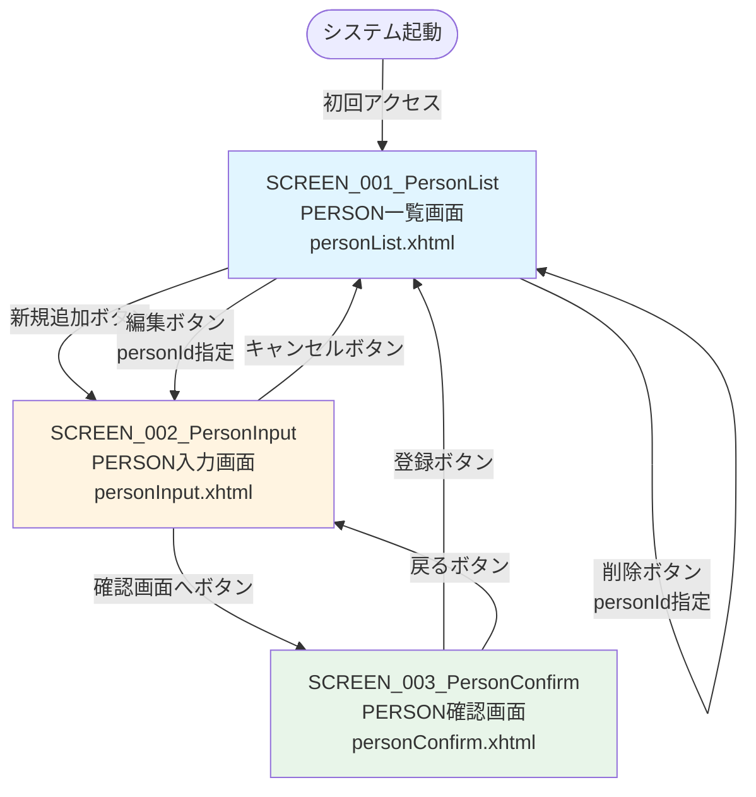
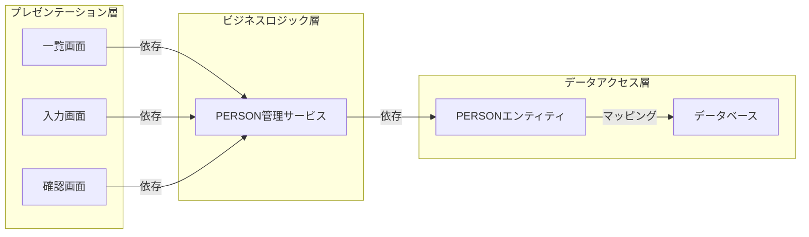

# 機能設計書

## 1. 概要

本ドキュメントは、人材管理システム（JSF Person）の機能設計（基本設計）を定義する。画面一覧、画面遷移、画面の役割と機能を記述する。

注意: 実装クラス（Managed Bean、Service、Dao等）の詳細、メソッドシグネチャ、アノテーションは詳細設計書（detailed_design.md）で記述します。

## 2. 画面一覧

### 2.1 画面リスト

* SCREEN_001_PersonList: PERSON一覧画面
  * URL: /personList.xhtml
  * 目的: 全PERSON情報を一覧表示し、追加・編集・削除のエントリーポイントを提供
  * 主要機能: 一覧表示、新規追加、編集、削除

* SCREEN_002_PersonInput: PERSON入力画面
  * URL: /personInput.xhtml
  * 目的: PERSON情報の入力または編集を行う
  * モード: 新規追加モードと編集モード
  * 主要機能: データ入力、バリデーション、確認画面への遷移

* SCREEN_003_PersonConfirm: PERSON確認画面
  * URL: /personConfirm.xhtml
  * 目的: 入力または編集されたPERSON情報を確認し、登録・更新を実行する
  * 主要機能: 入力内容確認、登録実行、入力画面への戻り

## 3. 画面遷移図

### 3.1 全体画面遷移



### 3.2 画面遷移詳細

* PERSON一覧画面（personList.xhtml）
  * → PERSON入力画面（personInput.xhtml）: 新規追加ボタンをクリック
  * → PERSON入力画面（personInput.xhtml?personId=xxx）: 編集ボタンをクリック
  * → PERSON一覧画面（personList.xhtml）: 削除ボタンをクリック（即座に削除してリロード）

* PERSON入力画面（personInput.xhtml）
  * → PERSON確認画面（personConfirm.xhtml）: 確認画面へボタンをクリック
  * → PERSON一覧画面（personList.xhtml）: キャンセルボタンをクリック

* PERSON確認画面（personConfirm.xhtml）
  * → PERSON一覧画面（personList.xhtml）: 登録ボタンをクリック（登録・更新後にリダイレクト）
  * → PERSON入力画面（personInput.xhtml）: 戻るボタンをクリック

### 3.3 画面遷移のパターン

* 通常遷移（Forward）
  * 入力画面 → 確認画面
  * データはFlash ScopeまたはView Scopeで引き継ぐ

* リダイレクト遷移（Redirect）
  * 確認画面 → 一覧画面（登録・更新後）
  * 一覧画面 → 一覧画面（削除後）
  * 戻り値に "?faces-redirect=true" を付加

* ブラウザ履歴を使用した戻る
  * 確認画面 → 入力画面（戻るボタン）
  * JavaScript: history.back()

## 4. 画面機能詳細

注意: 以下は論理レベルの記述です。実装クラス（Managed Bean、Service、Dao）の詳細は詳細設計書（detailed_design.md）を参照してください。

### 4.1 SCREEN_001_PersonList（PERSON一覧画面）

#### 4.1.1 画面の役割

全PERSON情報を一覧表示し、新規追加・編集・削除の操作を提供する。

#### 4.1.2 画面初期表示

1. 画面表示時に全PERSON情報をデータベースから取得
2. PERSON_ID昇順でソート
3. 一覧形式で表示

#### 4.1.3 主要機能

* 新規追加
  * 新規追加ボタンをクリック
  * PERSON入力画面へ遷移（新規追加モード）

* 編集
  * 各行の編集ボタンをクリック
  * 選択されたPERSON_IDをパラメータとして渡す
  * PERSON入力画面へ遷移（編集モード）

* 削除
  * 各行の削除ボタンをクリック
  * 指定されたPERSONをデータベースから削除
  * 削除後、一覧を再表示

#### 4.1.4 表示項目

* PERSON_ID（人材ID）
* PERSON_NAME（人材名）
* AGE（年齢）
* GENDER（性別）
* 操作ボタン（編集、削除）

### 4.2 SCREEN_002_PersonInput（PERSON入力画面）

#### 4.2.1 画面の役割

PERSON情報の入力または編集を行う。新規追加モードと編集モードの2つのモードをサポート。

#### 4.2.2 画面初期表示

* 編集モードの場合
  1. URLパラメータからPERSON_IDを取得
  2. 指定されたPERSON情報をデータベースから取得
  3. 取得したデータを入力フィールドに設定

* 新規追加モードの場合
  1. 全入力フィールドを空の状態で表示

#### 4.2.3 主要機能

* 入力項目
  * PERSON_NAME（人材名）: テキスト入力
  * AGE（年齢）: 数値入力
  * GENDER（性別）: ラジオボタン選択（男性/女性）

* 確認画面へ
  * 確認画面へボタンをクリック
  * 入力値をセッションまたはスコープに保存
  * PERSON確認画面へ遷移

* キャンセル
  * キャンセルボタンをクリック
  * PERSON一覧画面へリダイレクト（入力内容は破棄）

#### 4.2.4 バリデーション

* PERSON_NAME: 必須、最大50文字
* AGE: 必須、0以上150以下の整数
* GENDER: 必須、選択肢から選択

### 4.3 SCREEN_003_PersonConfirm（PERSON確認画面）

#### 4.3.1 画面の役割

入力または編集されたPERSON情報を確認し、登録・更新を実行する。

#### 4.3.2 画面初期表示

1. PERSON入力画面から渡されたデータを取得
2. 入力内容を確認用に表示
3. 編集モードか新規追加モードかを判定

#### 4.3.3 主要機能

* 確認表示項目
  * PERSON_NAME（人材名）: 読み取り専用表示
  * AGE（年齢）: 読み取り専用表示
  * GENDER（性別）: 読み取り専用表示（male→男性、female→女性に変換）

* 登録/更新
  * 登録ボタンをクリック
  * 新規追加モードの場合: データベースに新規PERSON登録
  * 編集モードの場合: 既存PERSONを更新
  * 登録/更新成功後、PERSON一覧画面へリダイレクト

* 戻る
  * 戻るボタンをクリック
  * PERSON入力画面へ戻る（入力内容は保持）
  * ブラウザの履歴を使用して戻る

#### 4.3.4 トランザクション管理

* 登録/更新処理は単一トランザクションで実行
* エラー発生時は自動ロールバック
* 成功時はコミット後に一覧画面へ遷移

## 5. 処理フロー

注意: 以下は論理レベルの処理フローです。実装クラス名やメソッド名は詳細設計書（detailed_design.md）を参照してください。

### 5.1 PERSON一覧表示フロー

```
一覧画面表示
  ↓
データベースから全PERSON取得
  ↓
PERSON_ID昇順でソート
  ↓
画面に一覧表示
```

### 5.2 PERSON追加フロー

```
一覧画面で新規追加ボタンをクリック
  ↓
入力画面表示（新規追加モード）
  ↓
PERSON情報を入力
  ↓
確認画面へボタンをクリック
  ↓
確認画面で入力内容を表示
  ↓
登録ボタンをクリック
  ↓
データベースに新規PERSON登録
  ↓
一覧画面へリダイレクト
```

### 5.3 PERSON編集フロー

```
一覧画面で編集ボタンをクリック
  ↓
PERSON_IDをパラメータとして渡す
  ↓
入力画面表示（編集モード）
  ↓
既存PERSON情報をデータベースから取得
  ↓
入力フィールドに既存データを設定
  ↓
PERSON情報を編集
  ↓
確認画面へボタンをクリック
  ↓
確認画面で編集内容を表示
  ↓
登録ボタンをクリック
  ↓
データベースの既存PERSONを更新
  ↓
一覧画面へリダイレクト
```

### 5.4 PERSON削除フロー

```
一覧画面で削除ボタンをクリック
  ↓
PERSON_IDをパラメータとして渡す
  ↓
データベースから指定PERSONを削除
  ↓
一覧を再取得
  ↓
一覧画面をリロード
```

## 6. 画面間データ受け渡し

### 6.1 データ受け渡し方式

* 一覧画面 → 入力画面（編集モード）
  * URLパラメータでPERSON_IDを渡す
  * 例: personInput.xhtml?personId=123
  * 入力画面の初期化時にPERSON_IDから既存データを取得

* 入力画面 → 確認画面
  * 入力されたPERSON情報をセッションスコープまたは画面スコープで保持
  * 確認画面で入力データを参照

* 確認画面 → 一覧画面
  * リダイレクト遷移（データ受け渡しなし）
  * 一覧画面で再度データベースからデータを取得

### 6.2 データ保持スコープ

* 画面スコープ
  * 画面単位のライフサイクル
  * 一覧画面、入力画面、確認画面で使用
  * 画面間遷移で状態を維持

* リクエストスコープ
  * リクエスト単位のライフサイクル
  * ビジネスロジック層で使用
  * ステートレス、トランザクション境界

* フラッシュスコープ
  * リダイレクト前後でデータを引き継ぐ
  * 入力画面 → 確認画面のデータ受け渡しに使用可能

## 7. バリデーション

### 7.1 入力検証ルール

* PERSON_NAME（名前）
  * 必須入力
  * 最大長: 30文字

* AGE（年齢）
  * 必須入力
  * 最小値: 0
  * 最大値: 150

* GENDER（性別）
  * 必須入力
  * 許可値: "male"（男性）または "female"（女性）

### 7.2 バリデーション実行タイミング

* クライアントサイド
  * 入力画面でリアルタイムバリデーション（オプション）
  * JavaScriptによる基本チェック

* サーバーサイド
  * 確認画面へ遷移時に実行
  * すべての入力値を検証
  * バリデーションエラー時は入力画面に戻る

### 7.3 エラーメッセージ表示

* 入力画面上部にエラーメッセージ領域を配置
* バリデーションエラー時、該当フィールドとメッセージを表示
* エラーフィールドは赤色でハイライト

## 8. アーキテクチャ概要

注意: 実装クラスの詳細は詳細設計書（detailed_design.md）を参照してください。

### 8.1 レイヤー構成



### 8.2 レイヤー間の責務

* プレゼンテーション層
  * 画面表示とユーザー操作の制御
  * 入力データのバリデーション
  * ビジネスロジック層への処理委譲

* ビジネスロジック層
  * PERSON管理のビジネスロジック
  * トランザクション管理
  * データアクセス層への処理委譲

* データアクセス層
  * データベースへのCRUD操作
  * PERSONエンティティの永続化管理

## 9. 非機能要件

### 9.1 トランザクション管理

* ビジネスロジック層でトランザクション境界を定義
* データベース操作は必ずトランザクション内で実行
* 例外発生時は自動的にロールバック
* 成功時はコミット

### 9.2 エラーハンドリング

* システムエラー
  * データベース接続エラー
  * 予期しない例外
  * エラーメッセージを画面に表示
  * ログにエラー詳細を記録

* 業務エラー
  * バリデーションエラー
  * データ不整合エラー
  * エラーメッセージを画面に表示
  * 入力画面またはエラー画面に遷移

### 9.3 ロギング

* ログ出力レベル
  * INFO: 登録・更新・削除の成功
  * WARN: バリデーションエラー、業務エラー
  * ERROR: システムエラー、予期しない例外

* ログ出力内容
  * 操作種別（追加/更新/削除）
  * 対象PERSON_ID
  * 操作日時
  * エラー詳細（エラー時）

## 10. 参考資料

* [システム要件定義](requirements.md) - システム要件
* [アーキテクチャ設計書](architecture_design.md) - システム全体のアーキテクチャ
* [データモデル](data_model.md) - データベーススキーマの詳細
* [振る舞い仕様書](behaviors.md) - システム全体の振る舞い
* [SCREEN_001_PersonList仕様](../detailed_design/screen/SCREEN_001_PersonList/screen_design.md)
* [SCREEN_002_PersonInput仕様](../detailed_design/screen/SCREEN_002_PersonInput/screen_design.md)
* [SCREEN_003_PersonConfirm仕様](../detailed_design/screen/SCREEN_003_PersonConfirm/screen_design.md)
