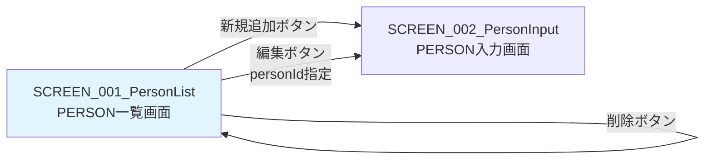
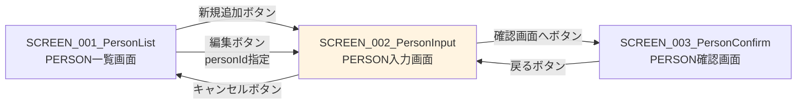
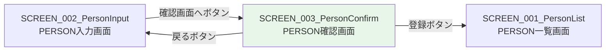

# 画面設計書

## 1. 概要

本ドキュメントは、PERSON管理システムの全画面の設計を定義する。

### 1.1 対象システム

* システム名: PERSON管理システム
* 技術スタック: Jakarta EE 10、Jakarta Faces (JSF) 4.0

### 1.2 画面一覧

| 画面ID | 画面名 | URL | 目的 |
|--------|--------|-----|------|
| SCREEN_001 | PERSON一覧画面 | /personList.xhtml | 全PERSON情報を一覧表示し、追加・編集・削除のエントリーポイントを提供 |
| SCREEN_002 | PERSON入力画面 | /personInput.xhtml | PERSON情報の入力または編集を行う |
| SCREEN_003 | PERSON確認画面 | /personConfirm.xhtml | 入力または編集されたPERSON情報を確認し、登録・更新を実行 |

---

# SCREEN_001: PERSON一覧画面

## 1. 画面概要

* 画面ID: SCREEN_001_PersonList
* 画面名: PERSON一覧画面
* URL: /personList.xhtml
* 目的: 全PERSON情報を一覧表示し、追加・編集・削除のエントリーポイントを提供する

## 2. 画面レイアウト

### 2.1 画面構成

```
+------------------------------------------------------------------+
|                      PERSON一覧                                   |
+------------------------------------------------------------------+
| [新規追加]                                                        |
+------------------------------------------------------------------+
| ID  | 名前    | 年齢 | 性別 | 操作                               |
+------------------------------------------------------------------+
| 1   | Alice   | 35   | 女性 | [編集] [削除]                      |
| 2   | Bob     | 20   | 男性 | [編集] [削除]                      |
| 3   | Carol   | 30   | 女性 | [編集] [削除]                      |
+------------------------------------------------------------------+
```

### 2.2 画面要素

* ページヘッダー
  * タイトル: "PERSON一覧"（H1見出し）

* 新規追加ボタン
  * ラベル: "新規追加"
  * 機能: PERSON入力画面に遷移（新規追加モード）
  * スタイル: button-link add クラス

* PERSONリスト表（テーブル）
  * 表示形式: HTMLテーブル（<h:dataTable>）
  * カラム:
    * ID: PERSON_ID（整数）
    * 名前: PERSON_NAME（文字列、最大30文字）
    * 年齢: AGE（整数）
    * 性別: GENDER（"男性" または "女性"）
    * 操作: 編集ボタンと削除ボタン

* 編集ボタン（各行）
  * ラベル: "編集"
  * 機能: PERSON入力画面に遷移（編集モード、personIdを指定）
  * スタイル: button-linkクラス

* 削除ボタン（各行）
  * ラベル: "削除"
  * 機能: 削除確認ダイアログを表示し、OKの場合は指定PERSONを削除
  * スタイル: button-link deleteクラス
  * JavaScript確認: "削除してもよろしいですか？"

## 3. 表示データ

### 3.1 表示項目

* personList: List<Person>
  * データソース: PersonService.getAllPersons()
  * ソート順: PERSON_ID の昇順
  * 表示件数: 全件（ページネーションなし）

### 3.2 各行の表示データ

* person.personId
  * 表示形式: 整数
  * 例: 1、2、3

* person.personName
  * 表示形式: 文字列
  * 最大長: 30文字
  * 例: "Alice"、"Bob"、"Carol"

* person.age
  * 表示形式: 整数
  * 例: 35、20、30

* person.gender
  * データベース値: "male"、"female"
  * 表示値: "男性"、"女性"
  * 変換ロジック:
    * "male" → "男性"
    * "female" → "女性"

## 4. ボタンとアクション

### 4.1 新規追加ボタン

* ボタンラベル: "新規追加"
* クリック時の動作:
  * personInput.xhtmlに遷移
  * personIdは指定しない（新規追加モード）
  * PersonInputBeanのinit()メソッドでフィールドを初期化

* 実装:

```xml
<h:link outcome="personInput" value="新規追加" styleClass="button-link add"/>
```

または

```xml
<h:commandButton value="新規追加" action="personInput"/>
```

### 4.2 編集ボタン

* ボタンラベル: "編集"
* クリック時の動作:
  * personInput.xhtml?personId=xxxに遷移
  * URLパラメータで編集対象のpersonIdを指定
  * PersonInputBeanのinit()メソッドで既存データを取得してフィールドに設定

* 実装:

```xml
<h:link outcome="personInput" value="編集" styleClass="button-link">
    <f:param name="personId" value="#{person.personId}"/>
</h:link>
```

または

```xml
<h:commandButton value="編集" action="personInput">
    <f:param name="personId" value="#{person.personId}"/>
</h:commandButton>
```

### 4.3 削除ボタン

* ボタンラベル: "削除"
* クリック時の動作:
  1. JavaScriptの削除確認ダイアログを表示: "削除してもよろしいですか？"
  2. ユーザーが「OK」をクリックした場合:
     * PersonListBean.deletePerson(personId)を呼び出す
     * PersonService.deletePerson(personId)でデータベースから削除
     * PersonListBean.init()を再度呼び出してリストを更新
     * 一覧画面を再表示
  3. ユーザーが「キャンセル」をクリックした場合:
     * 削除処理を実行しない

* 実装:

```xml
<h:commandButton value="削除" 
                 action="#{personListBean.deletePerson(person.personId)}"
                 onclick="return confirm('削除してもよろしいですか？');">
    <f:ajax execute="@form" render="@all"/>
</h:commandButton>
```

## 5. 画面遷移

### 5.1 遷移先画面

* personInput.xhtml（PERSON入力画面）
  * 新規追加ボタンから遷移
  * 編集ボタンから遷移（personIdを指定）

### 5.2 遷移元画面

* 初回アクセス: システム起動時の最初の画面
* personInput.xhtml: キャンセルボタンから戻る
* personConfirm.xhtml: 登録ボタンから戻る（リダイレクト）
* personList.xhtml: 削除ボタンから戻る（リロード）

### 5.3 遷移図



## 6. 入力項目

* 本画面には入力項目なし（表示のみ）

## 7. バリデーション

* 本画面にはバリデーションなし

## 8. エラーメッセージ

### 8.1 エラーメッセージ表示エリア

* <h:messages>コンポーネント
  * 削除処理でエラーが発生した場合にメッセージを表示
  * スタイル: error-messagesクラス

### 8.2 エラーメッセージ例

* "削除処理に失敗しました: [エラー詳細]"
  * 原因: データベースエラー、制約違反等
  * 対応: エラーメッセージを表示し、画面はそのまま

## 9. スタイルシート

### 9.1 CSSクラス

* button-link: ボタン風リンクのスタイル
* button-link add: 新規追加ボタンのスタイル（緑色背景）
* button-link delete: 削除ボタンのスタイル（赤色背景）
* error-messages: エラーメッセージのスタイル

### 9.2 CSS例

```css
.button-link {
    display: inline-block;
    padding: 8px 16px;
    background-color: #007bff;
    color: white;
    text-decoration: none;
    border-radius: 4px;
    border: none;
    cursor: pointer;
}

.button-link.add {
    background-color: #28a745;
}

.button-link.delete {
    background-color: #dc3545;
}

.error-messages {
    color: red;
    font-weight: bold;
    margin-bottom: 10px;
}

table {
    width: 100%;
    border-collapse: collapse;
    margin-top: 20px;
}

table th, table td {
    border: 1px solid #ddd;
    padding: 8px;
    text-align: left;
}

table th {
    background-color: #f2f2f2;
}
```

## 10. アクセシビリティ

### 10.1 HTML要素

* セマンティックHTML:
  * <h1>: ページタイトル
  * <table>: データテーブル
  * <th>: テーブルヘッダー
  * <td>: テーブルデータセル

### 10.2 キーボード操作

* Tabキー: ボタン間の移動
* Enterキー: ボタンのクリック

## 11. パフォーマンス

### 11.1 データ取得

* 全PERSONを一度に取得
* ページネーションなし（将来的に追加の可能性）

### 11.2 レンダリング

* <h:dataTable>でサーバー側レンダリング
* Ajaxによる部分更新（削除ボタンクリック時）

## 12. セキュリティ

### 12.1 XSS対策

* <h:outputText>は自動的にHTMLエスケープを行う
* ユーザー入力はエスケープされる

### 12.2 CSRF対策

* <h:form>は自動的にCSRFトークンを生成
* jakarta.faces.ViewState hidden field

---

# SCREEN_002: PERSON入力画面

## 1. 画面概要

* 画面ID: SCREEN_002_PersonInput
* 画面名: PERSON入力画面
* URL: /personInput.xhtml
* 目的: PERSON情報の入力または編集を行う
* モード: 新規追加モードと編集モード

## 2. 画面レイアウト

### 2.1 新規追加モード画面構成

```
+------------------------------------------------------------------+
|                      PERSON入力                                   |
+------------------------------------------------------------------+
| 名前: [                              ]  ← 入力フィールド        |
|                                                                  |
| 年齢: [          ]  ← 入力フィールド                            |
|                                                                  |
| 性別: ( ) 男性  ( ) 女性  ← ラジオボタン                         |
|                                                                  |
| [確認画面へ]  [キャンセル]                                        |
+------------------------------------------------------------------+
```

### 2.2 編集モード画面構成

```
+------------------------------------------------------------------+
|                      PERSON入力                                   |
+------------------------------------------------------------------+
| 名前: [Bob                           ]  ← 既存データプリセット  |
|                                                                  |
| 年齢: [20        ]  ← 既存データプリセット                       |
|                                                                  |
| 性別: ( ) 男性  (●) 女性  ← 既存データプリセット                |
|                                                                  |
| [確認画面へ]  [キャンセル]                                        |
+------------------------------------------------------------------+
```

### 2.3 画面要素

* ページヘッダー
  * タイトル: "PERSON入力"（H1見出し）

* エラーメッセージ表示エリア
  * <h:messages>コンポーネント
  * バリデーションエラー時に表示

* 入力フォーム（<h:form>）
  * personIdフィールド（hidden）: 編集モードの場合にpersonIdを保持
  * personNameフィールド: 名前入力テキストボックス
  * ageフィールド: 年齢入力テキストボックス
  * genderフィールド: 性別選択ラジオボタン

* 確認画面へボタン
  * ラベル: "確認画面へ"
  * 機能: 入力内容を確認画面に遷移
  * バリデーション: クリック時にBean Validationを実行

* キャンセルボタン
  * ラベル: "キャンセル"
  * 機能: 一覧画面に戻る（入力データは破棄）

## 3. 入力項目

### 3.1 personId（hidden）

* フィールド名: personId
* 型: Integer
* 表示: 非表示（<h:inputHidden>）
* 説明: 編集モードの場合にpersonIdを保持
* 新規追加モード: null
* 編集モード: 既存のpersonId（例: 2）

### 3.2 personName（名前）

* フィールド名: personName
* 型: String
* 表示: テキストボックス（<h:inputText>）
* 最大長: 30文字
* 必須: はい
* 初期値:
  * 新規追加モード: 空文字列
  * 編集モード: 既存のpersonName（例: "Bob"）

* バリデーション:
  * @NotNull: 必須チェック
  * @Size(min = 1, max = 30): 1〜30文字チェック

### 3.3 age（年齢）

* フィールド名: age
* 型: Integer
* 表示: テキストボックス（<h:inputText>）
* 必須: はい
* 初期値:
  * 新規追加モード: null
  * 編集モード: 既存のage（例: 20）

* バリデーション:
  * @NotNull: 必須チェック
  * @Min(0): 最小値0
  * @Max(150): 最大値150

### 3.4 gender（性別）

* フィールド名: gender
* 型: String
* 表示: ラジオボタン（<h:selectOneRadio>）
* 必須: はい
* 選択肢:
  * "male": 男性
  * "female": 女性
* 初期値:
  * 新規追加モード: null（選択なし）
  * 編集モード: 既存のgender（例: "male"）

* バリデーション:
  * @NotNull: 必須チェック

## 4. ボタンとアクション

### 4.1 確認画面へボタン

* ボタンラベル: "確認画面へ"
* クリック時の動作:
  1. JSFがBean Validationアノテーションを検証する
  2. バリデーションエラーがある場合:
     * 入力画面を再表示
     * <h:messages>にエラーメッセージを表示
     * 入力データは保持される
  3. バリデーションが成功した場合:
     * PersonInputBean.confirm()メソッドが実行される
     * personConfirm.xhtmlに遷移する

* 実装:

```xml
<h:commandButton value="確認画面へ" action="#{personInputBean.confirm}"/>
```

### 4.2 キャンセルボタン

* ボタンラベル: "キャンセル"
* クリック時の動作:
  * PersonInputBean.cancel()メソッドが実行される
  * personList.xhtmlにリダイレクトする
  * 入力データは破棄される

* 実装:

```xml
<h:commandButton value="キャンセル" action="#{personInputBean.cancel}" immediate="true"/>
```

* immediate="true": バリデーションをスキップ

## 5. 画面遷移

### 5.1 遷移先画面

* personConfirm.xhtml（PERSON確認画面）
  * 確認画面へボタンから遷移
  * 入力データをPersonConfirmBeanに引き継ぐ

* personList.xhtml（PERSON一覧画面）
  * キャンセルボタンから遷移（リダイレクト）

### 5.2 遷移元画面

* personList.xhtml（PERSON一覧画面）
  * 新規追加ボタンから遷移: personIdなし
  * 編集ボタンから遷移: personIdを指定

* personConfirm.xhtml（PERSON確認画面）
  * 戻るボタンから遷移（ブラウザ履歴を使用）

### 5.3 遷移図



## 6. バリデーション

### 6.1 バリデーションルール

* personName（名前）
  * 必須チェック: 空文字列またはnullは許可しない
  * 最大長チェック: 30文字以内
  * エラーメッセージ:
    * "名前を入力してください"
    * "名前は30文字以内で入力してください"

* age（年齢）
  * 必須チェック: nullは許可しない
  * 数値型チェック: 整数型（Integer）
  * 最小値チェック: 0以上
  * 最大値チェック: 150以下
  * エラーメッセージ:
    * "年齢を入力してください"
    * "年齢は数値で入力してください"
    * "年齢は0以上で入力してください"
    * "年齢は150以下で入力してください"

* gender（性別）
  * 必須チェック: nullは許可しない
  * 値チェック: "male" または "female" のみ許可
  * エラーメッセージ:
    * "性別を選択してください"

### 6.2 バリデーション実行タイミング

* 確認画面へボタンクリック時
* JSFがBean Validationアノテーションを自動的に検証

### 6.3 バリデーションエラー時の動作

* 入力画面を再表示
* <h:messages>コンポーネントにエラーメッセージを表示
* 入力データは保持される（再入力不要）
* ユーザーはエラーを修正して再度送信できる

## 7. エラーメッセージ表示

### 7.1 エラーメッセージ表示エリア

* <h:messages>コンポーネント
  * globalOnly="false": すべてのメッセージを表示
  * showSummary="true": メッセージサマリーを表示
  * showDetail="false": 詳細メッセージは非表示
  * styleClass="error-messages"

### 7.2 エラーメッセージ例

* "名前を入力してください"
* "年齢は0以上で入力してください"
* "性別を選択してください"
* "データ取得に失敗しました: [エラー詳細]"

## 8. スタイルシート

### 8.1 CSSクラス

* form-group: 入力フィールドのグループ
* button: ボタンのスタイル
* button cancel: キャンセルボタンのスタイル
* error-messages: エラーメッセージのスタイル

### 8.2 CSS例

```css
.form-group {
    margin-bottom: 15px;
}

.form-group label {
    display: inline-block;
    width: 100px;
    font-weight: bold;
}

.button {
    padding: 10px 20px;
    background-color: #007bff;
    color: white;
    border: none;
    border-radius: 4px;
    cursor: pointer;
}

.button.cancel {
    background-color: #6c757d;
}

.error-messages {
    color: red;
    font-weight: bold;
    margin-bottom: 15px;
}
```

## 9. アクセシビリティ

### 9.1 HTML要素

* セマンティックHTML:
  * <h1>: ページタイトル
  * <label>: 入力フィールドのラベル
  * <input>: 入力フィールド

### 9.2 キーボード操作

* Tabキー: フィールド間の移動
* Enterキー: ボタンのクリック（フォーム送信）

## 10. パフォーマンス

### 10.1 データ取得（編集モード）

* 1回のSELECT文で既存データを取得
* em.find(Person.class, personId)

### 10.2 バリデーション

* クライアント側バリデーション: オプション（HTML5 required属性）
* サーバー側バリデーション: Bean Validation（必須）

## 11. セキュリティ

### 11.1 XSS対策

* <h:inputText>は自動的にHTMLエスケープを行う

### 11.2 CSRF対策

* <h:form>は自動的にCSRFトークンを生成

---

# SCREEN_003: PERSON確認画面

## 1. 画面概要

* 画面ID: SCREEN_003_PersonConfirm
* 画面名: PERSON確認画面
* URL: /personConfirm.xhtml
* 目的: 入力または編集されたPERSON情報を確認し、登録・更新を実行する

## 2. 画面レイアウト

### 2.1 画面構成

```
+------------------------------------------------------------------+
|                      PERSON確認                                   |
+------------------------------------------------------------------+
| 名前: David                                                      |
|                                                                  |
| 年齢: 25                                                         |
|                                                                  |
| 性別: 男性                                                       |
|                                                                  |
| [登録]  [戻る]                                                   |
+------------------------------------------------------------------+
```

### 2.2 画面要素

* ページヘッダー
  * タイトル: "PERSON確認"（H1見出し）

* 確認情報表示エリア
  * 名前: 入力された名前を表示
  * 年齢: 入力された年齢を表示
  * 性別: 入力された性別を表示（"男性" または "女性"）

* hiddenフィールド（<h:form>内）
  * personId: 編集モードの場合にpersonIdを保持
  * personName: 登録・更新のために値を保持
  * age: 登録・更新のために値を保持
  * gender: 登録・更新のために値を保持

* 登録ボタン
  * ラベル: "登録"
  * 機能: データベースに登録または更新し、一覧画面に遷移

* 戻るボタン
  * ラベル: "戻る"
  * 機能: 入力画面に戻る（ブラウザ履歴を使用）

## 3. 表示データ

### 3.1 表示項目

* personName
  * 型: String
  * 表示形式: 文字列
  * 例: "David"、"Alice"、"Bob"

* age
  * 型: Integer
  * 表示形式: 整数
  * 例: 25、35、20

* gender
  * データベース値: "male"、"female"
  * 表示値: "男性"、"女性"
  * 変換ロジック:
    * "male" → "男性"
    * "female" → "女性"

## 4. ボタンとアクション

### 4.1 登録ボタン

* ボタンラベル: "登録"
* クリック時の動作:
  1. PersonConfirmBean.save()メソッドが実行される
  2. Personオブジェクトを作成し、hiddenフィールドの値を設定する
  3. personIdがnullの場合（新規追加）:
     * PersonService.addPerson(person)を呼び出す
     * EntityManager.persist(person)でデータベースに登録
  4. personIdがnull以外の場合（更新）:
     * PersonService.updatePerson(person)を呼び出す
     * EntityManager.merge(person)でデータベースを更新
  5. トランザクションがコミットされ、INSERT/UPDATEが実行される
  6. personList.xhtmlにリダイレクトする

* 実装:

```xml
<h:commandButton value="登録" action="#{personConfirmBean.save}"/>
```

### 4.2 戻るボタン

* ボタンラベル: "戻る"
* クリック時の動作:
  * JavaScriptのhistory.back()が実行される
  * ブラウザ履歴を使用して入力画面に戻る
  * 入力データは保持される（@ViewScopedのため）

* 実装:

```xml
<h:button value="戻る" onclick="history.back(); return false;" styleClass="button back"/>
```

または

```xml
<input type="button" value="戻る" onclick="history.back();" class="button back"/>
```

## 5. 画面遷移

### 5.1 遷移先画面

* personList.xhtml（PERSON一覧画面）
  * 登録ボタンから遷移（リダイレクト）
  * 登録・更新が完了した後に遷移

### 5.2 遷移元画面

* personInput.xhtml（PERSON入力画面）
  * 確認画面へボタンから遷移（通常遷移）
  * 入力データをPersonConfirmBeanに引き継ぐ

### 5.3 遷移図



## 6. 入力項目

### 6.1 hiddenフィールド

* personId（hidden）
  * フィールド名: personId
  * 型: Integer
  * 表示: 非表示（<h:inputHidden>）
  * 説明: 編集モードの場合にpersonIdを保持

* personName（hidden）
  * フィールド名: personName
  * 型: String
  * 表示: 非表示（<h:inputHidden>）
  * 説明: 登録・更新のために値を保持

* age（hidden）
  * フィールド名: age
  * 型: Integer
  * 表示: 非表示（<h:inputHidden>）
  * 説明: 登録・更新のために値を保持

* gender（hidden）
  * フィールド名: gender
  * 型: String
  * 表示: 非表示（<h:inputHidden>）
  * 説明: 登録・更新のために値を保持

## 7. バリデーション

* 本画面ではバリデーションなし（入力画面で既に実行済み）

## 8. エラーメッセージ

### 8.1 エラーメッセージ表示エリア

* <h:messages>コンポーネント
  * 登録・更新処理でエラーが発生した場合にメッセージを表示
  * スタイル: error-messagesクラス

### 8.2 エラーメッセージ例

* "登録処理に失敗しました: [エラー詳細]"
  * 原因: データベースエラー、制約違反等
  * 対応: エラーメッセージを表示し、確認画面はそのまま

## 9. スタイルシート

### 9.1 CSSクラス

* info-group: 確認情報のグループ
* button: ボタンのスタイル
* button back: 戻るボタンのスタイル
* error-messages: エラーメッセージのスタイル

### 9.2 CSS例

```css
.info-group {
    margin-bottom: 15px;
}

.info-group label {
    display: inline-block;
    width: 100px;
    font-weight: bold;
}

.button {
    padding: 10px 20px;
    background-color: #007bff;
    color: white;
    border: none;
    border-radius: 4px;
    cursor: pointer;
}

.button.back {
    background-color: #6c757d;
}

.error-messages {
    color: red;
    font-weight: bold;
    margin-bottom: 15px;
}
```

## 10. アクセシビリティ

### 10.1 HTML要素

* セマンティックHTML:
  * <h1>: ページタイトル
  * <label>: 確認項目のラベル
  * <div>: 確認情報のコンテナ

### 10.2 キーボード操作

* Tabキー: ボタン間の移動
* Enterキー: ボタンのクリック

## 11. パフォーマンス

### 11.1 データ登録・更新

* 1回のINSERTまたはUPDATE文
* トランザクション: 短時間のトランザクション

## 12. セキュリティ

### 12.1 XSS対策

* <h:outputText>は自動的にHTMLエスケープを行う

### 12.2 CSRF対策

* <h:form>は自動的にCSRFトークンを生成

---

## 13. 参考資料

* [システム要件定義](requirements.md)
* [機能設計書](functional_design.md)
* [データモデル](data_model.md)
* [アーキテクチャ設計書](architecture_design.md)
* [システム振る舞い仕様書](behaviors.md)
