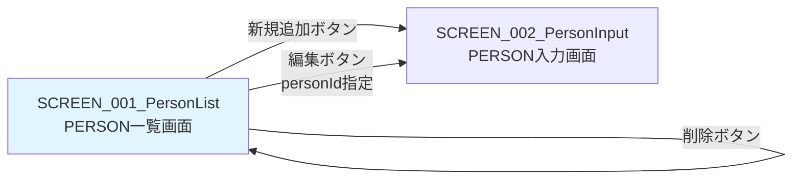

# 画面設計書 - SCREEN_001_PersonList

## 1. 画面概要

* 画面ID: SCREEN_001_PersonList
* 画面名: PERSON一覧画面
* URL: /personList.xhtml
* 目的: 全PERSON情報を一覧表示し、追加・編集・削除のエントリーポイントを提供する

## 2. 画面レイアウト

### 2.1 画面構成

```
+------------------------------------------------------------------+
|                      PERSON一覧                                   |
+------------------------------------------------------------------+
| [新規追加]                                                        |
+------------------------------------------------------------------+
| ID  | 名前    | 年齢 | 性別 | 操作                               |
+------------------------------------------------------------------+
| 1   | Alice   | 35   | 女性 | [編集] [削除]                      |
| 2   | Bob     | 20   | 男性 | [編集] [削除]                      |
| 3   | Carol   | 30   | 女性 | [編集] [削除]                      |
+------------------------------------------------------------------+
```

### 2.2 画面要素

* ページヘッダー
  * タイトル: "PERSON一覧"（H1見出し）

* 新規追加ボタン
  * ラベル: "新規追加"
  * 機能: PERSON入力画面に遷移（新規追加モード）
  * スタイル: button-link add クラス

* PERSONリスト表（テーブル）
  * 表示形式: HTMLテーブル（<h:dataTable>）
  * カラム:
    * ID: PERSON_ID（整数）
    * 名前: PERSON_NAME（文字列、最大30文字）
    * 年齢: AGE（整数）
    * 性別: GENDER（"男性" または "女性"）
    * 操作: 編集ボタンと削除ボタン

* 編集ボタン（各行）
  * ラベル: "編集"
  * 機能: PERSON入力画面に遷移（編集モード、personIdを指定）
  * スタイル: button-linkクラス

* 削除ボタン（各行）
  * ラベル: "削除"
  * 機能: 削除確認ダイアログを表示し、OKの場合は指定PERSONを削除
  * スタイル: button-link deleteクラス
  * JavaScript確認: "削除してもよろしいですか？"

## 3. 表示データ

### 3.1 表示項目

* personList: List<Person>
  * データソース: PersonService.getAllPersons()
  * ソート順: PERSON_ID の昇順
  * 表示件数: 全件（ページネーションなし）

### 3.2 各行の表示データ

* person.personId
  * 表示形式: 整数
  * 例: 1、2、3

* person.personName
  * 表示形式: 文字列
  * 最大長: 30文字
  * 例: "Alice"、"Bob"、"Carol"

* person.age
  * 表示形式: 整数
  * 例: 35、20、30

* person.gender
  * データベース値: "male"、"female"
  * 表示値: "男性"、"女性"
  * 変換ロジック:
    * "male" → "男性"
    * "female" → "女性"

## 4. ボタンとアクション

### 4.1 新規追加ボタン

* ボタンラベル: "新規追加"
* クリック時の動作:
  * personInput.xhtmlに遷移
  * personIdは指定しない（新規追加モード）
  * PersonInputBeanのinit()メソッドでフィールドを初期化

* 実装:

```xml
<h:link outcome="personInput" value="新規追加" styleClass="button-link add"/>
```

または

```xml
<h:commandButton value="新規追加" action="personInput"/>
```

### 4.2 編集ボタン

* ボタンラベル: "編集"
* クリック時の動作:
  * personInput.xhtml?personId=xxxに遷移
  * URLパラメータで編集対象のpersonIdを指定
  * PersonInputBeanのinit()メソッドで既存データを取得してフィールドに設定

* 実装:

```xml
<h:link outcome="personInput" value="編集" styleClass="button-link">
    <f:param name="personId" value="#{person.personId}"/>
</h:link>
```

または

```xml
<h:commandButton value="編集" action="personInput">
    <f:param name="personId" value="#{person.personId}"/>
</h:commandButton>
```

### 4.3 削除ボタン

* ボタンラベル: "削除"
* クリック時の動作:
  1. JavaScriptの削除確認ダイアログを表示: "削除してもよろしいですか？"
  2. ユーザーが「OK」をクリックした場合:
     * PersonListBean.deletePerson(personId)を呼び出す
     * PersonService.deletePerson(personId)でデータベースから削除
     * PersonListBean.init()を再度呼び出してリストを更新
     * 一覧画面を再表示
  3. ユーザーが「キャンセル」をクリックした場合:
     * 削除処理を実行しない

* 実装:

```xml
<h:commandButton value="削除" 
                 action="#{personListBean.deletePerson(person.personId)}"
                 onclick="return confirm('削除してもよろしいですか？');">
    <f:ajax execute="@form" render="@all"/>
</h:commandButton>
```

## 5. 画面遷移

### 5.1 遷移先画面

* personInput.xhtml（PERSON入力画面）
  * 新規追加ボタンから遷移
  * 編集ボタンから遷移（personIdを指定）

### 5.2 遷移元画面

* 初回アクセス: システム起動時の最初の画面
* personInput.xhtml: キャンセルボタンから戻る
* personConfirm.xhtml: 登録ボタンから戻る（リダイレクト）
* personList.xhtml: 削除ボタンから戻る（リロード）

### 5.3 遷移図



## 6. 入力項目

* 本画面には入力項目なし（表示のみ）

## 7. バリデーション

* 本画面にはバリデーションなし

## 8. エラーメッセージ

### 8.1 エラーメッセージ表示エリア

* <h:messages>コンポーネント
  * 削除処理でエラーが発生した場合にメッセージを表示
  * スタイル: error-messagesクラス

### 8.2 エラーメッセージ例

* "削除処理に失敗しました: [エラー詳細]"
  * 原因: データベースエラー、制約違反等
  * 対応: エラーメッセージを表示し、画面はそのまま

## 9. スタイルシート

### 9.1 CSSクラス

* button-link: ボタン風リンクのスタイル
* button-link add: 新規追加ボタンのスタイル（緑色背景）
* button-link delete: 削除ボタンのスタイル（赤色背景）
* error-messages: エラーメッセージのスタイル

### 9.2 CSS例

```css
.button-link {
    display: inline-block;
    padding: 8px 16px;
    background-color: #007bff;
    color: white;
    text-decoration: none;
    border-radius: 4px;
    border: none;
    cursor: pointer;
}

.button-link.add {
    background-color: #28a745;
}

.button-link.delete {
    background-color: #dc3545;
}

.error-messages {
    color: red;
    font-weight: bold;
    margin-bottom: 10px;
}

table {
    width: 100%;
    border-collapse: collapse;
    margin-top: 20px;
}

table th, table td {
    border: 1px solid #ddd;
    padding: 8px;
    text-align: left;
}

table th {
    background-color: #f2f2f2;
}
```

## 10. アクセシビリティ

### 10.1 HTML要素

* セマンティックHTML:
  * <h1>: ページタイトル
  * <table>: データテーブル
  * <th>: テーブルヘッダー
  * <td>: テーブルデータセル

### 10.2 キーボード操作

* Tabキー: ボタン間の移動
* Enterキー: ボタンのクリック

## 11. パフォーマンス

### 11.1 データ取得

* 全PERSONを一度に取得
* ページネーションなし（将来的に追加の可能性）

### 11.2 レンダリング

* <h:dataTable>でサーバー側レンダリング
* Ajaxによる部分更新（削除ボタンクリック時）

## 12. セキュリティ

### 12.1 XSS対策

* <h:outputText>は自動的にHTMLエスケープを行う
* ユーザー入力はエスケープされる

### 12.2 CSRF対策

* <h:form>は自動的にCSRFトークンを生成
* jakarta.faces.ViewState hidden field

## 13. 参考資料

* [システム要件定義](../../system/requirements.md)
* [機能設計書](../../system/functional_design.md)
* [データモデル](../../system/data_model.md)
* [SCREEN_001_PersonList機能設計](functional_design.md)
* [SCREEN_001_PersonList振る舞い仕様](behaviors.md)
