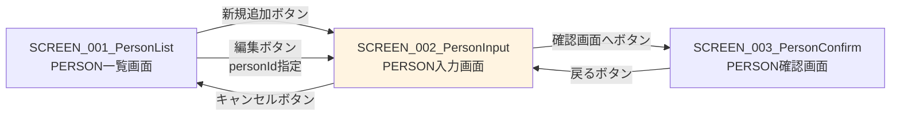

# 画面設計書 - SCREEN_002_PersonInput

## 1. 画面概要

* 画面ID: SCREEN_002_PersonInput
* 画面名: PERSON入力画面
* URL: /personInput.xhtml
* 目的: PERSON情報の入力または編集を行う
* モード: 新規追加モードと編集モード

## 2. 画面レイアウト

### 2.1 新規追加モード画面構成

```
+------------------------------------------------------------------+
|                      PERSON入力                                   |
+------------------------------------------------------------------+
| 名前: [                              ]  ← 入力フィールド        |
|                                                                  |
| 年齢: [          ]  ← 入力フィールド                            |
|                                                                  |
| 性別: ( ) 男性  ( ) 女性  ← ラジオボタン                         |
|                                                                  |
| [確認画面へ]  [キャンセル]                                        |
+------------------------------------------------------------------+
```

### 2.2 編集モード画面構成

```
+------------------------------------------------------------------+
|                      PERSON入力                                   |
+------------------------------------------------------------------+
| 名前: [Bob                           ]  ← 既存データプリセット  |
|                                                                  |
| 年齢: [20        ]  ← 既存データプリセット                       |
|                                                                  |
| 性別: ( ) 男性  (●) 女性  ← 既存データプリセット                |
|                                                                  |
| [確認画面へ]  [キャンセル]                                        |
+------------------------------------------------------------------+
```

### 2.3 画面要素

* ページヘッダー
  * タイトル: "PERSON入力"（H1見出し）

* エラーメッセージ表示エリア
  * <h:messages>コンポーネント
  * バリデーションエラー時に表示

* 入力フォーム（<h:form>）
  * personIdフィールド（hidden）: 編集モードの場合にpersonIdを保持
  * personNameフィールド: 名前入力テキストボックス
  * ageフィールド: 年齢入力テキストボックス
  * genderフィールド: 性別選択ラジオボタン

* 確認画面へボタン
  * ラベル: "確認画面へ"
  * 機能: 入力内容を確認画面に遷移
  * バリデーション: クリック時にBean Validationを実行

* キャンセルボタン
  * ラベル: "キャンセル"
  * 機能: 一覧画面に戻る（入力データは破棄）

## 3. 入力項目

### 3.1 personId（hidden）

* フィールド名: personId
* 型: Integer
* 表示: 非表示（<h:inputHidden>）
* 説明: 編集モードの場合にpersonIdを保持
* 新規追加モード: null
* 編集モード: 既存のpersonId（例: 2）

### 3.2 personName（名前）

* フィールド名: personName
* 型: String
* 表示: テキストボックス（<h:inputText>）
* 最大長: 30文字
* 必須: はい
* 初期値:
  * 新規追加モード: 空文字列
  * 編集モード: 既存のpersonName（例: "Bob"）

* バリデーション:
  * @NotNull: 必須チェック
  * @Size(min = 1, max = 30): 1〜30文字チェック

### 3.3 age（年齢）

* フィールド名: age
* 型: Integer
* 表示: テキストボックス（<h:inputText>）
* 必須: はい
* 初期値:
  * 新規追加モード: null
  * 編集モード: 既存のage（例: 20）

* バリデーション:
  * @NotNull: 必須チェック
  * @Min(0): 最小値0
  * @Max(150): 最大値150

### 3.4 gender（性別）

* フィールド名: gender
* 型: String
* 表示: ラジオボタン（<h:selectOneRadio>）
* 必須: はい
* 選択肢:
  * "male": 男性
  * "female": 女性
* 初期値:
  * 新規追加モード: null（選択なし）
  * 編集モード: 既存のgender（例: "male"）

* バリデーション:
  * @NotNull: 必須チェック

## 4. ボタンとアクション

### 4.1 確認画面へボタン

* ボタンラベル: "確認画面へ"
* クリック時の動作:
  1. JSFがBean Validationアノテーションを検証する
  2. バリデーションエラーがある場合:
     * 入力画面を再表示
     * <h:messages>にエラーメッセージを表示
     * 入力データは保持される
  3. バリデーションが成功した場合:
     * PersonInputBean.confirm()メソッドが実行される
     * personConfirm.xhtmlに遷移する

* 実装:

```xml
<h:commandButton value="確認画面へ" action="#{personInputBean.confirm}"/>
```

### 4.2 キャンセルボタン

* ボタンラベル: "キャンセル"
* クリック時の動作:
  * PersonInputBean.cancel()メソッドが実行される
  * personList.xhtmlにリダイレクトする
  * 入力データは破棄される

* 実装:

```xml
<h:commandButton value="キャンセル" action="#{personInputBean.cancel}" immediate="true"/>
```

* immediate="true": バリデーションをスキップ

## 5. 画面遷移

### 5.1 遷移先画面

* personConfirm.xhtml（PERSON確認画面）
  * 確認画面へボタンから遷移
  * 入力データをPersonConfirmBeanに引き継ぐ

* personList.xhtml（PERSON一覧画面）
  * キャンセルボタンから遷移（リダイレクト）

### 5.2 遷移元画面

* personList.xhtml（PERSON一覧画面）
  * 新規追加ボタンから遷移: personIdなし
  * 編集ボタンから遷移: personIdを指定

* personConfirm.xhtml（PERSON確認画面）
  * 戻るボタンから遷移（ブラウザ履歴を使用）

### 5.3 遷移図



## 6. バリデーション

### 6.1 バリデーションルール

* personName（名前）
  * 必須チェック: 空文字列またはnullは許可しない
  * 最大長チェック: 30文字以内
  * エラーメッセージ:
    * "名前を入力してください"
    * "名前は30文字以内で入力してください"

* age（年齢）
  * 必須チェック: nullは許可しない
  * 数値型チェック: 整数型（Integer）
  * 最小値チェック: 0以上
  * 最大値チェック: 150以下
  * エラーメッセージ:
    * "年齢を入力してください"
    * "年齢は数値で入力してください"
    * "年齢は0以上で入力してください"
    * "年齢は150以下で入力してください"

* gender（性別）
  * 必須チェック: nullは許可しない
  * 値チェック: "male" または "female" のみ許可
  * エラーメッセージ:
    * "性別を選択してください"

### 6.2 バリデーション実行タイミング

* 確認画面へボタンクリック時
* JSFがBean Validationアノテーションを自動的に検証

### 6.3 バリデーションエラー時の動作

* 入力画面を再表示
* <h:messages>コンポーネントにエラーメッセージを表示
* 入力データは保持される（再入力不要）
* ユーザーはエラーを修正して再度送信できる

## 7. エラーメッセージ表示

### 7.1 エラーメッセージ表示エリア

* <h:messages>コンポーネント
  * globalOnly="false": すべてのメッセージを表示
  * showSummary="true": メッセージサマリーを表示
  * showDetail="false": 詳細メッセージは非表示
  * styleClass="error-messages"

### 7.2 エラーメッセージ例

* "名前を入力してください"
* "年齢は0以上で入力してください"
* "性別を選択してください"
* "データ取得に失敗しました: [エラー詳細]"

## 8. スタイルシート

### 8.1 CSSクラス

* form-group: 入力フィールドのグループ
* button: ボタンのスタイル
* button cancel: キャンセルボタンのスタイル
* error-messages: エラーメッセージのスタイル

### 8.2 CSS例

```css
.form-group {
    margin-bottom: 15px;
}

.form-group label {
    display: inline-block;
    width: 100px;
    font-weight: bold;
}

.button {
    padding: 10px 20px;
    background-color: #007bff;
    color: white;
    border: none;
    border-radius: 4px;
    cursor: pointer;
}

.button.cancel {
    background-color: #6c757d;
}

.error-messages {
    color: red;
    font-weight: bold;
    margin-bottom: 15px;
}
```

## 9. アクセシビリティ

### 9.1 HTML要素

* セマンティックHTML:
  * <h1>: ページタイトル
  * <label>: 入力フィールドのラベル
  * <input>: 入力フィールド

### 9.2 キーボード操作

* Tabキー: フィールド間の移動
* Enterキー: ボタンのクリック（フォーム送信）

## 10. パフォーマンス

### 10.1 データ取得（編集モード）

* 1回のSELECT文で既存データを取得
* em.find(Person.class, personId)

### 10.2 バリデーション

* クライアント側バリデーション: オプション（HTML5 required属性）
* サーバー側バリデーション: Bean Validation（必須）

## 11. セキュリティ

### 11.1 XSS対策

* <h:inputText>は自動的にHTMLエスケープを行う

### 11.2 CSRF対策

* <h:form>は自動的にCSRFトークンを生成

## 12. 参考資料

* [システム要件定義](../../system/requirements.md)
* [機能設計書](../../system/functional_design.md)
* [データモデル](../../system/data_model.md)
* [SCREEN_002_PersonInput機能設計](functional_design.md)
* [SCREEN_002_PersonInput振る舞い仕様](behaviors.md)
