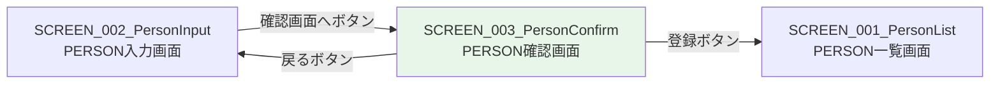

# 画面設計書 - SCREEN_003_PersonConfirm

## 1. 画面概要

* 画面ID: SCREEN_003_PersonConfirm
* 画面名: PERSON確認画面
* URL: /personConfirm.xhtml
* 目的: 入力または編集されたPERSON情報を確認し、登録・更新を実行する

## 2. 画面レイアウト

### 2.1 画面構成

```
+------------------------------------------------------------------+
|                      PERSON確認                                   |
+------------------------------------------------------------------+
| 名前: David                                                      |
|                                                                  |
| 年齢: 25                                                         |
|                                                                  |
| 性別: 男性                                                       |
|                                                                  |
| [登録]  [戻る]                                                   |
+------------------------------------------------------------------+
```

### 2.2 画面要素

* ページヘッダー
  * タイトル: "PERSON確認"（H1見出し）

* 確認情報表示エリア
  * 名前: 入力された名前を表示
  * 年齢: 入力された年齢を表示
  * 性別: 入力された性別を表示（"男性" または "女性"）

* hiddenフィールド（<h:form>内）
  * personId: 編集モードの場合にpersonIdを保持
  * personName: 登録・更新のために値を保持
  * age: 登録・更新のために値を保持
  * gender: 登録・更新のために値を保持

* 登録ボタン
  * ラベル: "登録"
  * 機能: データベースに登録または更新し、一覧画面に遷移

* 戻るボタン
  * ラベル: "戻る"
  * 機能: 入力画面に戻る（ブラウザ履歴を使用）

## 3. 表示データ

### 3.1 表示項目

* personName
  * 型: String
  * 表示形式: 文字列
  * 例: "David"、"Alice"、"Bob"

* age
  * 型: Integer
  * 表示形式: 整数
  * 例: 25、35、20

* gender
  * データベース値: "male"、"female"
  * 表示値: "男性"、"女性"
  * 変換ロジック:
    * "male" → "男性"
    * "female" → "女性"

## 4. ボタンとアクション

### 4.1 登録ボタン

* ボタンラベル: "登録"
* クリック時の動作:
  1. PersonConfirmBean.save()メソッドが実行される
  2. Personオブジェクトを作成し、hiddenフィールドの値を設定する
  3. personIdがnullの場合（新規追加）:
     * PersonService.addPerson(person)を呼び出す
     * EntityManager.persist(person)でデータベースに登録
  4. personIdがnull以外の場合（更新）:
     * PersonService.updatePerson(person)を呼び出す
     * EntityManager.merge(person)でデータベースを更新
  5. トランザクションがコミットされ、INSERT/UPDATEが実行される
  6. personList.xhtmlにリダイレクトする

* 実装:

```xml
<h:commandButton value="登録" action="#{personConfirmBean.save}"/>
```

### 4.2 戻るボタン

* ボタンラベル: "戻る"
* クリック時の動作:
  * JavaScriptのhistory.back()が実行される
  * ブラウザ履歴を使用して入力画面に戻る
  * 入力データは保持される（@ViewScopedのため）

* 実装:

```xml
<h:button value="戻る" onclick="history.back(); return false;" styleClass="button back"/>
```

または

```xml
<input type="button" value="戻る" onclick="history.back();" class="button back"/>
```

## 5. 画面遷移

### 5.1 遷移先画面

* personList.xhtml（PERSON一覧画面）
  * 登録ボタンから遷移（リダイレクト）
  * 登録・更新が完了した後に遷移

### 5.2 遷移元画面

* personInput.xhtml（PERSON入力画面）
  * 確認画面へボタンから遷移（通常遷移）
  * 入力データをPersonConfirmBeanに引き継ぐ

### 5.3 遷移図



## 6. 入力項目

### 6.1 hiddenフィールド

* personId（hidden）
  * フィールド名: personId
  * 型: Integer
  * 表示: 非表示（<h:inputHidden>）
  * 説明: 編集モードの場合にpersonIdを保持

* personName（hidden）
  * フィールド名: personName
  * 型: String
  * 表示: 非表示（<h:inputHidden>）
  * 説明: 登録・更新のために値を保持

* age（hidden）
  * フィールド名: age
  * 型: Integer
  * 表示: 非表示（<h:inputHidden>）
  * 説明: 登録・更新のために値を保持

* gender（hidden）
  * フィールド名: gender
  * 型: String
  * 表示: 非表示（<h:inputHidden>）
  * 説明: 登録・更新のために値を保持

## 7. バリデーション

* 本画面ではバリデーションなし（入力画面で既に実行済み）

## 8. エラーメッセージ

### 8.1 エラーメッセージ表示エリア

* <h:messages>コンポーネント
  * 登録・更新処理でエラーが発生した場合にメッセージを表示
  * スタイル: error-messagesクラス

### 8.2 エラーメッセージ例

* "登録処理に失敗しました: [エラー詳細]"
  * 原因: データベースエラー、制約違反等
  * 対応: エラーメッセージを表示し、確認画面はそのまま

## 9. スタイルシート

### 9.1 CSSクラス

* info-group: 確認情報のグループ
* button: ボタンのスタイル
* button back: 戻るボタンのスタイル
* error-messages: エラーメッセージのスタイル

### 9.2 CSS例

```css
.info-group {
    margin-bottom: 15px;
}

.info-group label {
    display: inline-block;
    width: 100px;
    font-weight: bold;
}

.button {
    padding: 10px 20px;
    background-color: #007bff;
    color: white;
    border: none;
    border-radius: 4px;
    cursor: pointer;
}

.button.back {
    background-color: #6c757d;
}

.error-messages {
    color: red;
    font-weight: bold;
    margin-bottom: 15px;
}
```

## 10. アクセシビリティ

### 10.1 HTML要素

* セマンティックHTML:
  * <h1>: ページタイトル
  * <label>: 確認項目のラベル
  * <div>: 確認情報のコンテナ

### 10.2 キーボード操作

* Tabキー: ボタン間の移動
* Enterキー: ボタンのクリック

## 11. パフォーマンス

### 11.1 データ登録・更新

* 1回のINSERTまたはUPDATE文
* トランザクション: 短時間のトランザクション

## 12. セキュリティ

### 12.1 XSS対策

* <h:outputText>は自動的にHTMLエスケープを行う

### 12.2 CSRF対策

* <h:form>は自動的にCSRFトークンを生成

## 13. 参考資料

* [システム要件定義](../../system/requirements.md)
* [機能設計書](../../system/functional_design.md)
* [データモデル](../../system/data_model.md)
* [SCREEN_003_PersonConfirm機能設計](functional_design.md)
* [SCREEN_003_PersonConfirm振る舞い仕様](behaviors.md)
