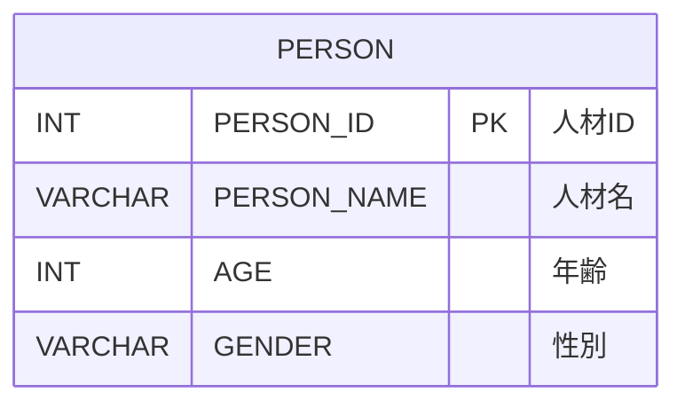

# データモデル

## 1. 概要

本ドキュメントは、人材管理システム（JSF Person）のデータモデルを定義する。エンティティ、テーブル定義、リレーション、JPA設計を記述する。

## 2. エンティティ一覧

### 2.1 Personエンティティ

* エンティティ名: Person
* テーブル名: PERSON
* パッケージ: pro.kensait.jsf.person.entity
* 説明: 人材情報を表すエンティティ

### 2.2 エンティティサマリ

* Person
  * 役割: 人材情報（ID、名前、年齢、性別）を管理する
  * 主キー: personId（自動採番）
  * リレーション: なし（単独テーブル）

## 3. テーブル定義

### 3.1 PERSONテーブル

* テーブル名: PERSON
* 説明: 人材情報を格納するテーブル

* カラム定義:

| カラム名 | データ型 | 制約 | 説明 |
|----------|---------|------|------|
| PERSON_ID | INT | PRIMARY KEY, AUTO INCREMENT | 人材ID（主キー、自動採番） |
| PERSON_NAME | VARCHAR(30) | NOT NULL | 人材名 |
| AGE | INT | NOT NULL | 年齢 |
| GENDER | VARCHAR(10) | NOT NULL | 性別（male/female） |

* DDL（既存スキーマ）:

```sql
CREATE TABLE PERSON (
    PERSON_ID   INT GENERATED BY DEFAULT AS IDENTITY PRIMARY KEY,
    PERSON_NAME VARCHAR(30) NOT NULL,
    AGE         INT NOT NULL,
    GENDER      VARCHAR(10) NOT NULL
);
```

* インデックス:
  * PRIMARY KEY: PERSON_ID

* 制約:
  * PRIMARY KEY制約: PERSON_ID
  * NOT NULL制約: PERSON_NAME、AGE、GENDER
  * AUTO INCREMENT: PERSON_ID（IDENTITY列）

### 3.2 初期データ

* 初期データ例:

```sql
INSERT INTO PERSON (PERSON_ID, PERSON_NAME, AGE, GENDER) VALUES(1, 'Alice', 35, 'female');
INSERT INTO PERSON (PERSON_ID, PERSON_NAME, AGE, GENDER) VALUES(2, 'Bob', 20, 'male');
INSERT INTO PERSON (PERSON_ID, PERSON_NAME, AGE, GENDER) VALUES(3, 'Carol', 30, 'female');
```

* 説明:
  * テスト用の初期データとして3件のPERSONレコードを用意
  * PERSON_IDは明示的に指定しているが、新規追加時は自動採番される

## 4. エンティティリレーション

### 4.1 リレーション図



### 4.2 リレーション説明

* 本システムはPersonエンティティのみを持つシンプルな構造
* テーブル間のリレーション（FOREIGN KEY）は存在しない
* 将来的に他のエンティティ（部署、役職等）が追加される可能性がある

## 5. JPA設計

### 5.1 Personエンティティクラス

* パッケージ: pro.kensait.jsf.person.entity
* クラス名: Person
* アノテーション:
  * @Entity: JPAエンティティとして定義
  * @Table(name = "PERSON"): テーブル名を指定
  * implements Serializable: シリアライズ可能にする

* フィールド:
  * personId: Integer
    * @Id: 主キー
    * @GeneratedValue(strategy = GenerationType.IDENTITY): 自動採番（IDENTITY戦略）
    * @Column(name = "PERSON_ID"): カラム名を指定
  
  * personName: String
    * @Column(name = "PERSON_NAME", nullable = false, length = 30): カラムマッピング
    * nullable = false: NOT NULL制約
    * length = 30: 最大長30文字
  
  * age: Integer
    * @Column(name = "AGE", nullable = false): カラムマッピング
    * nullable = false: NOT NULL制約
  
  * gender: String
    * @Column(name = "GENDER", nullable = false, length = 10): カラムマッピング
    * nullable = false: NOT NULL制約
    * length = 10: 最大長10文字

* メソッド:
  * getter/setterメソッド: 各フィールドに対するアクセサメソッド
  * toString(): デバッグ用の文字列表現
  * hashCode()、equals(): エンティティの同一性判定（オプション）

* Java実装例:

```java
package pro.kensait.jsf.person.entity;

import java.io.Serializable;
import jakarta.persistence.Column;
import jakarta.persistence.Entity;
import jakarta.persistence.GeneratedValue;
import jakarta.persistence.GenerationType;
import jakarta.persistence.Id;
import jakarta.persistence.Table;

@Entity
@Table(name = "PERSON")
public class Person implements Serializable {
    private static final long serialVersionUID = 1L;

    @Id
    @GeneratedValue(strategy = GenerationType.IDENTITY)
    @Column(name = "PERSON_ID")
    private Integer personId;

    @Column(name = "PERSON_NAME", nullable = false, length = 30)
    private String personName;

    @Column(name = "AGE", nullable = false)
    private Integer age;

    @Column(name = "GENDER", nullable = false, length = 10)
    private String gender;

    // コンストラクタ
    public Person() {}

    public Person(String personName, Integer age, String gender) {
        this.personName = personName;
        this.age = age;
        this.gender = gender;
    }

    public Person(Integer personId, String personName, Integer age, String gender) {
        this.personId = personId;
        this.personName = personName;
        this.age = age;
        this.gender = gender;
    }

    // ゲッター・セッター
    public Integer getPersonId() {
        return personId;
    }

    public void setPersonId(Integer personId) {
        this.personId = personId;
    }

    public String getPersonName() {
        return personName;
    }

    public void setPersonName(String personName) {
        this.personName = personName;
    }

    public Integer getAge() {
        return age;
    }

    public void setAge(Integer age) {
        this.age = age;
    }

    public String getGender() {
        return gender;
    }

    public void setGender(String gender) {
        this.gender = gender;
    }

    @Override
    public String toString() {
        return "Person [personId=" + personId + ", personName=" + personName
                + ", age=" + age + ", gender=" + gender + "]";
    }
}
```

### 5.2 主キー生成戦略

* GenerationType.IDENTITY
  * HSQLDBのAUTO INCREMENT（IDENTITY列）に対応
  * データベースが自動的に主キー値を生成
  * INSERT後にJPAが自動的に生成されたIDを取得

### 5.3 カラム名マッピング

* テーブルカラム名とフィールド名の対応:
  * PERSON_ID → personId
  * PERSON_NAME → personName
  * AGE → age
  * GENDER → gender

* @Columnアノテーションでカラム名を明示的に指定
* データベーススキーマは既存のまま維持

## 6. JPQLクエリ

### 6.1 全PERSON取得クエリ

* JPQL:

```sql
SELECT p FROM Person p ORDER BY p.personId
```

* 説明:
  * Personエンティティの全レコードを取得
  * personIdの昇順でソート

* 実装箇所: PersonService.getAllPersons()

### 6.2 IDでPERSON取得

* JPA APIメソッド:

```java
em.find(Person.class, personId)
```

* 説明:
  * 主キーでエンティティを検索
  * 該当レコードがない場合はnullを返す

* 実装箇所: PersonService.getPersonById(Integer personId)

### 6.3 PERSON追加

* JPA APIメソッド:

```java
em.persist(person)
```

* 説明:
  * 新しいエンティティをデータベースに追加
  * personIdはデータベースが自動採番
  * トランザクションコミット時にINSERTが実行される

* 実装箇所: PersonService.addPerson(Person person)

### 6.4 PERSON更新

* JPA APIメソッド:

```java
em.merge(person)
```

* 説明:
  * 既存のエンティティを更新
  * personIdが既存レコードのIDと一致する必要がある
  * トランザクションコミット時にUPDATEが実行される

* 実装箇所: PersonService.updatePerson(Person person)

### 6.5 PERSON削除

* JPA APIメソッド:

```java
Person person = em.find(Person.class, personId);
if (person != null) {
    em.remove(person);
}
```

* 説明:
  * 主キーでエンティティを検索
  * 見つかった場合は削除
  * トランザクションコミット時にDELETEが実行される

* 実装箇所: PersonService.deletePerson(Integer personId)

## 7. persistence.xml設定

### 7.1 Persistence Unit定義

* 設定ファイル: src/main/resources/META-INF/persistence.xml
* Persistence Unit名: personPU

* 設定例:

```xml
<?xml version="1.0" encoding="UTF-8"?>
<persistence version="3.1"
             xmlns="https://jakarta.ee/xml/ns/persistence"
             xmlns:xsi="http://www.w3.org/2001/XMLSchema-instance"
             xsi:schemaLocation="https://jakarta.ee/xml/ns/persistence
                                 https://jakarta.ee/xml/ns/persistence/persistence_3_1.xsd">
    <persistence-unit name="personPU" transaction-type="JTA">
        <jta-data-source>java:app/jdbc/testdb</jta-data-source>
        <class>pro.kensait.jsf.person.entity.Person</class>
        <properties>
            <property name="jakarta.persistence.schema-generation.database.action" value="none"/>
            <property name="eclipselink.logging.level" value="FINE"/>
            <property name="eclipselink.logging.parameters" value="true"/>
        </properties>
    </persistence-unit>
</persistence>
```

### 7.2 設定項目説明

* transaction-type="JTA"
  * JTA（Jakarta Transactions）を使用
  * アプリケーションサーバーによるトランザクション管理

* jta-data-source
  * java:app/jdbc/testdb
  * Payara ServerのJNDI名でデータソースを指定

* class
  * pro.kensait.jsf.person.entity.Person
  * エンティティクラスを明示的に指定

* jakarta.persistence.schema-generation.database.action
  * value="none"
  * スキーマ自動生成を無効化
  * 既存のデータベーススキーマをそのまま使用

* eclipselink.logging.level
  * value="FINE"
  * SQLログを詳細に出力（開発時）
  * 本番環境ではWARNING等に変更

* eclipselink.logging.parameters
  * value="true"
  * SQLパラメータをログに出力

## 8. データソース設定

### 8.1 データソース名

* JNDI名: java:app/jdbc/testdb
* リソースタイプ: javax.sql.DataSource（jakarta.sql.DataSource）

### 8.2 接続情報

* データベース種別: HSQLDB 2.7.x
* JDBCドライバー: org.hsqldb.jdbc.JDBCDriver
* 接続URL: jdbc:hsqldb:hsql://localhost:9001/testdb
* ユーザー名: SA
* パスワード: （空文字）

### 8.3 接続プール設定

* 管理: Payara Server
* 最小接続数: 8
* 最大接続数: 32
* アイドルタイムアウト: 300秒

## 9. データ整合性

### 9.1 NOT NULL制約

* すべてのカラムがNOT NULL制約を持つ
* JPAエンティティのnullable = falseと対応
* Bean Validation（@NotNull）でアプリケーションレベルでも検証

### 9.2 主キー制約

* PERSON_IDがPRIMARY KEY
* 自動採番（IDENTITY列）により一意性を保証
* 重複する値が挿入されることはない

### 9.3 データ型整合性

* AGEは整数型（INT）
* GENDERは文字列型（VARCHAR）だが、アプリケーションレベルで "male" または "female" に制限

## 10. データベーススキーマ移行

### 10.1 移行方針

* データベーススキーマは変更しない
* 既存のPERSONテーブル構造を維持
* マイグレーション範囲はアプリケーション層のみ

### 10.2 データ継続性

* 既存のPERSONデータをそのまま使用
* データ移行は不要
* JPA Entityが既存テーブルにマッピングされる

### 10.3 スキーマ自動生成の無効化

* persistence.xmlで "jakarta.persistence.schema-generation.database.action" を "none" に設定
* JPAによるテーブル自動生成を防止
* 既存のDDLスクリプトを使用してテーブルを作成

## 11. 将来の拡張性

### 11.1 エンティティ追加の可能性

* 部署（Department）エンティティ
  * PERSONと部署の関連（ManyToOne）
  * 部署ID（DEPT_ID）をPERSONテーブルに追加

* 役職（Position）エンティティ
  * PERSONと役職の関連（ManyToOne）
  * 役職ID（POSITION_ID）をPERSONテーブルに追加

### 11.2 リレーション追加の可能性

* OneToMany関係
  * 部署 → PERSON（1つの部署に複数のPERSON）

* ManyToOne関係
  * PERSON → 部署（1つのPERSONは1つの部署に所属）

### 11.3 スキーマ拡張の考慮事項

* 既存のPERSONテーブルにカラムを追加する場合、ALTER TABLE文を使用
* JPA Entityにフィールドを追加し、@Columnでマッピング
* データ移行スクリプトを用意して既存データに対応

## 12. 参考資料

* [システム要件定義](requirements.md) - システム要件
* [アーキテクチャ設計書](architecture_design.md) - システム全体のアーキテクチャ
* [機能設計書](functional_design.md) - 画面遷移とコンポーネント設計
* [振る舞い仕様書](behaviors.md) - システム全体の振る舞い
* [Jakarta Persistence 3.1仕様](https://jakarta.ee/specifications/persistence/3.1/)
