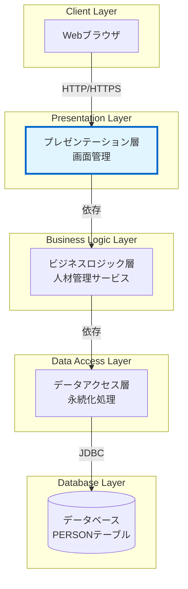

# 外部インターフェース仕様書

## 1. 概要

本ドキュメントは、人材管理システム（JSF Person）が外部システムを呼び出す際のインターフェース仕様を定義する。

注意: 
* 基本設計レベルのため、論理的な外部連携の有無と方向性を記述します
* 実装クラス（RestClient等）、アノテーション（@RestClient、@RegisterRestClient等）、具体的なHTTPクライアントライブラリは詳細設計フェーズで記述します

## 2. 外部システム連携状況

人材管理システム（JSF Person）は、外部システムを呼び出さない独立したWebアプリケーションとして設計されている。

注意: 論理レベルのアーキテクチャ図です。実装クラス名（PersonListBean、PersonService等）やアノテーション（@Inject、@Transactional等）は詳細設計で記述します。

---

## 3. 参考資料

* [システム要件定義](requirements.md) - システム要件
* [アーキテクチャ設計書](architecture_design.md) - システム全体のアーキテクチャ
* [データモデル](data_model.md) - データベーススキーマの詳細
* [機能設計書](functional_design.md) - 画面遷移とコンポーネント設計
* [振る舞い仕様書](behaviors.md) - システム全体の振る舞い
