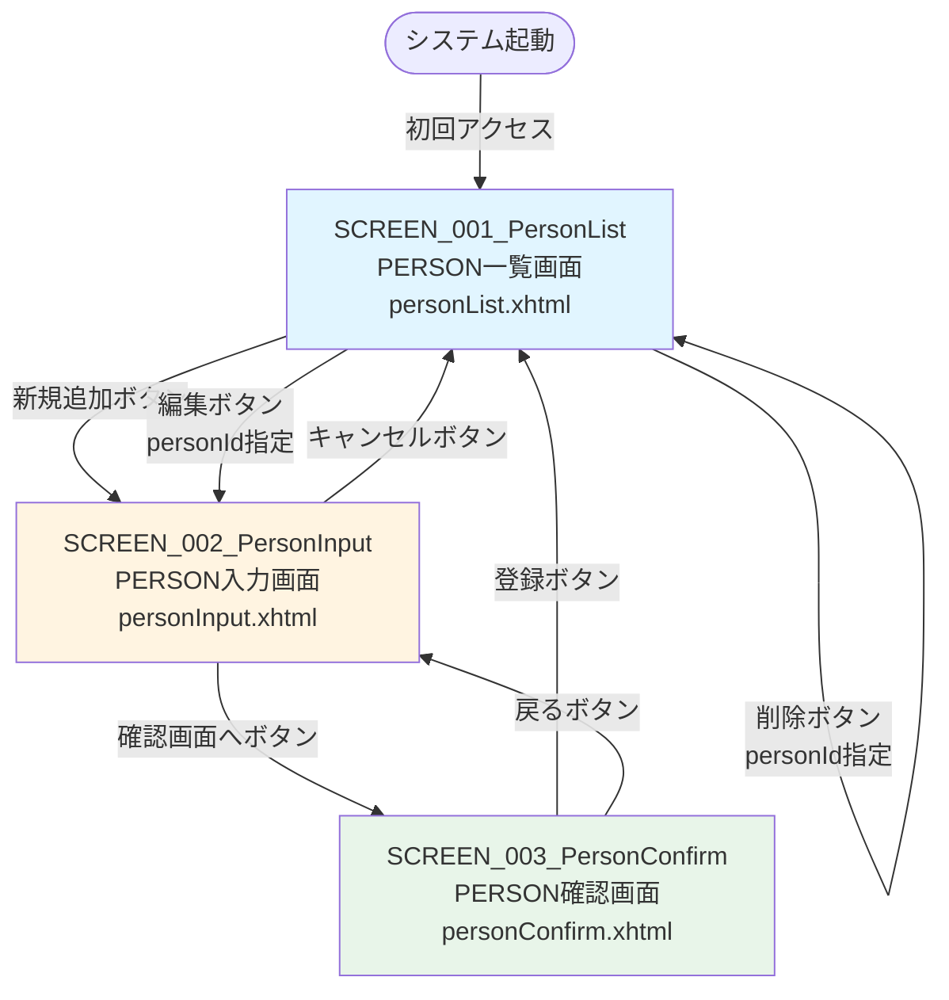

# 機能設計書

## 1. 概要

本ドキュメントは、人材管理システム（JSF Person）の機能設計を定義する。画面一覧、画面遷移、コンポーネント設計を記述する。

## 2. 画面一覧

### 2.1 画面リスト

* SCREEN_001_PersonList: PERSON一覧画面
  * URL: /personList.xhtml
  * 目的: 全PERSON情報を一覧表示し、追加・編集・削除のエントリーポイントを提供
  * Managed Bean: PersonListBean
  * スコープ: @ViewScoped

* SCREEN_002_PersonInput: PERSON入力画面
  * URL: /personInput.xhtml
  * 目的: PERSON情報の入力または編集を行う
  * Managed Bean: PersonInputBean
  * スコープ: @ViewScoped
  * モード: 新規追加モードと編集モード

* SCREEN_003_PersonConfirm: PERSON確認画面
  * URL: /personConfirm.xhtml
  * 目的: 入力または編集されたPERSON情報を確認し、登録・更新を実行する
  * Managed Bean: PersonConfirmBean
  * スコープ: @ViewScoped

### 2.2 画面とManaged Beanの対応

* personList.xhtml ↔ PersonListBean
* personInput.xhtml ↔ PersonInputBean
* personConfirm.xhtml ↔ PersonConfirmBean

## 3. 画面遷移図

### 3.1 全体画面遷移



### 3.2 画面遷移詳細

* PERSON一覧画面（personList.xhtml）
  * → PERSON入力画面（personInput.xhtml）: 新規追加ボタンをクリック
  * → PERSON入力画面（personInput.xhtml?personId=xxx）: 編集ボタンをクリック
  * → PERSON一覧画面（personList.xhtml）: 削除ボタンをクリック（即座に削除してリロード）

* PERSON入力画面（personInput.xhtml）
  * → PERSON確認画面（personConfirm.xhtml）: 確認画面へボタンをクリック
  * → PERSON一覧画面（personList.xhtml）: キャンセルボタンをクリック

* PERSON確認画面（personConfirm.xhtml）
  * → PERSON一覧画面（personList.xhtml）: 登録ボタンをクリック（登録・更新後にリダイレクト）
  * → PERSON入力画面（personInput.xhtml）: 戻るボタンをクリック

### 3.3 画面遷移のパターン

* 通常遷移（Forward）
  * 入力画面 → 確認画面
  * データはFlash ScopeまたはView Scopeで引き継ぐ

* リダイレクト遷移（Redirect）
  * 確認画面 → 一覧画面（登録・更新後）
  * 一覧画面 → 一覧画面（削除後）
  * 戻り値に "?faces-redirect=true" を付加

* ブラウザ履歴を使用した戻る
  * 確認画面 → 入力画面（戻るボタン）
  * JavaScript: history.back()

## 4. コンポーネント設計

### 4.1 SCREEN_001_PersonList（PERSON一覧画面）

#### 4.1.1 Managed Bean: PersonListBean

* パッケージ: pro.kensait.jsf.person.bean
* アノテーション:
  * @Named("personListBean")
  * @ViewScoped
  * implements Serializable

* フィールド:
  * personService: PersonService（@Inject）
  * personList: List<Person>

* メソッド:
  * init(): void（@PostConstruct）
    * 画面初期表示時に全PERSONを取得
    * personService.getAllPersons()を呼び出し
    * 結果をpersonListフィールドに設定

  * getPersonList(): List<Person>
    * personListフィールドを返す
    * ビューから#{personListBean.personList}でアクセス

  * deletePerson(Integer personId): String
    * 指定されたPERSONを削除
    * personService.deletePerson(personId)を呼び出し
    * 削除後に再度getAllPersons()を呼び出してリストを更新
    * 戻り値: null（同じページをリロード）

#### 4.1.2 Service: PersonService

* メソッド呼び出し:
  * getAllPersons(): List<Person>
    * 全PERSONを取得するJPQLクエリを実行
    * "SELECT p FROM Person p ORDER BY p.personId"

  * deletePerson(Integer personId): void
    * 指定されたPERSONを削除
    * em.find()でエンティティを取得
    * em.remove()で削除

#### 4.1.3 ビュー: personList.xhtml

* JSFタグライブラリ:
  * xmlns:h="jakarta.faces.html"
  * xmlns:f="jakarta.faces.core"
  * xmlns:ui="jakarta.faces.facelets"

* 主要コンポーネント:
  * <h:head>: ページヘッダー（タイトル、スタイルシート）
  * <h:body>: ページボディ
  * <h:form>: フォーム
  * <h:commandButton>: 新規追加ボタン
  * <h:dataTable>: PERSONリストの表示
    * value="#{personListBean.personList}"
    * var="person"
    * カラム: ID、名前、年齢、性別、操作
  * <h:commandButton>: 編集ボタン、削除ボタン

### 4.2 SCREEN_002_PersonInput（PERSON入力画面）

#### 4.2.1 Managed Bean: PersonInputBean

* パッケージ: pro.kensait.jsf.person.bean
* アノテーション:
  * @Named("personInputBean")
  * @ViewScoped
  * implements Serializable

* フィールド:
  * personService: PersonService（@Inject）
  * personId: Integer（編集モードの場合に設定）
  * personName: String
  * age: Integer
  * gender: String

* メソッド:
  * init(): void（@PostConstruct）
    * 編集モードの場合（personIdが指定されている場合）
      * リクエストパラメータからpersonIdを取得
      * personService.getPersonById(personId)を呼び出し
      * 取得したPersonデータをフィールドに設定
    * 新規追加モードの場合
      * フィールドを初期化（nullまたはデフォルト値）

  * confirm(): String
    * 確認画面に遷移
    * 入力データをFlash Scopeに保存（または@ViewScopedのままConfirmBeanに渡す）
    * 戻り値: "personConfirm"

  * cancel(): String
    * 一覧画面に戻る
    * 戻り値: "personList?faces-redirect=true"

#### 4.2.2 Service: PersonService

* メソッド呼び出し:
  * getPersonById(Integer personId): Person
    * 指定されたIDのPERSONを取得
    * em.find(Person.class, personId)

#### 4.2.3 ビュー: personInput.xhtml

* JSFタグライブラリ:
  * xmlns:h="jakarta.faces.html"
  * xmlns:f="jakarta.faces.core"

* 主要コンポーネント:
  * <h:form>: フォーム
  * <h:inputHidden>: personId（編集モードの場合に値を保持）
  * <h:inputText>: personName（名前入力フィールド）
  * <h:inputText>: age（年齢入力フィールド）
  * <h:selectOneRadio>: gender（性別選択ラジオボタン）
    * 選択肢: male（男性）、female（女性）
  * <h:commandButton>: 確認画面へボタン（action="#{personInputBean.confirm}"）
  * <h:commandButton>: キャンセルボタン（action="#{personInputBean.cancel}"）

### 4.3 SCREEN_003_PersonConfirm（PERSON確認画面）

#### 4.3.1 Managed Bean: PersonConfirmBean

* パッケージ: pro.kensait.jsf.person.bean
* アノテーション:
  * @Named("personConfirmBean")
  * @ViewScoped
  * implements Serializable

* フィールド:
  * personService: PersonService（@Inject）
  * personId: Integer
  * personName: String
  * age: Integer
  * gender: String

* メソッド:
  * init(): void（@PostConstruct）
    * PersonInputBeanから渡されたデータをフィールドに設定
    * Flash Scopeまたはリクエストパラメータからデータを取得

  * save(): String
    * Personオブジェクトを作成
    * personIdがnullの場合: 新規追加
      * personService.addPerson(person)を呼び出し
    * personIdがnull以外の場合: 更新
      * personService.updatePerson(person)を呼び出し
    * 戻り値: "personList?faces-redirect=true"

  * back(): void
    * 入力画面に戻る
    * JavaScript: history.back()を使用

#### 4.3.2 Service: PersonService

* メソッド呼び出し:
  * addPerson(Person person): void
    * 新しいPERSONを追加
    * em.persist(person)

  * updatePerson(Person person): void
    * 既存のPERSONを更新
    * em.merge(person)

#### 4.3.3 ビュー: personConfirm.xhtml

* JSFタグライブラリ:
  * xmlns:h="jakarta.faces.html"
  * xmlns:f="jakarta.faces.core"

* 主要コンポーネント:
  * <h:form>: フォーム
  * <h:inputHidden>: personId（編集モードの場合に値を保持）
  * <h:inputHidden>: personName（確認後の登録のためにhiddenフィールドで保持）
  * <h:inputHidden>: age
  * <h:inputHidden>: gender
  * <h:outputText>: personName（名前表示）
  * <h:outputText>: age（年齢表示）
  * <h:outputText>: gender（性別表示、male→男性、female→女性に変換）
  * <h:commandButton>: 登録ボタン（action="#{personConfirmBean.save}"）
  * <h:button>: 戻るボタン（onclick="history.back(); return false;"）

## 5. データフロー

### 5.1 PERSON一覧表示フロー

```
PersonListBean.init()
  ↓
PersonService.getAllPersons()
  ↓
EntityManager.createQuery("SELECT p FROM Person p ORDER BY p.personId")
  ↓
List<Person> personList
  ↓
PersonListBean.personList に設定
  ↓
personList.xhtml でリストを表示
```

### 5.2 PERSON追加フロー

```
personInput.xhtml（入力画面）
  ↓
PersonInputBean.confirm()
  ↓
personConfirm.xhtml（確認画面）に遷移
  ↓
PersonConfirmBean.save()
  ↓
PersonService.addPerson(person)
  ↓
EntityManager.persist(person)
  ↓
personList.xhtml（一覧画面）にリダイレクト
```

### 5.3 PERSON編集フロー

```
personList.xhtml（一覧画面）
  ↓ personId指定
personInput.xhtml（入力画面）
  ↓
PersonInputBean.init()
  ↓
PersonService.getPersonById(personId)
  ↓
EntityManager.find(Person.class, personId)
  ↓
フィールドに既存データを設定
  ↓
PersonInputBean.confirm()
  ↓
personConfirm.xhtml（確認画面）に遷移
  ↓
PersonConfirmBean.save()
  ↓
PersonService.updatePerson(person)
  ↓
EntityManager.merge(person)
  ↓
personList.xhtml（一覧画面）にリダイレクト
```

### 5.4 PERSON削除フロー

```
personList.xhtml（一覧画面）
  ↓ personId指定
PersonListBean.deletePerson(personId)
  ↓
PersonService.deletePerson(personId)
  ↓
EntityManager.find(Person.class, personId)
  ↓
EntityManager.remove(person)
  ↓
PersonListBean.init()（リストを再取得）
  ↓
personList.xhtml（一覧画面）をリロード
```

## 6. 画面間データ受け渡し

### 6.1 データ受け渡し方式

* 一覧画面 → 入力画面（編集モード）
  * URLパラメータ: personInput.xhtml?personId=xxx
  * <f:viewParam>でpersonIdを受け取り
  * @PostConstructでデータを取得

* 入力画面 → 確認画面
  * Flash Scopeまたは@ViewScopedのBeanプロパティ
  * PersonInputBeanとPersonConfirmBeanが同じデータを参照

* 確認画面 → 一覧画面
  * リダイレクト遷移のため、データ受け渡しなし
  * 一覧画面で再度データベースからデータを取得

### 6.2 スコープの使い分け

* @ViewScoped
  * 画面単位のライフサイクル
  * PersonListBean、PersonInputBean、PersonConfirmBeanに使用
  * Ajax通信、画面リロードを考慮

* @RequestScoped
  * リクエスト単位のライフサイクル
  * PersonServiceに使用
  * ステートレス、トランザクション境界

* Flash Scope
  * リダイレクト前後でデータを引き継ぐ
  * 入力画面 → 確認画面のデータ受け渡しに使用可能

## 7. バリデーション設計

### 7.1 入力検証ルール

* personName（名前）
  * 必須: @NotNull
  * 最大長: @Size(max = 30)

* age（年齢）
  * 必須: @NotNull
  * 最小値: @Min(0)
  * 最大値: @Max(150)

* gender（性別）
  * 必須: @NotNull
  * 値: "male" または "female"

### 7.2 バリデーション方式

* Bean Validationアノテーション
  * PersonInputBeanのフィールドにアノテーションを付加
  * JSFが自動的にバリデーションを実行

* カスタムバリデーター
  * 必要に応じてカスタムバリデーターを作成
  * @FacesValidatorアノテーションで定義

### 7.3 エラーメッセージ表示

* <h:messages>コンポーネント
  * personInput.xhtmlに配置
  * バリデーションエラーメッセージを表示

* FacesContext.addMessage()
  * プログラムからメッセージを追加

## 8. コンポーネント間の依存関係

### 8.1 依存関係図

```mermaid
graph LR
    subgraph "Presentation Layer"
        PL[PersonListBean]
        PI[PersonInputBean]
        PC[PersonConfirmBean]
    end
    
    subgraph "Business Logic Layer"
        PS[PersonService]
    end
    
    subgraph "Data Access Layer"
        PE[Person Entity]
        EM[EntityManager]
    end
    
    PL -->|@Inject| PS
    PI -->|@Inject| PS
    PC -->|@Inject| PS
    PS -->|@PersistenceContext| EM
    EM -->|JPQL| PE
```

### 8.2 依存性注入

* PersonListBean → PersonService（@Inject）
* PersonInputBean → PersonService（@Inject）
* PersonConfirmBean → PersonService（@Inject）
* PersonService → EntityManager（@PersistenceContext）

## 9. 非機能設計

### 9.1 トランザクション管理

* PersonServiceのメソッドレベルで@Transactionalを適用
* データベース操作は必ずトランザクション内で実行される
* 例外発生時は自動的にロールバック

### 9.2 エラーハンドリング

* try-catchブロックでRuntimeExceptionをキャッチ
* FacesContext.addMessage()でエラーメッセージを追加
* <h:messages>でユーザーにエラーを通知

### 9.3 ロギング

* PersonServiceの主要メソッドでログを出力
* ログレベル: INFO（登録・更新・削除）、SEVERE（エラー）

## 10. 参考資料

* [システム要件定義](requirements.md) - システム要件
* [アーキテクチャ設計書](architecture_design.md) - システム全体のアーキテクチャ
* [データモデル](data_model.md) - データベーススキーマの詳細
* [振る舞い仕様書](behaviors.md) - システム全体の振る舞い
* [SCREEN_001_PersonList仕様](../screen/SCREEN_001_PersonList/screen_design.md)
* [SCREEN_002_PersonInput仕様](../screen/SCREEN_002_PersonInput/screen_design.md)
* [SCREEN_003_PersonConfirm仕様](../screen/SCREEN_003_PersonConfirm/screen_design.md)
