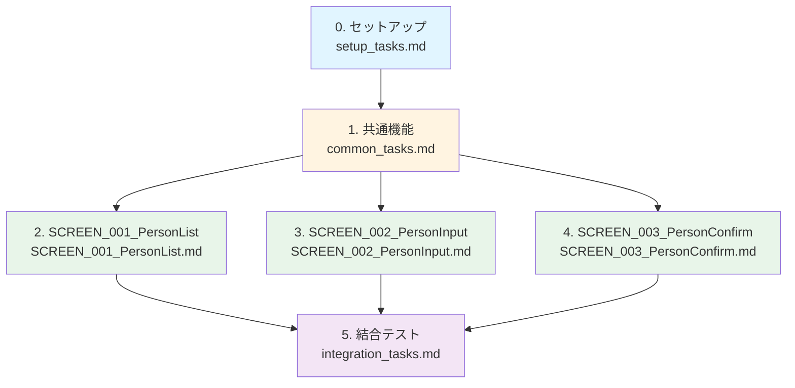

# jsf-person-sdd - 実装タスクリスト

## 全体構成と担当割り当て

### タスク概要

| タスク | タスクファイル | 担当者 | 並行実行 | 想定工数 |
|---------|--------------|--------|---------|---------|
| 0. セットアップ | [setup_tasks.md](setup_tasks.md) | 全員 | 不可 | 2時間 |
| 1. 共通機能 | [common_tasks.md](common_tasks.md) | 共通機能チーム | 一部可能 | 4時間 |
| 2. SCREEN_001_PersonList | [SCREEN_001_PersonList.md](SCREEN_001_PersonList.md) | 担当者A | 可能 | 3時間 |
| 3. SCREEN_002_PersonInput | [SCREEN_002_PersonInput.md](SCREEN_002_PersonInput.md) | 担当者B | 可能 | 4時間 |
| 4. SCREEN_003_PersonConfirm | [SCREEN_003_PersonConfirm.md](SCREEN_003_PersonConfirm.md) | 担当者C | 可能 | 3時間 |
| 5. 結合テスト | [integration_tasks.md](integration_tasks.md) | 全員 | 一部可能 | 4時間 |

### 実行順序

1. タスク0: セットアップ（全員で実行）
2. タスク1: 共通機能（共通機能チームが実装）
3. タスク2～4: 画面別実装（各担当者が並行実行） ← ここが並行化のポイント
4. タスク5: 結合テスト（全員で実施）

### タスクファイル一覧

* [セットアップタスク](setup_tasks.md)
* [共通機能タスク](common_tasks.md)
* [SCREEN_001_PersonListタスク](SCREEN_001_PersonList.md)
* [SCREEN_002_PersonInputタスク](SCREEN_002_PersonInput.md)
* [SCREEN_003_PersonConfirmタスク](SCREEN_003_PersonConfirm.md)
* [結合テストタスク](integration_tasks.md)

## 依存関係図

## プロジェクト概要

* プロジェクト名: jsf-person-sdd
* 目的: Apache Struts 1.xからJakarta Faces (JSF) 4.0への人材管理システムのマイグレーション
* 技術スタック: Jakarta EE 10、JSF 4.0、JPA 3.1、CDI 4.0、Payara Server 6、HSQLDB 2.7.x
* アーキテクチャ: レイヤードアーキテクチャ（Presentation Layer、Business Logic Layer、Data Access Layer）

## 画面一覧

* SCREEN_001_PersonList: PERSON一覧画面
* SCREEN_002_PersonInput: PERSON入力画面（新規追加・編集）
* SCREEN_003_PersonConfirm: PERSON確認画面

## 主要機能

* PERSON一覧表示機能
* PERSON追加機能
* PERSON編集機能
* PERSON削除機能

## 実装方針

* 仕様駆動開発: 完成したSPECに基づいて実装
* テストカバレッジ: 単体テスト、画面テスト、E2Eテストを含む
* 並行実行: 画面単位でタスクを分割し、複数人が並行して作業可能
* ソースコードはタスク実行時に生成: このタスクリストには「何を作成するか」のみを記載

## 参考資料

* [システム要件定義](../specs/baseline/system/requirements.md)
* [アーキテクチャ設計書](../specs/baseline/system/architecture_design.md)
* [機能設計書](../specs/baseline/system/functional_design.md)
* [データモデル](../specs/baseline/system/data_model.md)
* [マイグレーション憲章](../../../agent_skills/struts-to-jsf-migration/principles/constitution.md)
* [Jakarta EE開発憲章](../../../agent_skills/jakarta-ee-standard/principles/constitution.md)
